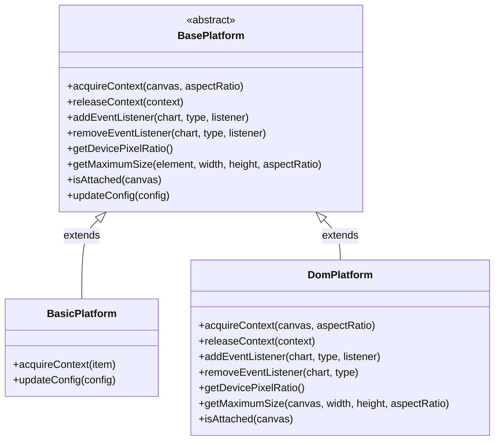
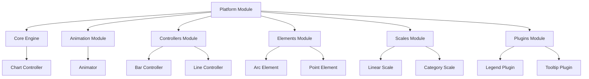

# Platform Module Documentation

## Overview

The Platform module in Chart.js provides an abstraction layer that handles platform-specific operations, allowing the charting library to work seamlessly across different environments. It manages canvas contexts, event handling, device pixel ratios, and platform-specific optimizations while maintaining a consistent API for the core chart functionality.

## Architecture

The Platform module follows a hierarchical design pattern with a base abstract class and specialized implementations for different deployment environments:


```mermaid
classDiagram
    class BasePlatform {
        <<abstract>>
        +acquireContext(canvas, aspectRatio)
        +releaseContext(context)
        +addEventListener(chart, type, listener)
        +removeEventListener(chart, type, listener)
        +getDevicePixelRatio()
        +getMaximumSize(element, width, height, aspectRatio)
        +isAttached(canvas)
        +updateConfig(config)
    }
    
    class BasicPlatform {
        +acquireContext(item)
        +updateConfig(config)
    }
    
    class DomPlatform {
        +acquireContext(canvas, aspectRatio)
        +releaseContext(context)
        +addEventListener(chart, type, listener)
        +removeEventListener(chart, type)
        +getDevicePixelRatio()
        +getMaximumSize(canvas, width, height, aspectRatio)
        +isAttached(canvas)
    }
    
    BasePlatform <|-- BasicPlatform : extends
    BasePlatform <|-- DomPlatform : extends
```

## Core Components

### BasePlatform (`src.platform.platform.base.BasePlatform`)
The abstract base class that defines the platform interface contract. All platform implementations must extend this class and provide concrete implementations for the required methods. It provides default implementations for basic functionality while leaving platform-specific operations as abstract methods.

**Detailed Documentation**: [Base Platform](base_platform.md)

### BasicPlatform (`src.platform.platform.basic.BasicPlatform`)
A minimal platform implementation designed for environments with limited DOM access, such as OffscreenCanvas or headless environments. It provides basic canvas context acquisition and disables animations for performance.

**Detailed Documentation**: [Basic Platform](basic_platform.md)

### DomPlatform (`src.platform.platform.dom.DomPlatform`)
The full-featured platform implementation for web browsers. It provides comprehensive DOM integration, event handling, responsive resizing, device pixel ratio management, and canvas lifecycle management.

**Detailed Documentation**: [DOM Platform](dom_platform.md)

## Key Features

### Canvas Context Management
- **Context Acquisition**: Securely acquires 2D rendering contexts from canvas elements
- **Context Release**: Properly cleans up and restores canvas state on chart destruction
- **Fingerprinting Protection**: Handles cases where canvas methods are undefined by privacy tools

### Event System
- **Event Normalization**: Maps native DOM events to Chart.js event types
- **Touch/Mouse Integration**: Seamlessly handles both touch and mouse events
- **Responsive Events**: Manages resize, attach, and detach events for responsive charts

### Responsive Design
- **Resize Observation**: Uses ResizeObserver API for efficient container size monitoring
- **Device Pixel Ratio**: Handles high-DPI displays and device pixel ratio changes
- **Maximum Size Calculation**: Calculates optimal canvas dimensions while maintaining aspect ratios

### Performance Optimizations
- **Throttled Events**: Implements throttling for high-frequency events like resize and mouse move
- **Passive Listeners**: Uses passive event listeners where supported for better scroll performance
- **Observer Management**: Efficiently manages multiple observers for different event types

## Module Relationships

The Platform module serves as a foundational layer that other modules depend on:


```mermaid
graph TD
    Platform[Platform Module] --> Core[Core Engine]
    Platform --> Animation[Animation Module]
    Platform --> Controllers[Controllers Module]
    Platform --> Elements[Elements Module]
    Platform --> Scales[Scales Module]
    Platform --> Plugins[Plugins Module]
    
    Core --> Chart[Chart Controller]
    Animation --> Animator[Animator]
    Controllers --> Bar[Bar Controller]
    Controllers --> Line[Line Controller]
    Elements --> Arc[Arc Element]
    Elements --> Point[Point Element]
    Scales --> Linear[Linear Scale]
    Scales --> Category[Category Scale]
    Plugins --> Legend[Legend Plugin]
    Plugins --> Tooltip[Tooltip Plugin]
```

## Platform Selection

Chart.js automatically selects the appropriate platform based on the environment:

1. **DomPlatform**: Used when running in a web browser with full DOM access
2. **BasicPlatform**: Used for OffscreenCanvas or environments without DOM access
3. **Custom Platform**: Developers can extend BasePlatform for specialized environments

## Integration with Core Components

The Platform module integrates with the [Core Engine](core_engine.md) through the Chart controller, providing the necessary abstractions for:
- Canvas initialization and management
- Event handling and dispatching
- Responsive resizing and layout updates
- Device-specific optimizations

## Usage Examples

### Basic Usage
```javascript
// Platform is automatically selected based on environment
const chart = new Chart(ctx, {
    type: 'line',
    data: data,
    options: options
});
```

### Custom Platform
```javascript
import { BasePlatform } from 'chart.js';

class CustomPlatform extends BasePlatform {
    acquireContext(canvas, aspectRatio) {
        // Custom context acquisition logic
    }
    
    // Implement other required methods...
}

// Register custom platform
Chart.platform = CustomPlatform;
```

## Performance Considerations

- **Event Throttling**: High-frequency events are automatically throttled to prevent performance degradation
- **Observer Cleanup**: All observers are properly cleaned up when charts are destroyed
- **Passive Listeners**: Uses passive event listeners where supported to improve scroll performance
- **Resize Debouncing**: Resize events are debounced to prevent excessive redraws

## Browser Compatibility

The DomPlatform implementation includes fallbacks and polyfills for older browsers:
- ResizeObserver with fallback to MutationObserver
- Passive event listener detection
- Device pixel ratio change handling
- Canvas fingerprinting protection

## Related Documentation

- [Core Engine](core_engine.md) - The main chart controller that uses platform services
- [Animation Module](animation.md) - Animation system that relies on platform timing
- [Controllers](controllers.md) - Chart type controllers that interact with platform events
- [Elements](elements.md) - Visual elements rendered through platform contexts
- [Scales](scales.md) - Scale implementations that use platform dimensions
- [Plugins](plugins.md) - Plugins that hook into platform events and lifecycle