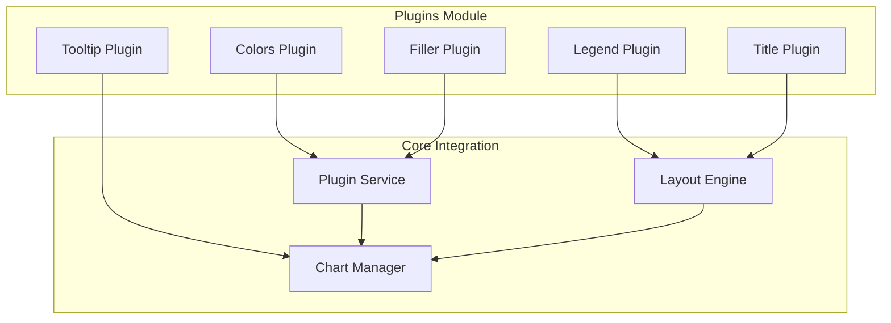
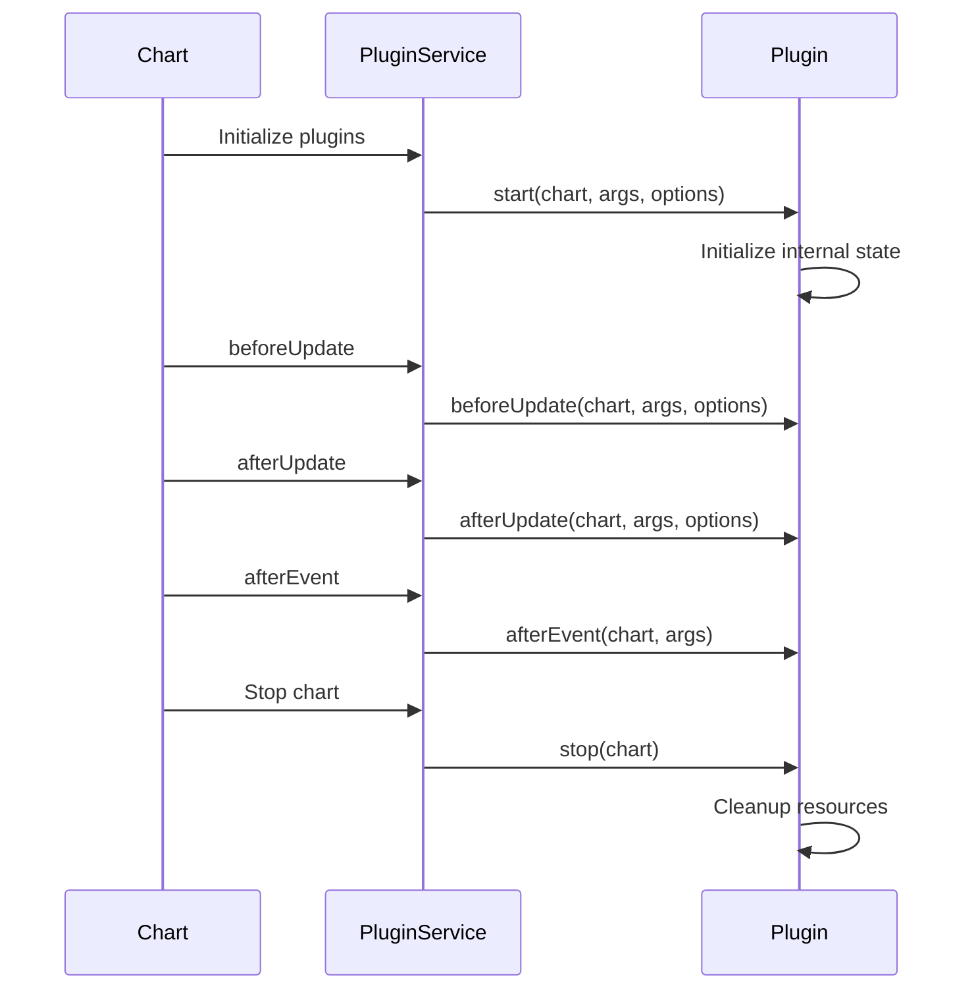

# Plugins Module Documentation

## Overview

The plugins module is a core component of Chart.js that provides extensible functionality through a plugin architecture. Plugins allow developers to enhance charts with additional features such as automatic color assignment, data filling, legends, titles, and interactive tooltips. The module follows a modular design where each plugin is self-contained and can be enabled/disabled independently.

## Architecture

The plugins module implements a plugin-based architecture where each plugin provides specific chart functionality:



## Core Functionality

### Plugin Service Integration
The plugins module integrates with the core [PluginService](core.md#plugin-service) which manages plugin lifecycle, registration, and execution. Each plugin follows a standard interface with lifecycle hooks like `beforeLayout`, `afterUpdate`, and `afterEvent`.

### Layout Management
Several plugins (Legend, Title) integrate with the [layout system](core.md#layout-management) to properly position themselves within the chart area. The layout engine ensures these elements don't overlap with chart content.

## Sub-modules

### [Colors Plugin](colors-plugin.md)
The Colors plugin automatically assigns colors to datasets that don't have predefined colors. It supports different color assignment strategies based on chart type:

- **Default Mode**: Assigns border and background colors to datasets
- **Doughnut Mode**: Assigns different colors to each data segment
- **Polar Area Mode**: Similar to doughnut but with transparency

**Key Features:**
- Automatic color cycling through predefined palettes
- Support for force override of existing colors
- Chart-type specific colorization logic

**Configuration:**
- `enabled`: Enable/disable automatic coloring
- `forceOverride`: Override existing color definitions

### Filler Plugin
The Filler plugin provides functionality for filling areas under or between datasets. It includes geometric utilities for complex fill operations.

**Key Components:**
- `simpleArc`: Utility class for arc-based fill operations
- Path segment generation for custom shapes
- Interpolation support for smooth curves

### [Legend Plugin](legend-plugin.md)
The Legend plugin displays a legend showing dataset information with interactive features for showing/hiding datasets.

**Key Features:**
- Automatic legend item generation from datasets
- Interactive dataset toggling (click to show/hide)
- Multiple layout modes (horizontal/vertical)
- Customizable styling and positioning
- RTL (Right-to-Left) text support
- Event handling for hover and click interactions

**Layout Modes:**
- **Horizontal**: Items arranged in rows, wraps to new lines
- **Vertical**: Items arranged in columns

**Styling Options:**
- Box styles (color, border, point styles)
- Font customization
- Padding and spacing control
- Title support

### [Title Plugin](title-plugin.md)
The Title plugin provides chart title functionality with support for multiple text lines and various positioning options.

**Key Features:**
- Single or multi-line titles
- Flexible positioning (top, bottom, left, right)
- Font and color customization
- Automatic layout integration
- Rotation support for vertical titles

### [Tooltip Plugin](tooltip-plugin.md)
The Tooltip plugin provides interactive tooltips that appear when users hover over chart elements. It's the most complex plugin with extensive customization options.

**Key Features:**
- Multiple positioning modes (average, nearest)
- Rich content support (title, body, footer)
- Color boxes and point style indicators
- Animation support with smooth transitions
- External tooltip support for custom rendering
- RTL text support
- Advanced callback system for content customization

**Positioning Modes:**
- **Average**: Positions tooltip at average position of active elements
- **Nearest**: Positions tooltip nearest to the event position

**Content Structure:**
- Title section with customizable text
- Body section with dataset information
- Footer section for additional content
- Color indicators for dataset identification

## Plugin Lifecycle



## Integration with Other Modules

### Core Module Dependencies
- **Element**: All plugins extend the base Element class for consistent behavior
- **Layout Engine**: Legend and Title plugins integrate with the layout system
- **Animation System**: Tooltip plugin uses animations for smooth transitions
- **Plugin Service**: Central service managing all plugin operations

### Helper Module Dependencies
- **Canvas Helpers**: Drawing utilities for rendering plugin content
- **RTL Helpers**: Right-to-left text support for internationalization
- **Math Helpers**: Geometric calculations for positioning
- **Options Helpers**: Configuration parsing and validation

## Configuration

Each plugin can be configured through the chart options:

```javascript
const chart = new Chart(ctx, {
    options: {
        plugins: {
            colors: { enabled: true, forceOverride: false },
            legend: { display: true, position: 'top' },
            title: { display: true, text: 'Chart Title' },
            tooltip: { enabled: true, mode: 'nearest' }
        }
    }
});
```

## Best Practices

1. **Plugin Ordering**: Consider plugin dependencies when enabling multiple plugins
2. **Performance**: Disable unused plugins to improve rendering performance
3. **Customization**: Use plugin callbacks for advanced customization without modifying core code
4. **Event Handling**: Leverage plugin event hooks for interactive features
5. **Layout Considerations**: Account for plugin dimensions when positioning chart elements

## Related Documentation
- [Core Module](core.md) - Plugin service and element base classes
- [Helpers Module](helpers.md) - Utility functions used by plugins
- [Types Module](types.md) - TypeScript definitions for plugin options