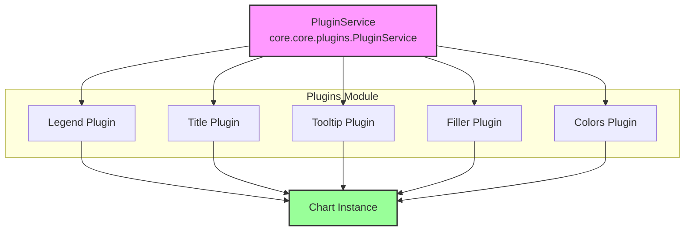
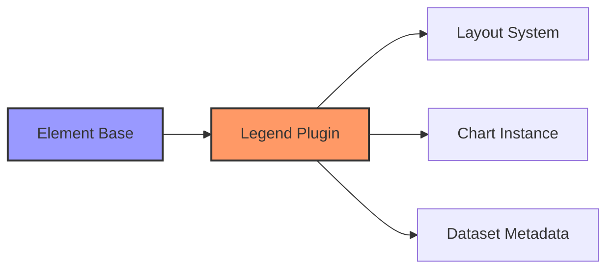
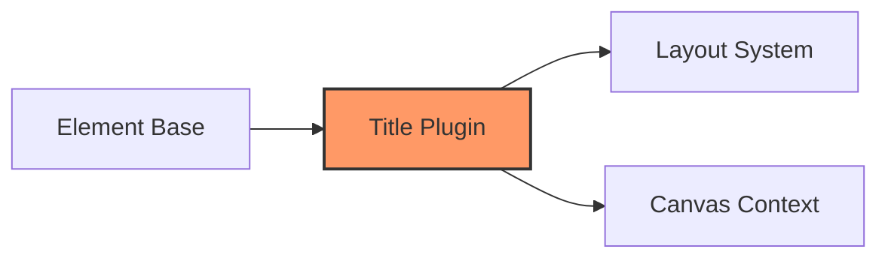
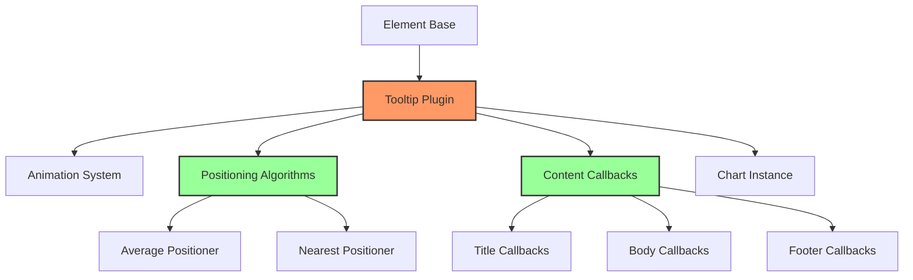
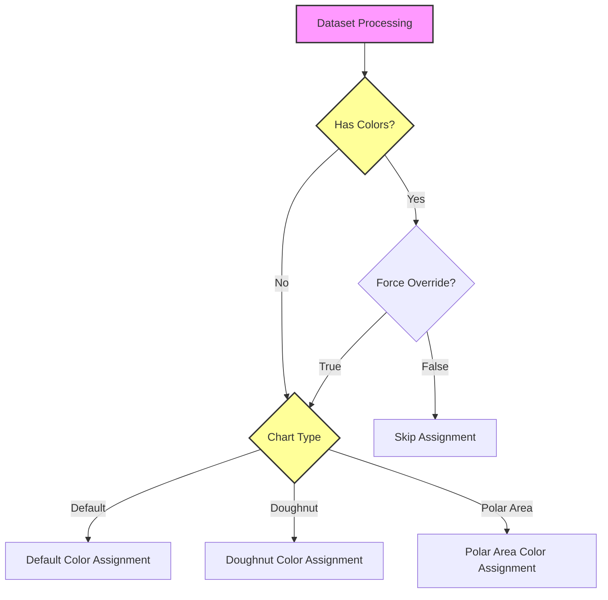
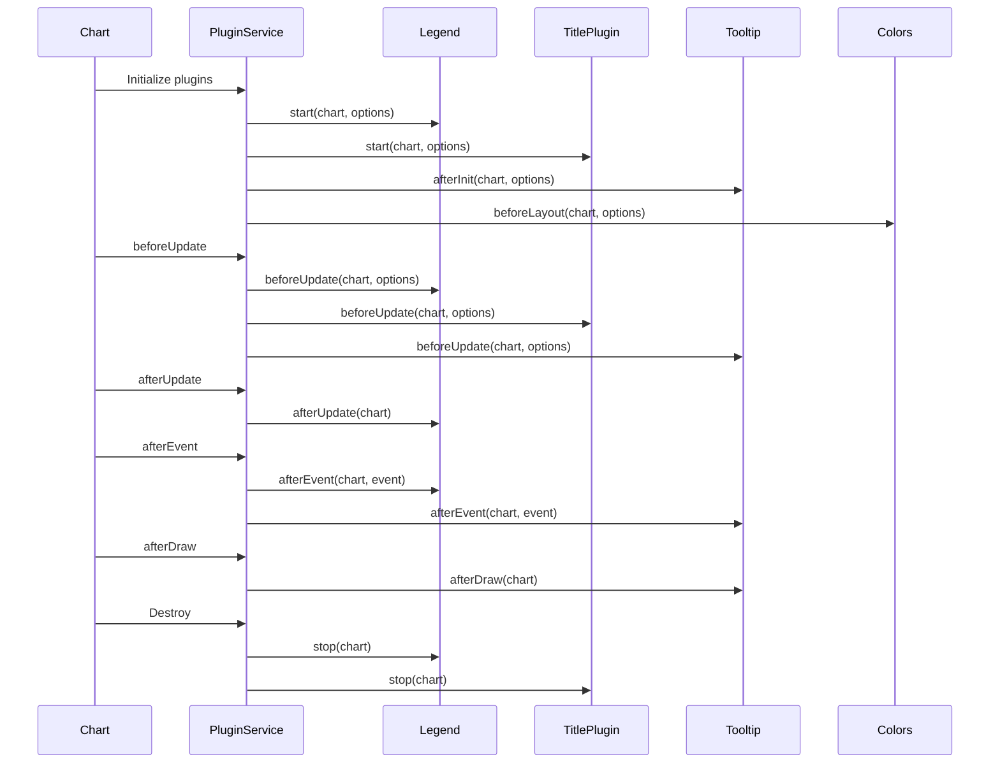

# Plugins Module Documentation

## Overview

The plugins module is a core component of Chart.js that provides essential chart enhancements and interactive features. It implements a plugin-based architecture that allows for modular functionality including legends, titles, tooltips, data filling, and automatic color assignment. These plugins extend the base chart functionality while maintaining loose coupling with the core chart system.

## Module Architecture

The plugins module follows a modular design pattern where each plugin is self-contained yet integrates seamlessly with the chart lifecycle. The architecture is built around the [PluginService](core_engine.md#pluginservice) from the core engine, which manages plugin registration, initialization, and lifecycle events.


```mermaid
graph TB
    subgraph "Plugins Module"
        L[Legend Plugin]
        T[Title Plugin]
        TT[Tooltip Plugin]
        F[Filler Plugin]
        C[Colors Plugin]
    end
    
    PS[PluginService<br/>core.core.plugins.PluginService]
    Chart[Chart Instance]
    
    PS --> L
    PS --> T
    PS --> TT
    PS --> F
    PS --> C
    
    L --> Chart
    T --> Chart
    TT --> Chart
    F --> Chart
    C --> Chart
    
    style PS fill:#f9f,stroke:#333,stroke-width:2px
    style Chart fill:#9f9,stroke:#333,stroke-width:2px
```

## Core Components

### Legend Plugin (src.plugins.plugin.legend.Legend)

The Legend plugin provides interactive chart legends that display dataset information and allow users to toggle dataset visibility. It extends the [Element](core_engine.md#element) base class and integrates with the layout system through [layouts](core_engine.md#layouts).

**Key Features:**
- Interactive dataset toggling (show/hide datasets)
- Configurable positioning (top, bottom, left, right)
- Customizable styling and formatting
- Support for multiple legend items and grouping
- RTL (Right-to-Left) text support
- Point style and color box rendering

**Architecture:**

```mermaid
graph LR
    Legend[Legend Plugin]
    Element[Element Base]
    Layouts[Layout System]
    Chart[Chart Instance]
    Dataset[Dataset Metadata]
    
    Element --> Legend
    Legend --> Layouts
    Legend --> Chart
    Legend --> Dataset
    
    style Legend fill:#f96,stroke:#333,stroke-width:2px
    style Element fill:#99f,stroke:#333,stroke-width:2px
```

**Lifecycle Integration:**
- `start()`: Initializes legend instance and adds to layout system
- `beforeUpdate()`: Configures legend with updated options
- `afterUpdate()`: Rebuilds labels and adjusts hit boxes
- `afterEvent()`: Handles user interactions (click, hover, leave)
- `stop()`: Removes legend from chart and layout system

### Title Plugin (src.plugins.plugin.title.Title)

The Title plugin provides chart titles with support for multiple text lines and various positioning options. It extends the [Element](core_engine.md#element) base class and offers simple yet flexible title rendering.

**Key Features:**
- Single or multi-line text support
- Positioning: top, bottom, left, right
- Customizable fonts, colors, and alignment
- Automatic text rotation for vertical positioning
- Integration with layout system for proper spacing

**Architecture:**

```mermaid
graph LR
    Title[Title Plugin]
    Element[Element Base]
    Layouts[Layout System]
    Canvas[Canvas Context]
    
    Element --> Title
    Title --> Layouts
    Title --> Canvas
    
    style Title fill:#f96,stroke:#333,stroke-width:2px
```

### Tooltip Plugin (src.plugins.plugin.tooltip.Tooltip)

The Tooltip plugin provides interactive data point information display with rich customization options. It extends the [Element](core_engine.md#element) base class and integrates with the animation system through [Animations](animation.md#animations).

**Key Features:**
- Multiple positioning modes (average, nearest)
- Rich content support (title, body, footer)
- Color box and point style rendering
- Customizable callbacks for content generation
- Animation support for smooth transitions
- RTL text support
- External tooltip support for custom rendering

**Architecture:**

```mermaid
graph TB
    Tooltip[Tooltip Plugin]
    Element[Element Base]
    Animations[Animation System]
    Positioners[Positioning Algorithms]
    Callbacks[Content Callbacks]
    Chart[Chart Instance]
    
    Element --> Tooltip
    Tooltip --> Animations
    Tooltip --> Positioners
    Tooltip --> Callbacks
    Tooltip --> Chart
    
    Positioners --> Average[Average Positioner]
    Positioners --> Nearest[Nearest Positioner]
    
    Callbacks --> TitleCB[Title Callbacks]
    Callbacks --> BodyCB[Body Callbacks]
    Callbacks --> FooterCB[Footer Callbacks]
    
    style Tooltip fill:#f96,stroke:#333,stroke-width:2px
    style Positioners fill:#9f9,stroke:#333,stroke-width:2px
    style Callbacks fill:#9f9,stroke:#333,stroke-width:2px
```

**Positioning Algorithms:**
- **Average**: Calculates the average position of all active elements
- **Nearest**: Finds the element closest to the event position

**Content Structure:**
```
Tooltip Content
├── Title Section
│   ├── beforeTitle
│   ├── title
│   └── afterTitle
├── Body Section
│   ├── beforeBody
│   ├── Body Items (per dataset)
│   │   ├── beforeLabel
│   │   ├── label
│   │   └── afterLabel
│   └── afterBody
└── Footer Section
    ├── beforeFooter
    ├── footer
    └── afterFooter
```

### Filler Plugin (src.plugins.plugin.filler.simpleArc.simpleArc)

The Filler plugin provides arc-based filling functionality for area charts and similar visualizations. It implements a simple arc class that can be used for creating filled regions under or between chart lines.

**Key Features:**
- Arc path generation for canvas rendering
- Interpolation support for smooth curves
- Parameterized arc bounds control
- Integration with chart area calculations

### Colors Plugin (src.plugins.plugin.colors.ColorsPluginOptions)

The Colors plugin automatically assigns colors to datasets that don't have predefined colors. It provides intelligent color cycling based on chart type and dataset characteristics.

**Key Features:**
- Automatic color assignment for datasets
- Chart-type specific color strategies
- Configurable color palettes
- Override options for custom color schemes
- Support for doughnut and polar area charts

**Color Assignment Strategy:**

```mermaid
graph TD
    Start[Dataset Processing]
    CheckColors{Has Colors?}
    CheckOverride{Force Override?}
    CheckType{Chart Type}
    
    Default[Default Color Assignment]
    Doughnut[Doughnut Color Assignment]
    Polar[Polar Area Color Assignment]
    Skip[Skip Assignment]
    
    Start --> CheckColors
    CheckColors -->|Yes| CheckOverride
    CheckColors -->|No| CheckType
    CheckOverride -->|True| CheckType
    CheckOverride -->|False| Skip
    
    CheckType -->|Default| Default
    CheckType -->|Doughnut| Doughnut
    CheckType -->|Polar Area| Polar
    
    style Start fill:#f9f,stroke:#333,stroke-width:2px
    style CheckColors fill:#ff9,stroke:#333,stroke-width:2px
    style CheckType fill:#ff9,stroke:#333,stroke-width:2px
```

## Plugin Integration and Data Flow

The plugins module integrates with the chart system through a well-defined lifecycle that ensures proper initialization, updates, and cleanup.


```mermaid
sequenceDiagram
    participant Chart
    participant PluginService
    participant Legend
    participant TitlePlugin
    participant Tooltip
    participant Colors
    
    Chart->>PluginService: Initialize plugins
    PluginService->>Legend: start(chart, options)
    PluginService->>TitlePlugin: start(chart, options)
    PluginService->>Tooltip: afterInit(chart, options)
    PluginService->>Colors: beforeLayout(chart, options)
    
    Chart->>PluginService: beforeUpdate
    PluginService->>Legend: beforeUpdate(chart, options)
    PluginService->>TitlePlugin: beforeUpdate(chart, options)
    PluginService->>Tooltip: beforeUpdate(chart, options)
    
    Chart->>PluginService: afterUpdate
    PluginService->>Legend: afterUpdate(chart)
    
    Chart->>PluginService: afterEvent
    PluginService->>Legend: afterEvent(chart, event)
    PluginService->>Tooltip: afterEvent(chart, event)
    
    Chart->>PluginService: afterDraw
    PluginService->>Tooltip: afterDraw(chart)
    
    Chart->>PluginService: Destroy
    PluginService->>Legend: stop(chart)
    PluginService->>TitlePlugin: stop(chart)
```

## Dependencies and Interactions

The plugins module has several key dependencies within the Chart.js ecosystem:

### Core Dependencies
- **[Element](core_engine.md#element)**: Base class for all plugin elements
- **[PluginService](core_engine.md#pluginservice)**: Manages plugin lifecycle and registration
- **[Layouts](core_engine.md#layouts)**: Handles positioning and sizing of layout-based plugins
- **[Defaults](core_engine.md#defaults)**: Provides default configuration values

### Helper Dependencies
- **Canvas Helpers**: Drawing utilities for rendering (rounded rectangles, text, points)
- **RTL Helpers**: Right-to-left text support
- **Option Helpers**: Configuration parsing and validation
- **Math Helpers**: Geometric calculations for positioning

### Animation Dependencies
- **[Animations](animation.md#animations)**: Smooth transitions for tooltip movements
- **[Animator](animation.md#animator)**: Animation state management

## Configuration and Customization

Each plugin provides extensive configuration options through the chart options object:

### Legend Configuration
```javascript
options: {
  plugins: {
    legend: {
      display: true,
      position: 'top',
      align: 'center',
      onClick: (e, legendItem, legend) => { /* custom click handler */ },
      onHover: (e, legendItem, legend) => { /* custom hover handler */ },
      labels: {
        color: (ctx) => ctx.chart.options.color,
        boxWidth: 40,
        padding: 10,
        generateLabels: (chart) => { /* custom label generation */ }
      }
    }
  }
}
```

### Tooltip Configuration
```javascript
options: {
  plugins: {
    tooltip: {
      enabled: true,
      position: 'average',
      backgroundColor: 'rgba(0,0,0,0.8)',
      titleColor: '#fff',
      bodyColor: '#fff',
      callbacks: {
        title: (tooltipItems) => { /* custom title */ },
        label: (tooltipItem) => { /* custom label */ }
      }
    }
  }
}
```

### Colors Configuration
```javascript
options: {
  plugins: {
    colors: {
      enabled: true,
      forceOverride: false
    }
  }
}
```

## Best Practices and Usage Guidelines

### Performance Considerations
- **Tooltip Performance**: Use `external` option for complex custom tooltips to avoid canvas rendering overhead
- **Legend Optimization**: Implement custom `generateLabels` for large datasets to reduce processing time
- **Color Assignment**: Disable colors plugin when custom colors are predefined to avoid unnecessary processing

### Accessibility
- **Legend Accessibility**: Ensure legend items have sufficient contrast and clear visual indicators
- **Tooltip Accessibility**: Provide keyboard navigation support through custom event handling
- **Color Accessibility**: Consider color-blind friendly palettes when using automatic color assignment

### Customization Patterns
- **Custom Legend Items**: Override `generateLabels` to create custom legend representations
- **External Tooltips**: Use the `external` callback for DOM-based tooltips with rich content
- **Event Handling**: Leverage plugin event callbacks for custom interactions and integrations

## Integration with Other Modules

The plugins module works closely with other Chart.js modules to provide a cohesive charting experience:

- **[Controllers](controllers.md)**: Plugins interact with dataset controllers for data access and styling
- **[Elements](elements.md)**: Legend and tooltip plugins render element representations
- **[Scales](scales.md)**: Tooltip positioning considers scale boundaries and transformations
- **[Animation](animation.md)**: Smooth transitions for interactive elements

This modular approach ensures that plugins can be easily extended, customized, or replaced while maintaining compatibility with the broader Chart.js ecosystem.