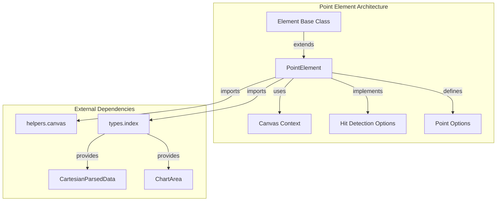
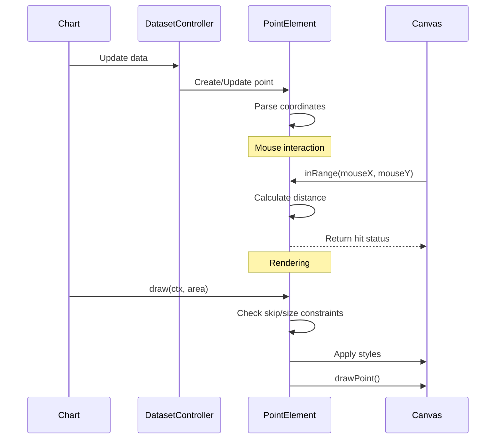
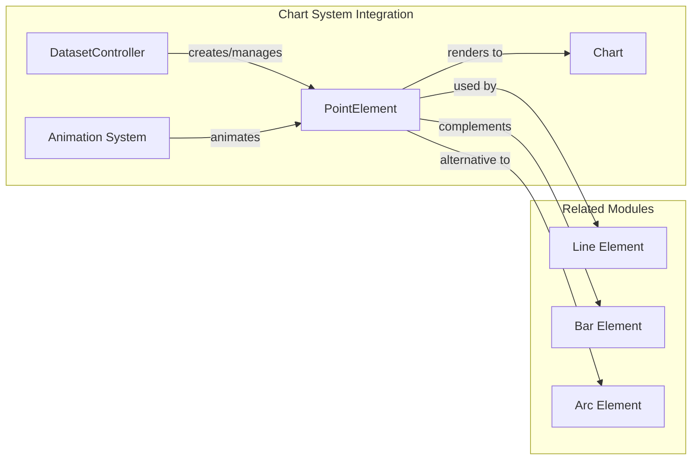

# Point Element Module

## Introduction

The Point Element module is a fundamental component of Chart.js that provides the visual representation and behavior for data points in various chart types. It extends the base Element class and implements the core functionality for rendering, hit detection, and interaction handling of individual data points across different chart configurations.

## Architecture Overview

The PointElement serves as the building block for visualizing data points in scatter plots, line charts, bubble charts, and other chart types that require individual point representation. It encapsulates the geometric properties, styling options, and interaction behaviors specific to data points.



## Component Structure

### Core Component: PointElement

The `PointElement` class extends the base `Element` class and provides specialized functionality for point visualization:

#### Key Properties
- **parsed**: `CartesianParsedData` - Contains the parsed x,y coordinates and data values
- **skip**: `boolean` - Flag to skip rendering this point
- **stop**: `boolean` - Flag to stop processing at this point
- **options**: Configuration object combining `PointOptions` and `PointHoverOptions`

#### Static Configuration
- **id**: `'point'` - Unique identifier for the element type
- **defaults**: Default styling and behavior configuration
- **defaultRoutes**: Color property routing for automatic styling

### Default Configuration

```typescript
static defaults = {
    borderWidth: 1,
    hitRadius: 1,
    hoverBorderWidth: 1,
    hoverRadius: 4,
    pointStyle: 'circle',
    radius: 3,
    rotation: 0
};

static defaultRoutes = {
    backgroundColor: 'backgroundColor',
    borderColor: 'borderColor'
};
```

## Data Flow and Interactions



## Key Methods and Functionality

### Hit Detection Methods

#### `inRange(mouseX: number, mouseY: number, useFinalPosition?: boolean): boolean`
Determines if a mouse position is within the point's hit area using circular collision detection based on radius + hitRadius.

#### `inXRange(mouseX: number, useFinalPosition?: boolean): boolean`
X-axis specific hit detection using the `inRange` helper function.

#### `inYRange(mouseY: number, useFinalPosition?: boolean): boolean`
Y-axis specific hit detection using the `inRange` helper function.

### Rendering Methods

#### `draw(ctx: CanvasRenderingContext2D, area: ChartArea): void`
Renders the point on the canvas with the following logic:
- Skips rendering if `this.skip` is true
- Skips rendering if radius is too small (< 0.1)
- Skips rendering if point is outside the chart area
- Applies border and fill styles
- Uses `drawPoint` helper for actual rendering

#### `size(options?: Partial<PointOptions & PointHoverOptions>): number`
Calculates the total size of the point including radius, hover radius, and border width.

### Utility Methods

#### `getCenterPoint(useFinalPosition?: boolean): Point`
Returns the center coordinates {x, y} of the point.

#### `getRange(): number`
Returns the effective range for hit detection (radius + hitRadius).

## Dependencies and Integration

### Internal Dependencies
- **Element**: Base class providing core element functionality ([element.md](element.md))
- **helpers.canvas**: Utility functions for canvas operations and point drawing

### External Type Dependencies
- **CartesianParsedData**: Parsed data structure from [types.index](../types/types-index.md)
- **ChartArea**: Chart area boundaries from [types.index](../types/types-index.md)
- **PointOptions**: Configuration interface from [types.index](../types/types-index.md)
- **PointHoverOptions**: Hover-specific options from [types.index](../types/types-index.md)

### Integration with Chart System



## Usage Patterns

### In Scatter Charts
Point elements are the primary visual representation, with each data point rendered as an individual point with customizable styling.

### In Line Charts
Point elements mark data vertices along the line path, often with hover effects for interaction.

### In Bubble Charts
Point elements are scaled based on a third data dimension (z-value), with radius dynamically calculated.

## Performance Considerations

### Optimization Strategies
1. **Skip Rendering**: Points can be marked to skip rendering for performance
2. **Size Constraints**: Points smaller than 0.1 radius are automatically skipped
3. **Area Clipping**: Points outside the chart area are not rendered
4. **Hit Radius**: Separate hit radius allows for precise interaction without large visual elements

### Memory Management
- Parsed data is stored efficiently in the `parsed` property
- Options are shared through prototype chain using static defaults
- Position calculations are cached when `useFinalPosition` is specified

## Extension Points

The PointElement can be extended or customized through:
- **Custom point styles**: Via the `pointStyle` option
- **Hover effects**: Through hover-specific options
- **Custom rendering**: By overriding the `draw` method
- **Hit detection**: By customizing radius and hitRadius values

## Related Documentation
- [Element Base Class](element.md) - Core element functionality
- [Line Element](line-element.md) - Line visualization using points
- [Bar Element](bar-element.md) - Bar chart elements
- [Arc Element](arc-element.md) - Circular chart elements
- [Animation System](../animation-system.md) - Point animation capabilities
- [Dataset Controller](../dataset-controller.md) - Point management and data binding