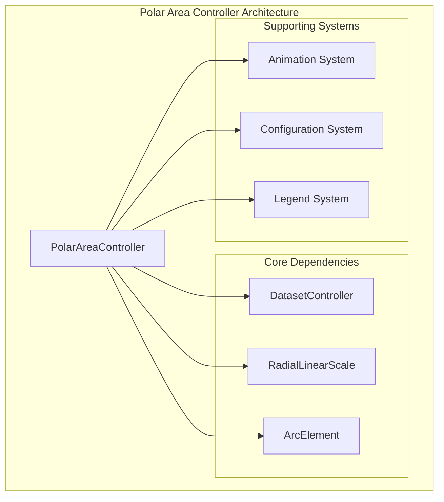
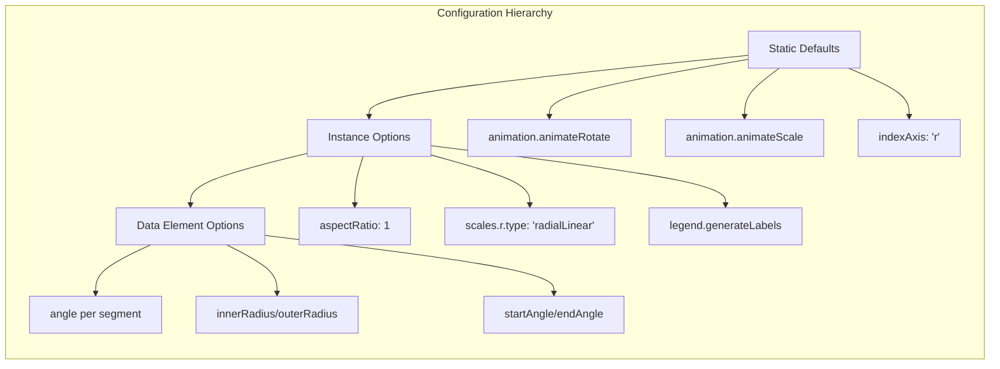
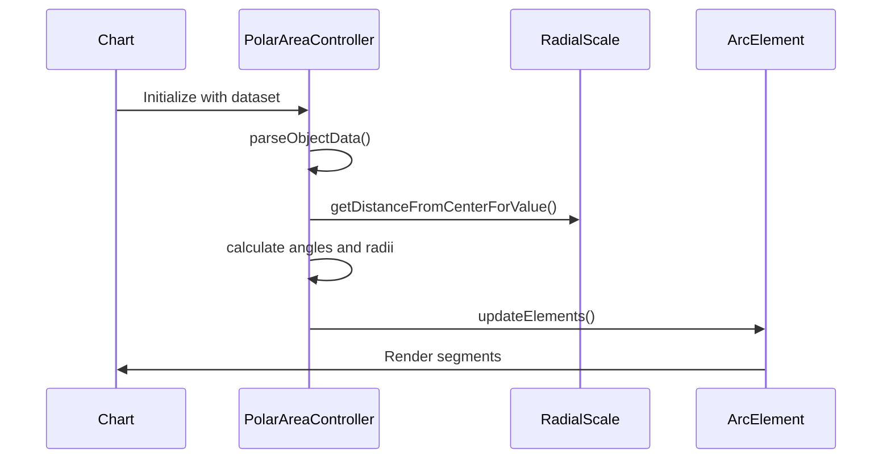
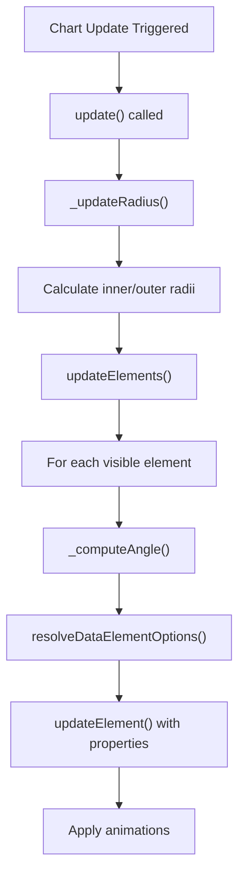
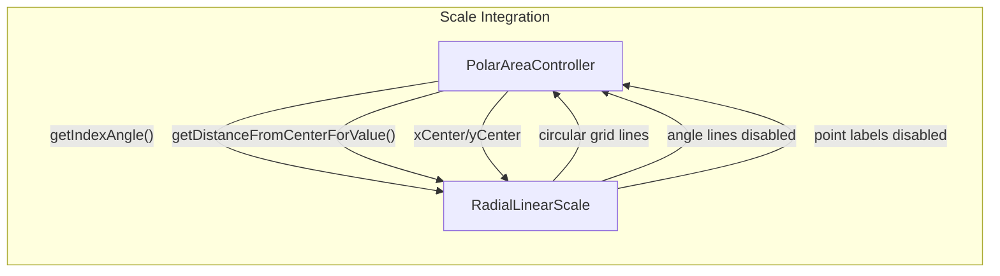
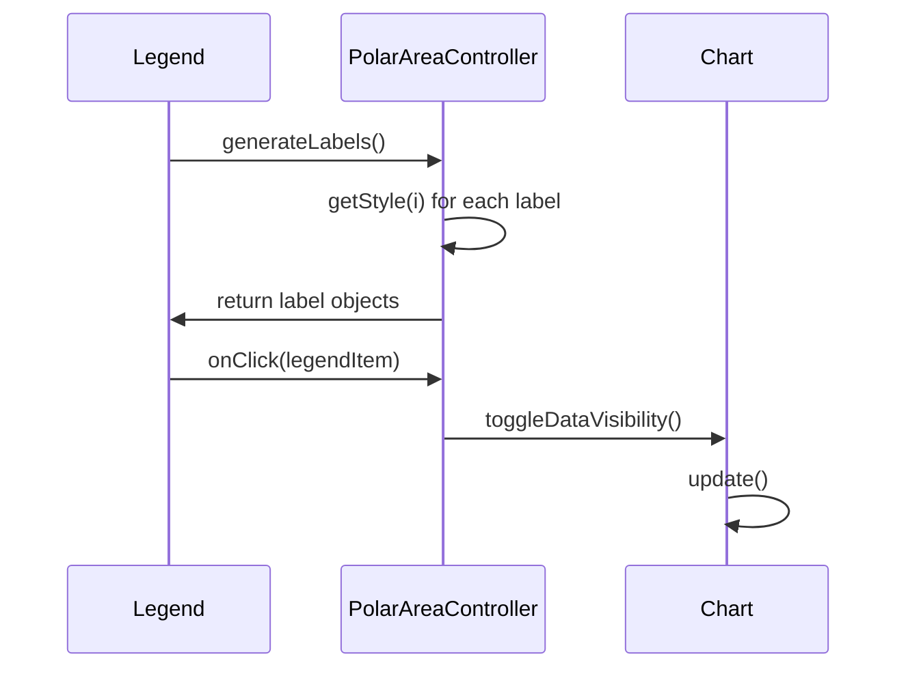

# Polar Area Controller Module

## Introduction

The Polar Area Controller module is a specialized chart controller within the Chart.js ecosystem that handles the creation and management of polar area charts. Polar area charts are circular charts that display data as segments of a circle, where each segment's angle represents the data value and the radius can be used to represent additional dimensions. This controller extends the base DatasetController to provide polar area-specific functionality including radial scaling, angular calculations, and specialized animations.

## Architecture Overview

The PolarAreaController is built on top of the core dataset controller architecture and integrates with several key systems within Chart.js:



## Component Details

### PolarAreaController Class

The `PolarAreaController` is the main component that orchestrates polar area chart functionality. It extends the base `DatasetController` class and provides specialized methods for handling radial data, angular calculations, and polar-specific animations.

**Key Responsibilities:**
- Data parsing and validation for radial scales
- Angular segment calculations and positioning
- Radius calculations based on chart dimensions
- Animation coordination for rotate and scale effects
- Integration with radial linear scales
- Legend integration for data visibility toggling

### Configuration Structure

The controller defines several configuration levels:



## Data Flow and Processing

### Data Parsing Flow



### Update Cycle

The controller follows a structured update cycle for processing data changes:



## Key Methods and Algorithms

### Radius Calculation Algorithm

The `_updateRadius()` method implements a sophisticated algorithm to calculate segment radii:

```javascript
// Pseudo-algorithm
outerRadius = max(minSize / 2, 0)
innerRadius = max(outerRadius * cutoutPercentage / 100, 0)
radiusLength = (outerRadius - innerRadius) / visibleDatasetCount
this.outerRadius = outerRadius - (radiusLength * datasetIndex)
this.innerRadius = this.outerRadius - radiusLength
```

### Angular Calculation

The controller calculates angles for each segment based on data visibility:

```javascript
// Default angle per visible element
defaultAngle = 360 / countVisibleElements()

// Individual segment angle
_computeAngle(index, mode, defaultAngle) {
  return isVisible ? toRadians(options.angle || defaultAngle) : 0
}
```

## Integration Points

### Scale Integration

The PolarAreaController integrates specifically with the RadialLinearScale:



### Legend Integration

The controller provides custom legend generation and interaction:



## Animation System

The controller supports specialized animations for polar area charts:

### Animation Types

1. **Rotate Animation**: Animates the start and end angles of segments
2. **Scale Animation**: Animates the outer radius of segments

### Animation Properties

```javascript
animations: {
  numbers: {
    type: 'number',
    properties: ['x', 'y', 'startAngle', 'endAngle', 'innerRadius', 'outerRadius']
  }
}
```

## Dependencies

The PolarAreaController depends on several core systems:

### Direct Dependencies
- [DatasetController](dataset-controller.md) - Base controller functionality
- [RadialLinearScale](radial-linear-scale.md) - Radial scaling and positioning
- [ArcElement](arc-element.md) - Segment rendering and styling

### Indirect Dependencies
- [Animation System](animation-system.md) - Animation coordination
- [Configuration System](configuration-system.md) - Option resolution
- [Legend System](legend.md) - Legend integration

## Usage Patterns

### Basic Configuration

```javascript
const config = {
  type: 'polarArea',
  data: {
    labels: ['Red', 'Green', 'Yellow', 'Grey', 'Blue'],
    datasets: [{
      label: 'My Dataset',
      data: [11, 16, 7, 3, 14],
      backgroundColor: [
        'rgba(255, 99, 132, 0.5)',
        'rgba(75, 192, 192, 0.5)',
        'rgba(255, 205, 86, 0.5)',
        'rgba(201, 203, 207, 0.5)',
        'rgba(54, 162, 235, 0.5)'
      ]
    }]
  },
  options: {
    responsive: true,
    plugins: {
      legend: {
        position: 'top',
      },
      title: {
        display: true,
        text: 'Chart.js Polar Area Chart'
      }
    }
  }
};
```

### Advanced Configuration

```javascript
const config = {
  type: 'polarArea',
  data: data,
  options: {
    scales: {
      r: {
        startAngle: 30,
        ticks: {
          display: false
        }
      }
    },
    plugins: {
      legend: {
        labels: {
          pointStyle: 'circle'
        }
      }
    },
    animation: {
      animateRotate: true,
      animateScale: true
    }
  }
};
```

## Performance Considerations

### Optimization Strategies

1. **Visibility Tracking**: The controller tracks visible elements to avoid unnecessary calculations
2. **Cached Metadata**: Uses cached meta objects to avoid repeated property access
3. **Efficient Angle Calculations**: Pre-calculates default angles for visible elements
4. **Selective Updates**: Only updates changed elements during animation cycles

### Memory Management

- Reuses arc elements across updates
- Clears temporary calculations after use
- Maintains minimal state between updates

## Extension Points

The PolarAreaController can be extended through:

1. **Custom Scales**: Override the default radial linear scale
2. **Animation Options**: Define custom animation properties
3. **Legend Behavior**: Customize legend generation and interaction
4. **Data Parsing**: Override data parsing for custom data formats

## Error Handling

The controller includes several safeguards:

- Validates data visibility before calculations
- Handles NaN values gracefully
- Provides fallback values for missing configuration
- Validates angle calculations to prevent rendering issues

## Testing Considerations

When testing the PolarAreaController:

1. **Data Visibility**: Test with mixed visible/hidden data points
2. **Animation States**: Verify correct behavior during animations
3. **Scale Integration**: Test with different radial scale configurations
4. **Legend Interaction**: Test legend click handling and data visibility toggling
5. **Edge Cases**: Test with empty datasets, single data points, and invalid data

This comprehensive documentation provides developers with the knowledge needed to understand, implement, and extend the PolarAreaController for creating sophisticated polar area visualizations within the Chart.js framework.