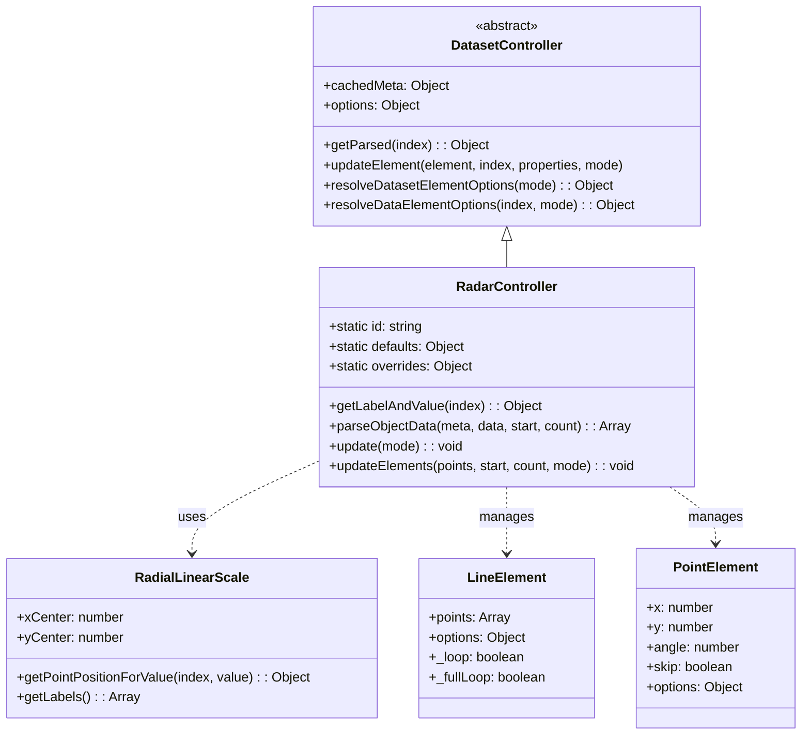
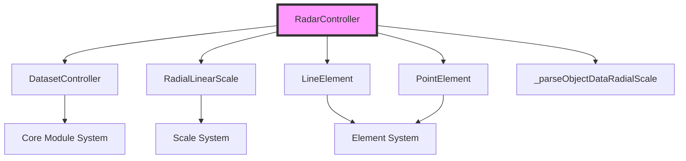
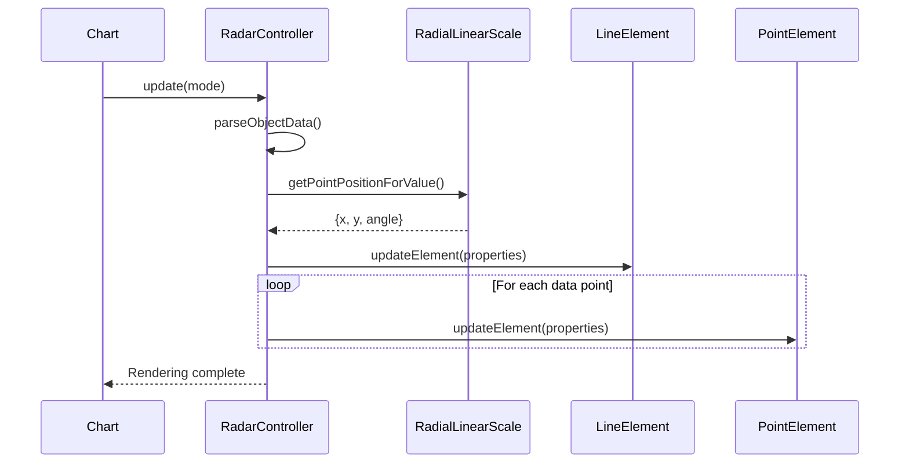
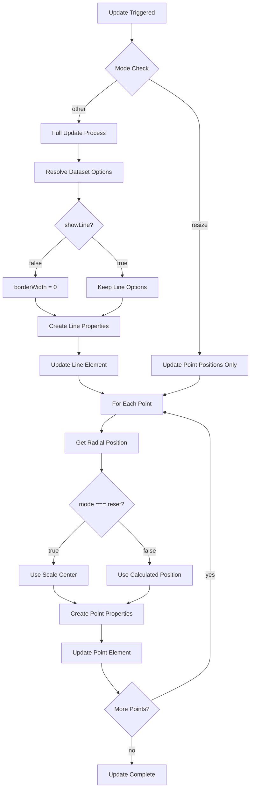
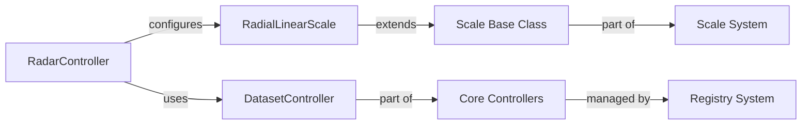

# Radar Controller Module Documentation

## Introduction

The Radar Controller module is a specialized chart controller within the Chart.js ecosystem designed specifically for creating radar charts (also known as spider charts or web charts). This controller extends the base DatasetController to provide functionality for rendering multi-dimensional data in a radial format, where each data point is positioned along axes radiating from a central point.

## Core Architecture

### Component Overview

The RadarController is built on top of the core DatasetController and implements specialized logic for handling radial data positioning, scale management, and element rendering for radar charts.



### Key Dependencies



## Data Flow Architecture

### Data Processing Pipeline



### Element Update Process



## Configuration and Defaults

### Static Configuration

The RadarController defines specific defaults and overrides that distinguish it from other chart types:

```javascript
// Default configuration
{
  datasetElementType: 'line',    // Line element for connecting data points
  dataElementType: 'point',      // Point elements for data values
  indexAxis: 'r',                // Radial axis as primary index
  showLine: true,                // Display connecting lines
  elements: {
    line: {
      fill: 'start'              // Fill area from line to center
    }
  }
}

// Override configuration
{
  aspectRatio: 1,                // Square aspect ratio
  scales: {
    r: {
      type: 'radialLinear'       // Radial linear scale
    }
  }
}
```

## Core Functionality

### Data Parsing and Processing

The RadarController utilizes the `_parseObjectDataRadialScale` helper function to properly interpret data for radial display. This ensures that data points are correctly mapped to the radial scale system.

### Element Management

The controller manages two primary element types:

1. **Line Element**: Connects all data points in a closed loop, creating the characteristic radar/web appearance
2. **Point Elements**: Individual data points positioned along radial axes

### Coordinate System

Unlike Cartesian charts, the RadarController operates in a polar coordinate system where:
- Position is determined by angle and distance from center
- The `r` scale (RadialLinearScale) handles value-to-position conversion
- Each data point's position is calculated using `getPointPositionForValue()`

## Integration with Chart.js Ecosystem

### Scale System Integration



### Element System Integration

The controller works with the element system to render visual components:

- **LineElement**: Handles the connecting lines between points
- **PointElement**: Manages individual data point markers
- Both elements inherit from the base Element class and support the Chart.js animation system

## Usage Patterns

### Chart Configuration

```javascript
// Typical radar chart configuration
{
  type: 'radar',
  data: {
    labels: ['Speed', 'Power', 'Agility', 'Stamina', 'Strength'],
    datasets: [{
      label: 'Player A',
      data: [90, 80, 85, 70, 95]
    }]
  },
  options: {
    scales: {
      r: {
        beginAtZero: true,
        max: 100
      }
    }
  }
}
```

### Data Format

The RadarController expects data in a format compatible with radial scales, where each data point corresponds to a label on the radial axis.

## Performance Considerations

### Optimization Strategies

1. **Resize Handling**: The controller optimizes resize operations by only updating point positions without recalculating other properties
2. **Loop Detection**: Automatically detects when the dataset forms a complete loop for proper line rendering
3. **Skip Logic**: Points with invalid coordinates are automatically skipped during rendering

### Memory Management

The controller efficiently manages element updates by:
- Reusing existing elements when possible
- Only updating changed properties
- Properly handling element lifecycle through the base DatasetController

## Error Handling

### Data Validation

The controller includes built-in validation:
- NaN checking for point coordinates
- Graceful handling of missing data points
- Automatic skip logic for invalid positions

### Scale Compatibility

The controller enforces the use of RadialLinearScale for the 'r' axis, ensuring proper radial data representation.

## Related Modules

- [Dataset Controller](dataset-controller.md) - Base controller class
- [Scale System](scale-system.md) - Radial scale implementation
- [Element System](element-system.md) - Line and point elements
- [Animation System](animation-system.md) - Element animation support
- [Configuration System](configuration-system.md) - Default configuration management

## API Reference

### RadarController Methods

- `getLabelAndValue(index)`: Retrieves label and formatted value for a data point
- `parseObjectData(meta, data, start, count)`: Parses data for radial scale compatibility
- `update(mode)`: Updates chart elements based on current data and options
- `updateElements(points, start, count, mode)`: Updates individual point elements

### Static Properties

- `id`: Controller identifier ('radar')
- `defaults`: Default configuration object
- `overrides`: Configuration overrides for radar charts

This documentation provides a comprehensive understanding of the RadarController module's architecture, functionality, and integration within the Chart.js framework.