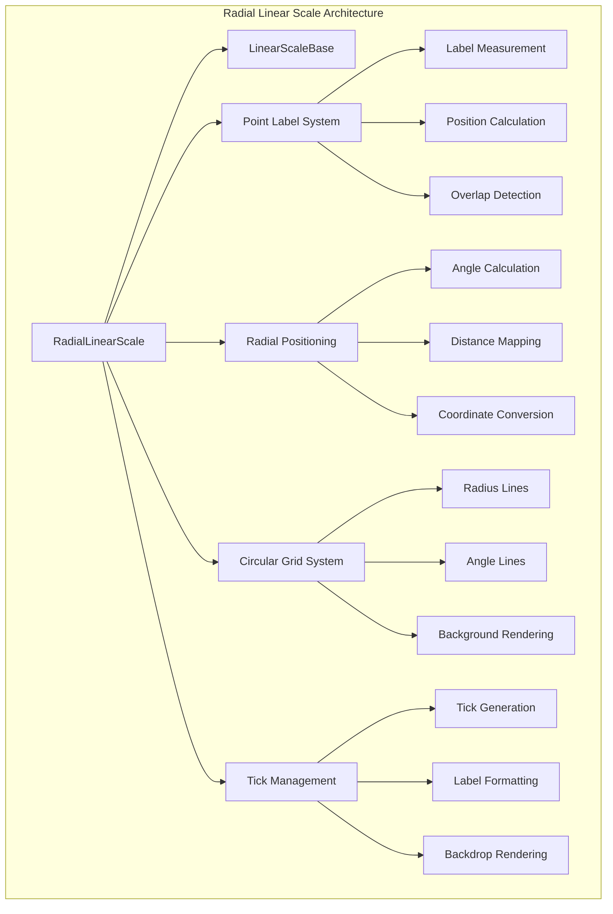
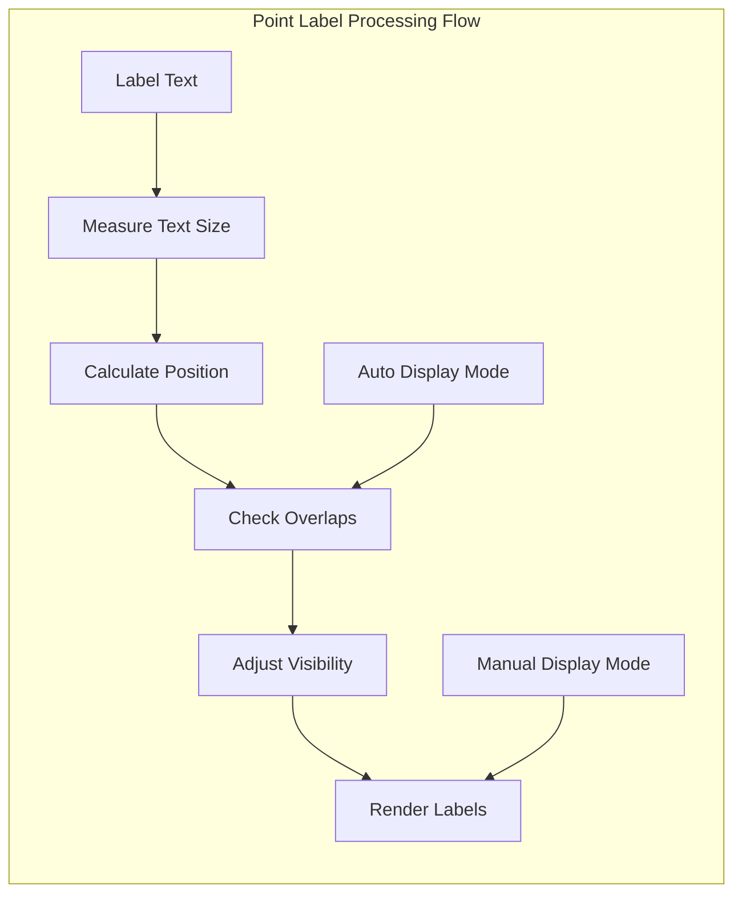
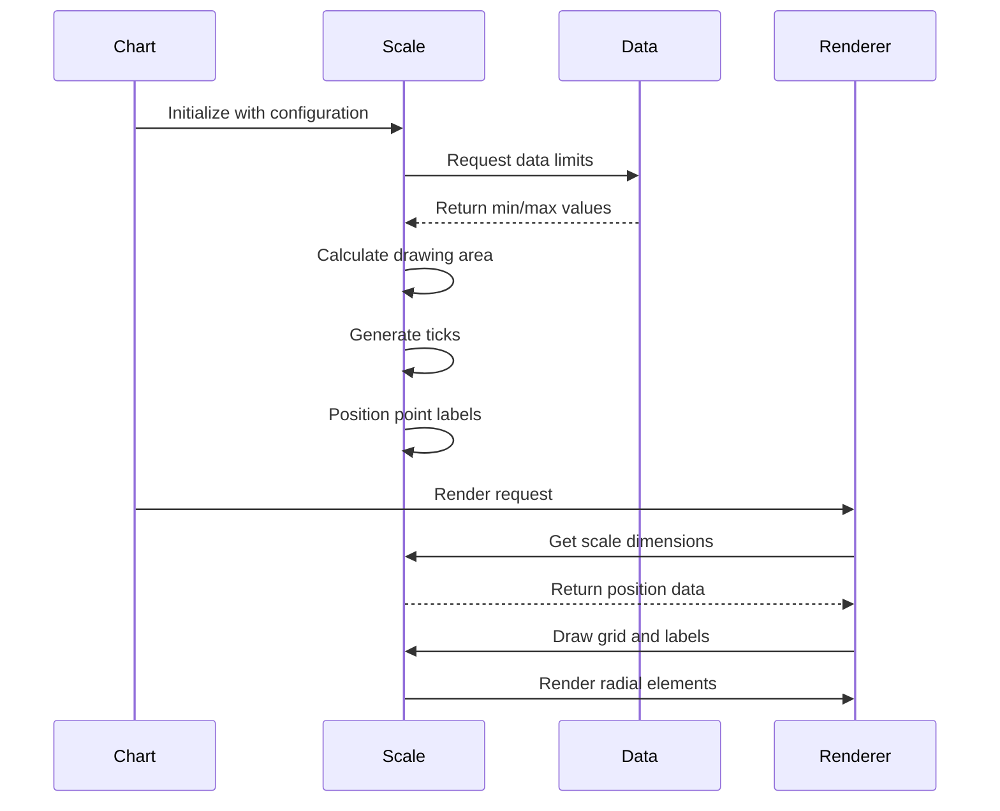
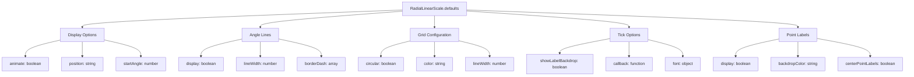
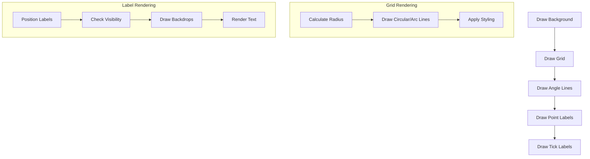

# Radial Linear Scale Module

## Introduction

The Radial Linear Scale module provides a specialized scale implementation for Chart.js that displays linear numerical data in a radial (circular) layout. This scale is primarily used in polar area charts and radar charts, where data points are positioned along radius lines emanating from a central point. The scale combines linear value mapping with angular positioning to create intuitive circular visualizations.

## Architecture Overview

The RadialLinearScale extends the LinearScaleBase class and implements specialized functionality for radial positioning, point label management, and circular grid rendering. The architecture follows a hierarchical design where the scale manages both the linear value domain and the spatial positioning of elements in polar coordinates.



## Core Components

### RadialLinearScale Class

The main scale implementation that provides radial linear scaling functionality. This class extends LinearScaleBase and adds specialized methods for polar coordinate handling, point label positioning, and circular grid rendering.

**Key Properties:**
- `xCenter`, `yCenter`: Center coordinates of the radial scale
- `drawingArea`: The radius of the drawing area
- `_pointLabels`: Array of point labels for each axis
- `_pointLabelItems`: Calculated positions and dimensions for point labels

**Key Methods:**
- `getIndexAngle()`: Calculates the angle for a given data index
- `getDistanceFromCenterForValue()`: Maps data values to radial distances
- `getPointPosition()`: Converts polar coordinates to cartesian coordinates
- `fitWithPointLabels()`: Optimizes scale positioning to accommodate labels

### Point Label System

The point label system manages the positioning and rendering of labels around the perimeter of the radial scale. It includes sophisticated overlap detection and automatic positioning algorithms.



### Radial Positioning Engine

Converts between data values, angles, and screen coordinates. The engine handles the mathematical transformations required for polar coordinate systems.

**Coordinate Transformations:**
- Value to Distance: Maps data values to radial distances from center
- Index to Angle: Converts data indices to angular positions
- Polar to Cartesian: Transforms polar coordinates to screen coordinates

## Data Flow



## Configuration System

The RadialLinearScale provides extensive configuration options through a hierarchical defaults system:



## Rendering Pipeline

The rendering process follows a structured pipeline that handles different visual elements in a specific order:



## Integration with Chart System

The RadialLinearScale integrates with the broader Chart.js ecosystem through well-defined interfaces:

### Scale System Integration
- Extends [LinearScaleBase](linear-scale.md#linearscalebase) for core linear scaling functionality
- Implements the [Scale](core.md#scale) interface for chart integration
- Uses [Ticks](core.md#ticks) for tick generation and formatting

### Chart Controller Integration
- Works with [PolarAreaController](polar-area-controller.md) for polar area charts
- Integrates with [RadarController](radar-controller.md) for radar charts
- Coordinates with [DatasetController](core.md#datasetcontroller) for data management

### Helper System Dependencies
- [Canvas Helpers](helpers.md#canvas-helpers) for text measurement and rendering
- [Math Helpers](helpers.md#math-helpers) for angle and coordinate calculations
- [Options Helpers](helpers.md#options-helpers) for configuration processing

## Performance Optimizations

The RadialLinearScale implements several performance optimizations:

### Label Overlap Detection
- Automatic visibility management for overlapping labels
- Configurable display modes ('auto' vs 'manual')
- Efficient bounding box calculations

### Caching Strategies
- Pre-calculated label positions stored in `_pointLabelItems`
- Reused angle calculations for positioning
- Optimized text measurement operations

### Rendering Optimizations
- Conditional rendering based on visibility
- Efficient path generation for circular grids
- Minimal context state changes during drawing

## Usage Examples

### Basic Configuration
```javascript
const config = {
  type: 'radar',
  data: data,
  options: {
    scales: {
      r: {
        type: 'radialLinear',
        beginAtZero: true,
        max: 100,
        ticks: {
          stepSize: 20
        },
        pointLabels: {
          font: {
            size: 14
          }
        }
      }
    }
  }
};
```

### Advanced Customization
```javascript
const config = {
  scales: {
    r: {
      type: 'radialLinear',
      startAngle: 90,
      grid: {
        circular: true,
        color: 'rgba(0, 0, 0, 0.1)'
      },
      angleLines: {
        display: true,
        lineWidth: 2
      },
      pointLabels: {
        display: true,
        centerPointLabels: true,
        backdropColor: 'white',
        backdropPadding: 4
      },
      ticks: {
        showLabelBackdrop: true,
        backdropColor: 'rgba(255, 255, 255, 0.8)'
      }
    }
  }
};
```

## Mathematical Foundations

The RadialLinearScale relies on several mathematical concepts:

### Polar Coordinate System
- Conversion between cartesian (x, y) and polar (r, θ) coordinates
- Angle normalization to ensure consistent positioning
- Distance calculations for value mapping

### Label Positioning Algorithm
The `fitWithPointLabels` function implements a sophisticated algorithm that:
1. Calculates the maximum possible radius for the chart
2. Measures all label dimensions
3. Determines label positions around the perimeter
4. Adjusts the chart radius to prevent label overlap
5. Centers the chart within the available space

### Overlap Detection
Uses bounding box intersection tests to determine label visibility, with optimizations for radial layouts where labels are positioned around a circle.

## Error Handling

The RadialLinearScale includes robust error handling for edge cases:
- Invalid data values (NaN, Infinity) are filtered out
- Missing labels are handled gracefully with fallback to empty strings
- Invalid angles are normalized to valid ranges
- Division by zero is prevented in scaling calculations

## Extension Points

The RadialLinearScale provides several extension points for customization:

### Custom Tick Formatters
```javascript
ticks: {
  callback: function(value, index, values) {
    return customFormat(value);
  }
}
```

### Point Label Callbacks
```javascript
pointLabels: {
  callback: function(label, index) {
    return customLabelTransform(label, index);
  }
}
```

### Context-based Styling
All visual elements support context-based configuration that can access the current data point, index, and chart state for dynamic styling decisions.

## Related Documentation

- [Linear Scale Base](linear-scale.md) - Base class providing linear scaling functionality
- [Core Scale System](core.md#scale-system) - General scale architecture and interfaces
- [Polar Area Controller](polar-area-controller.md) - Chart controller for polar area charts
- [Radar Controller](radar-controller.md) - Chart controller for radar charts
- [Canvas Helpers](helpers.md#canvas-helpers) - Text measurement and rendering utilities
- [Math Helpers](helpers.md#math-helpers) - Mathematical utility functions