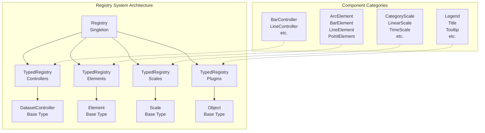
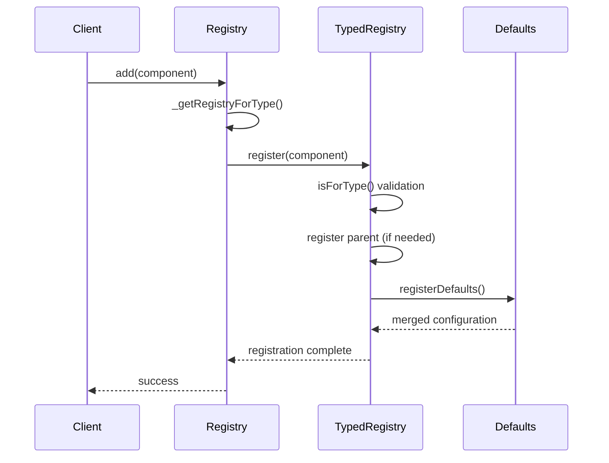
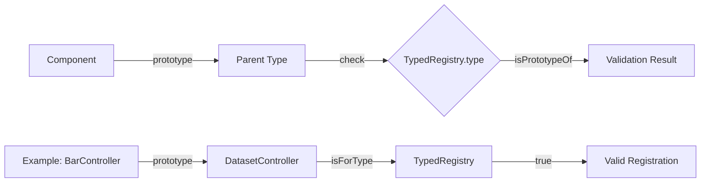
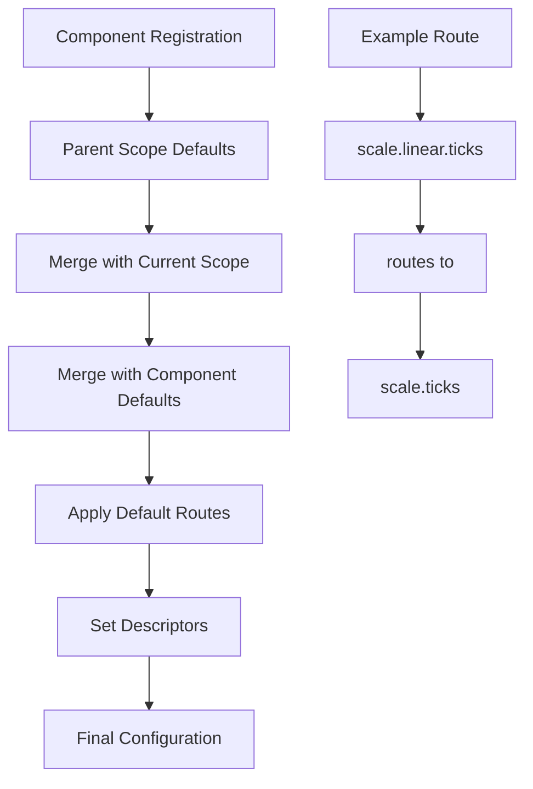

# Registry System Module

## Introduction

The registry-system module is the central component management and registration system for Chart.js. It provides a unified mechanism for registering, managing, and retrieving chart components including controllers, elements, scales, and plugins. This module serves as the backbone for the extensible architecture of Chart.js, enabling dynamic component registration and dependency management.

## Architecture Overview

The registry system is built around two main classes that work together to provide type-safe component registration and management:

- **Registry**: The main singleton that coordinates all component registration
- **TypedRegistry**: Specialized registries for different component types



## Core Components

### Registry Class

The `Registry` class is the main entry point for all component registration operations. It provides a unified API for registering and retrieving different types of chart components.

**Key Responsibilities:**
- Coordinate registration across all typed registries
- Provide type-specific registration methods
- Handle component lifecycle hooks (before/after registration)
- Manage fallback registration for plugins

**Core Methods:**
- `add()`: Generic registration method
- `addControllers()`, `addElements()`, `addPlugins()`, `addScales()`: Type-specific registration
- `getController()`, `getElement()`, `getPlugin()`, `getScale()`: Component retrieval
- `remove*()`: Component unregistration methods

### TypedRegistry Class

The `TypedRegistry` class provides type-safe registration and management for specific categories of components. Each typed registry is responsible for a particular component type and handles inheritance checking.

**Key Responsibilities:**
- Type-safe component registration
- Inheritance validation using prototype chains
- Default configuration management
- Component lifecycle management

**Registration Process:**
1. Validate component type compatibility
2. Register parent components if necessary
3. Store component in registry
4. Process default configurations
5. Handle routing and descriptors

## Data Flow



## Component Registration Process

### Type Validation

The system uses prototype chain checking to ensure type safety:



### Configuration Management

During registration, the system handles complex configuration inheritance:



## Integration with Other Systems

### Configuration System Integration

The registry system works closely with the [configuration-system](configuration-system.md) to manage component defaults and overrides:

- **Defaults Registration**: Component defaults are automatically registered in the configuration system
- **Override Handling**: Components can provide override configurations
- **Route Processing**: Default routes enable configuration inheritance
- **Descriptor Management**: Components can define configuration descriptors

### Plugin System Integration

The registry system integrates with the [plugin-system](plugin-system.md) through:

- **Plugin Registration**: Plugins are registered in a dedicated TypedRegistry
- **Fallback Mechanism**: The plugin registry serves as a fallback for unknown types
- **Lifecycle Hooks**: Plugins can implement before/after registration hooks

## Usage Patterns

### Basic Registration

```javascript
// Register a single component
Chart.register(MyController);

// Register multiple components
Chart.register(MyController, MyElement, MyScale);

// Register from a module
import * as components from './my-components';
Chart.register(components);
```

### Type-Specific Registration

```javascript
// Register only controllers
Chart.register(MyController);

// Register only elements
Chart.register(MyElement);

// Register only scales
Chart.register(MyScale);
```

### Component Retrieval

```javascript
// Get registered components
const Controller = Chart.getController('myController');
const Element = Chart.getElement('myElement');
const Scale = Chart.getScale('myScale');
const Plugin = Chart.getPlugin('myPlugin');
```

## Error Handling

The registry system implements comprehensive error handling:

- **Missing ID**: Components without IDs throw registration errors
- **Type Mismatch**: Incompatible types are rejected during registration
- **Unknown Components**: Retrieval of unregistered components throws descriptive errors
- **Duplicate Registration**: Already registered components are handled gracefully

## Extension Points

The registry system provides several extension mechanisms:

### Custom Component Types

Developers can create custom registries by extending the base patterns:

```javascript
// Custom typed registry
class CustomTypedRegistry extends TypedRegistry {
  constructor() {
    super(MyBaseType, 'custom', true);
  }
}
```

### Registration Hooks

Components can implement lifecycle hooks:

- `beforeRegister()`: Called before registration
- `afterRegister()`: Called after registration
- `beforeUnregister()`: Called before unregistration
- `afterUnregister()`: Called after unregistration

## Performance Considerations

The registry system is optimized for performance:

- **Singleton Pattern**: Single instance reduces memory overhead
- **Prototype Chain Caching**: Type checking is optimized through prototype inspection
- **Lazy Registration**: Components are only processed when needed
- **Efficient Lookups**: Direct property access for component retrieval

## Dependencies

The registry system depends on several core modules:

- **[Configuration System](configuration-system.md)**: For managing component defaults
- **[Core Helpers](helpers.md)**: For utility functions (merge, each, callback, capitalize)
- **[Dataset Controller](datasetController.md)**: Base type for chart controllers
- **[Element](element.md)**: Base type for chart elements
- **[Scale](scale.md)**: Base type for chart scales

## Type Definitions

The registry system exports comprehensive TypeScript definitions:

- `Registry`: Main registry class with all registration methods
- `TypedRegistry`: Base typed registry implementation
- `IChartComponent`: Interface for registerable components
- Component-specific type guards and helpers

This type system ensures compile-time safety and provides excellent IDE support for component registration and retrieval operations.