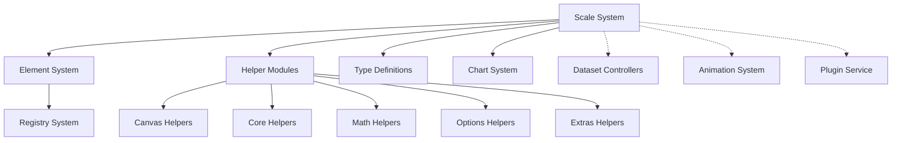
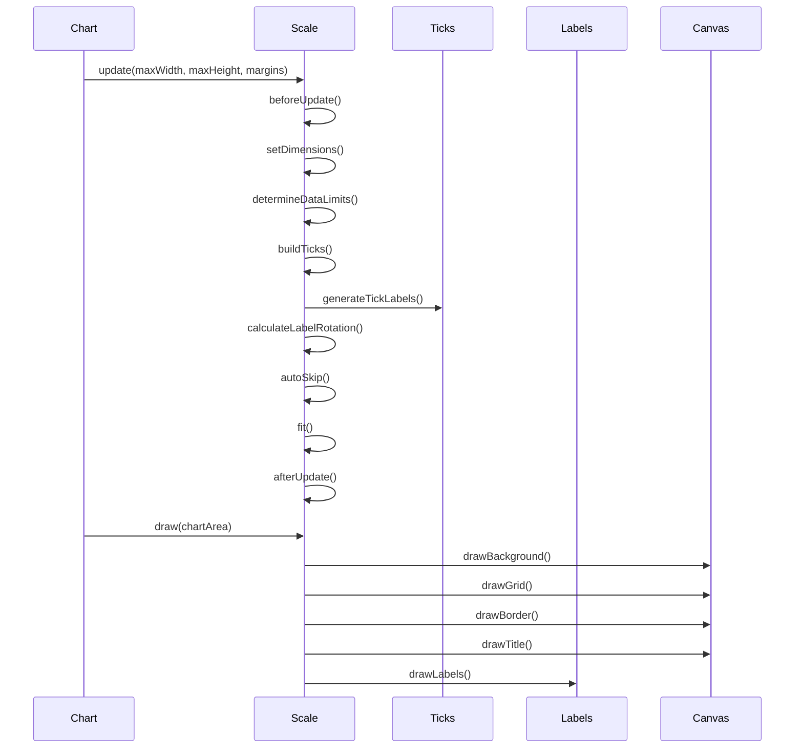
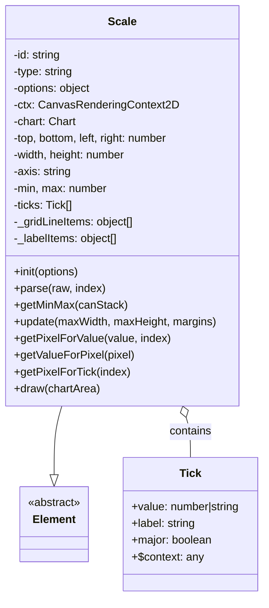
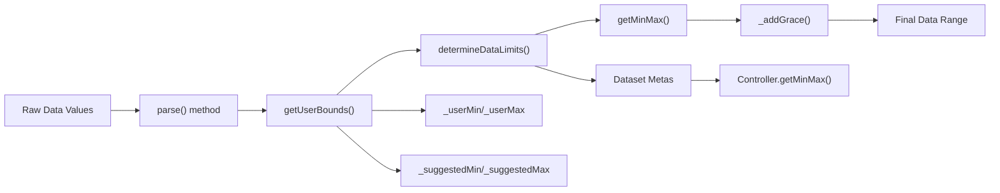
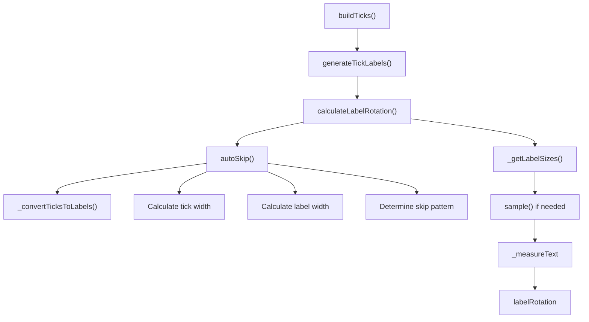
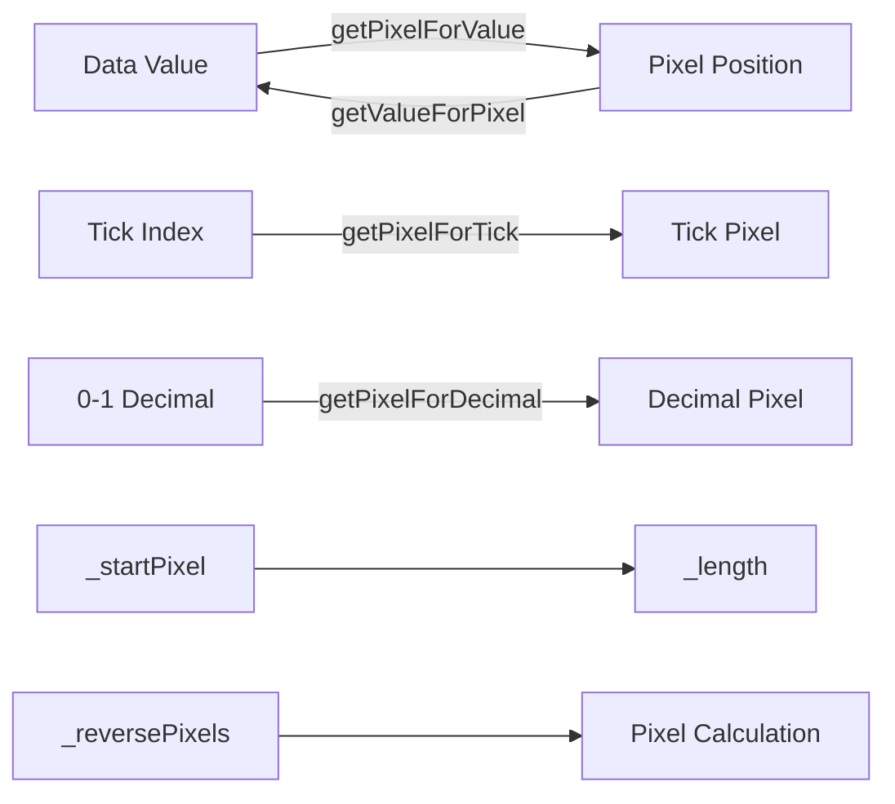
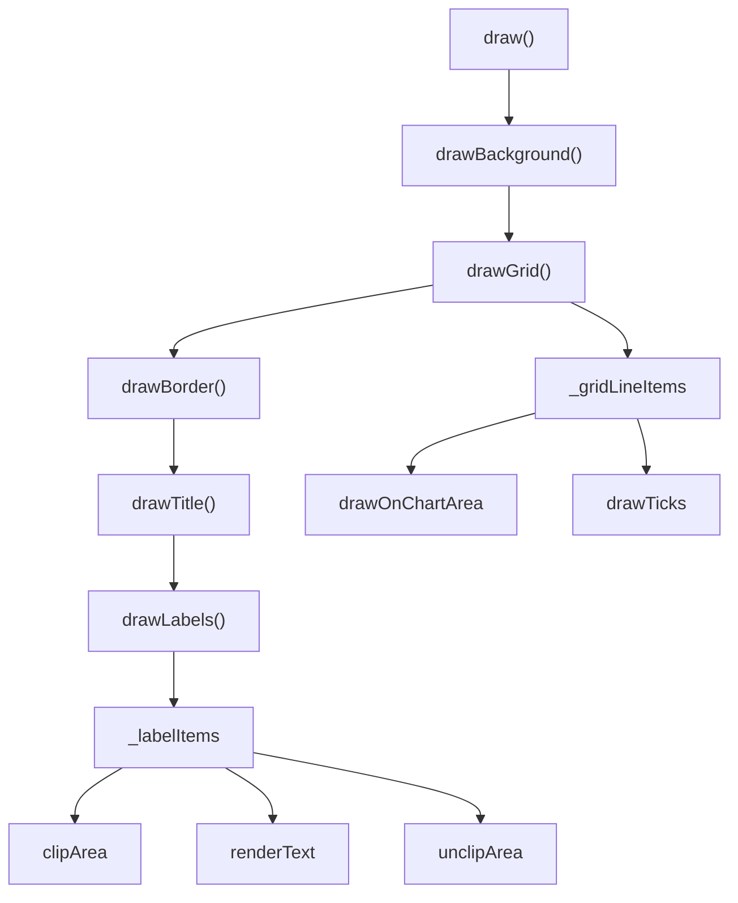

# Scale System Module Documentation

## Introduction

The scale-system module is a fundamental component of Chart.js that provides the core functionality for chart axes and data scaling. It serves as the base class for all scale types (linear, logarithmic, category, time, etc.) and handles the complex logic of data transformation, tick generation, label rendering, and coordinate mapping between data values and pixel positions.

The Scale class acts as an abstract base that defines the interface and common behavior for all scale implementations, providing a consistent API for data visualization across different chart types and scale configurations.

## Architecture Overview

### Core Components

The scale-system module is built around the `Scale` class, which extends the `Element` base class and provides comprehensive functionality for:

- **Data Processing**: Parsing, validating, and determining data limits
- **Tick Management**: Generating, filtering, and positioning tick marks
- **Label Rendering**: Calculating label dimensions, rotation, and positioning
- **Coordinate Mapping**: Converting between data values and pixel coordinates
- **Visual Elements**: Drawing grid lines, borders, titles, and labels
- **Layout Management**: Handling scale dimensions, padding, and margins

### Module Dependencies

### Scale Lifecycle and Data Flow

## Component Structure

### Scale Class Architecture

### Key Properties and Configuration

The Scale class maintains numerous properties that define its behavior and appearance:

**Dimensional Properties:**
- `top`, `bottom`, `left`, `right`: Position within the chart
- `width`, `height`: Scale dimensions
- `maxWidth`, `maxHeight`: Maximum allowed dimensions
- `_margins`: Space reserved for other chart elements

**Data Properties:**
- `min`, `max`: Data range boundaries
- `_userMin`, `_userMax`: User-defined range limits
- `_suggestedMin`, `_suggestedMax`: Suggested range extensions
- `ticks`: Array of tick objects with values and labels

**Rendering Properties:**
- `labelRotation`: Calculated rotation angle for labels
- `_gridLineItems`: Computed grid line positions and styles
- `_labelItems`: Computed label positions and styles
- `_labelSizes`: Cached label dimension measurements

## Core Functionality

### Data Processing Pipeline

### Tick Generation and Management

The scale system implements a sophisticated tick generation mechanism:

1. **Tick Building**: `buildTicks()` method generates initial tick array
2. **Label Conversion**: `generateTickLabels()` converts tick values to display labels
3. **Auto-Skipping**: `autoSkip()` algorithm removes overlapping ticks
4. **Rotation Calculation**: `calculateLabelRotation()` determines optimal label angle

### Coordinate Mapping System

The scale provides bidirectional coordinate mapping between data values and pixel positions:

- **Data to Pixel**: `getPixelForValue(value, index)` → pixel position
- **Pixel to Data**: `getValueForPixel(pixel)` → data value
- **Tick to Pixel**: `getPixelForTick(index)` → pixel position for specific tick
- **Decimal to Pixel**: `getPixelForDecimal(decimal)` → pixel for relative position (0-1)

### Rendering Pipeline

The scale rendering process follows a layered approach:

1. **Background**: Optional background color fill
2. **Grid Lines**: Major and minor grid lines with styling
3. **Border**: Scale axis border
4. **Title**: Scale title with positioning and styling
5. **Labels**: Tick labels with rotation, alignment, and backdrop

## Integration with Other Systems

### Chart System Integration

The scale system integrates closely with the main chart system:

- **Chart Updates**: Scales are updated during chart layout and rendering cycles
- **Dataset Controllers**: Controllers provide data limits and formatting information
- **Plugin System**: Plugins can hook into scale lifecycle events
- **Animation System**: Scale changes can be animated through the animation framework

### Registry System Integration

Scales are managed through the registry system, allowing for:

- **Scale Registration**: New scale types can be registered at runtime
- **Scale Lookup**: Charts can retrieve scale instances by ID
- **Type Safety**: Typed registry ensures correct scale type usage

### Configuration System Integration

Scale behavior is controlled through the configuration system:

- **Defaults**: Global scale defaults can be configured
- **Chart Options**: Individual chart scale options override defaults
- **Context-Aware Options**: Options can be functions that receive context

## Specialized Scale Types

The base Scale class is extended by various specialized scale types, each implementing specific behavior:

- **CategoryScale**: For categorical data with discrete labels
- **LinearScale**: For numerical data with linear progression
- **LogarithmicScale**: For data spanning multiple orders of magnitude
- **TimeScale**: For time-series data with date/time values
- **RadialLinearScale**: For radial charts like radar and polar area

## Performance Considerations

### Optimization Strategies

1. **Label Sampling**: For large datasets, labels are sampled to improve performance
2. **Caching**: Label sizes and other computed values are cached
3. **Auto-Skipping**: Intelligent tick skipping prevents label overlap
4. **Garbage Collection**: Unused cache entries are periodically cleaned up

### Memory Management

- **Cache Management**: `_longestTextCache` stores text measurements
- **Item Arrays**: `_gridLineItems` and `_labelItems` are computed once per update
- **Context Objects**: Scale and tick contexts are created on-demand

## Error Handling and Edge Cases

### Data Validation

- **Invalid Values**: Non-finite values are handled gracefully
- **Empty Datasets**: Scales handle empty or undefined data
- **Mixed Data Types**: Scales validate data type consistency

### Rendering Edge Cases

- **Zero Dimensions**: Scales handle zero width/height gracefully
- **Extreme Rotations**: Label rotation is clamped to reasonable angles
- **Overflow Protection**: Pixel calculations include boundary checks

## Extension Points

### Custom Scale Types

Developers can create custom scale types by extending the Scale class:

1. Override `parse()` for custom data parsing
2. Override `buildTicks()` for custom tick generation
3. Override `getPixelForValue()` and `getValueForPixel()` for custom mapping
4. Override `determineDataLimits()` for custom range calculation

### Plugin Hooks

The scale system provides numerous plugin hooks:

- `beforeUpdate`, `afterUpdate`: Scale update lifecycle
- `beforeSetDimensions`, `afterSetDimensions`: Dimension changes
- `beforeDataLimits`, `afterDataLimits`: Data limit calculation
- `beforeBuildTicks`, `afterBuildTicks`: Tick generation
- `beforeTickToLabelConversion`, `afterTickToLabelConversion`: Label creation

## Related Documentation

- [Element System](element-system.md) - Base class that Scale extends
- [Registry System](registry-system.md) - Scale registration and management
- [Configuration System](configuration-system.md) - Scale configuration and defaults
- [Animation System](animation-system.md) - Scale animation capabilities
- [Dataset Controllers](controllers.md) - Integration with data controllers

## API Reference

For detailed API documentation, refer to the TypeScript definitions in the types module, particularly:

- `Scale` interface in [types/index.d.ts](types.md)
- `CartesianScaleOptions` and `RadialScaleOptions`
- `Tick` and `TickOptions` interfaces
- Scale context types for plugin development