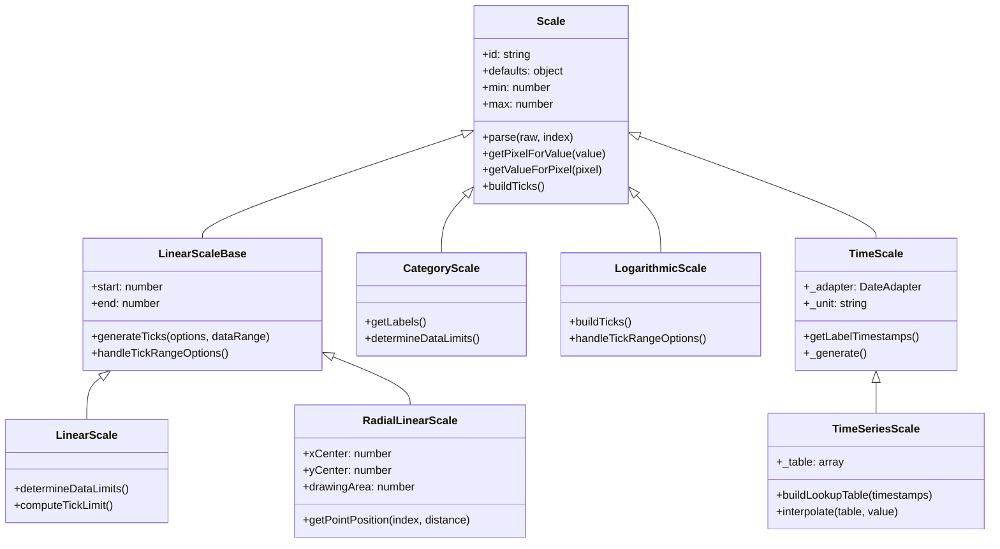
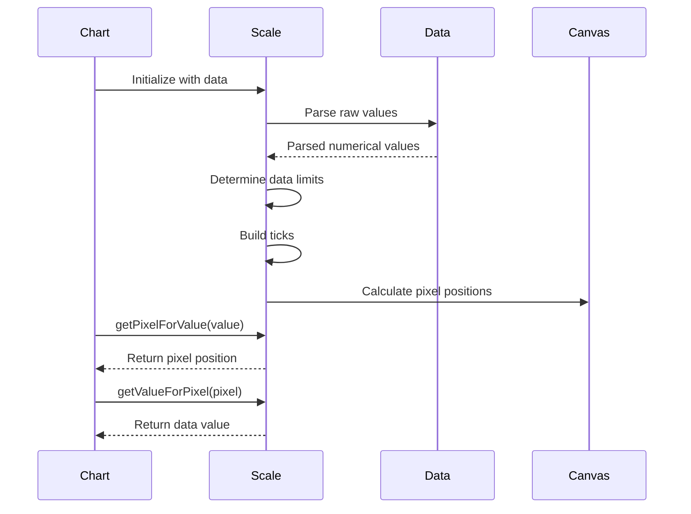

# Scales Module Documentation

## Overview

The scales module is a fundamental component of the Chart.js library that provides the axis system for charts. It handles the mapping between data values and pixel positions, manages tick generation, and provides various scale types to accommodate different data types and chart configurations.

## Purpose

Scales serve as the bridge between abstract data values and their visual representation on the chart canvas. They are responsible for:

- Converting data values to pixel coordinates and vice versa
- Generating appropriate tick marks and labels
- Handling different data types (numeric, categorical, temporal)
- Managing scale ranges, boundaries, and transformations
- Providing formatting for axis labels

## Architecture

The scales module follows an inheritance hierarchy with a common base class and specialized implementations for different scale types:

## Scale Types

The module provides six distinct scale types, each optimized for specific data characteristics:

### 1. Category Scale
- **Purpose**: Handles discrete, categorical data
- **Use Case**: Bar charts, line charts with string labels
- **Key Features**: Automatic label management, duplicate handling
- **Documentation**: [Category Scale](category-scale.md)

### 2. Linear Scale
- **Purpose**: Handles continuous numeric data with linear progression
- **Use Case**: Scatter plots, line charts with numeric axes
- **Key Features**: Automatic tick generation, configurable step sizes
- **Documentation**: [Linear Scale](linear-scale.md)

### 3. Logarithmic Scale
- **Purpose**: Handles data spanning multiple orders of magnitude
- **Use Case**: Scientific data, financial charts with exponential growth
- **Key Features**: Logarithmic tick generation, major/minor tick distinction
- **Documentation**: [Logarithmic Scale](logarithmic-scale.md)

### 4. Radial Linear Scale
- **Purpose**: Linear scale adapted for radial/polar charts
- **Use Case**: Radar charts, polar area charts
- **Key Features**: Point label positioning, circular/linear grid options
- **Documentation**: [Radial Linear Scale](radial-linear-scale.md)

### 5. Time Scale
- **Purpose**: Handles temporal data with automatic unit selection
- **Use Case**: Time series charts, financial charts
- **Key Features**: Multiple time units, timezone support, formatting options
- **Documentation**: [Time Scale](time-scale.md)

### 6. Time Series Scale
- **Purpose**: Optimized for irregular time series data
- **Use Case**: Data with non-uniform time intervals
- **Key Features**: Linear interpolation, lookup table optimization
- **Documentation**: [Time Series Scale](time-series-scale.md)

## Detailed Documentation

For comprehensive information about each scale type, including implementation details, configuration options, and usage examples, refer to the individual scale documentation files linked above.

## Data Flow

## Integration with Other Modules

The scales module integrates closely with several other Chart.js modules:

- **[Core Module](core.md)**: Inherits from the base Scale class and uses core utilities
- **[Controllers Module](controllers.md)**: Controllers use scales to position data elements
- **[Elements Module](elements.md)**: Elements are positioned based on scale calculations
- **[Helpers Module](helpers.md)**: Uses mathematical and formatting helpers

## Key Algorithms

### Tick Generation
Each scale type implements specific algorithms for generating appropriate tick marks:

- **Linear Scales**: Use the "nice number" algorithm for evenly spaced ticks
- **Logarithmic Scales**: Generate ticks at powers of 10 with intermediate values
- **Time Scales**: Automatically select appropriate time units based on data range
- **Category Scales**: Create ticks for each unique category

### Value-to-Pixel Conversion
The conversion process involves:
1. Parsing raw data values into numerical format
2. Normalizing values to a 0-1 range based on scale min/max
3. Mapping normalized values to pixel coordinates
4. Handling scale orientation (horizontal/vertical) and reversal

## Configuration

Scales are configured through the chart options object, with each scale type supporting specific configuration options while sharing common properties like `min`, `max`, `ticks`, and `grid` settings.

## Performance Considerations

- Tick generation is optimized to prevent excessive tick counts
- Caching mechanisms reduce recalculation overhead
- Lookup tables improve performance for time series data
- Pixel calculations are optimized for common operations

## Error Handling

The module includes robust error handling for:
- Invalid data values (NaN, Infinity)
- Missing or malformed configuration
- Edge cases in tick generation
- Coordinate system boundaries