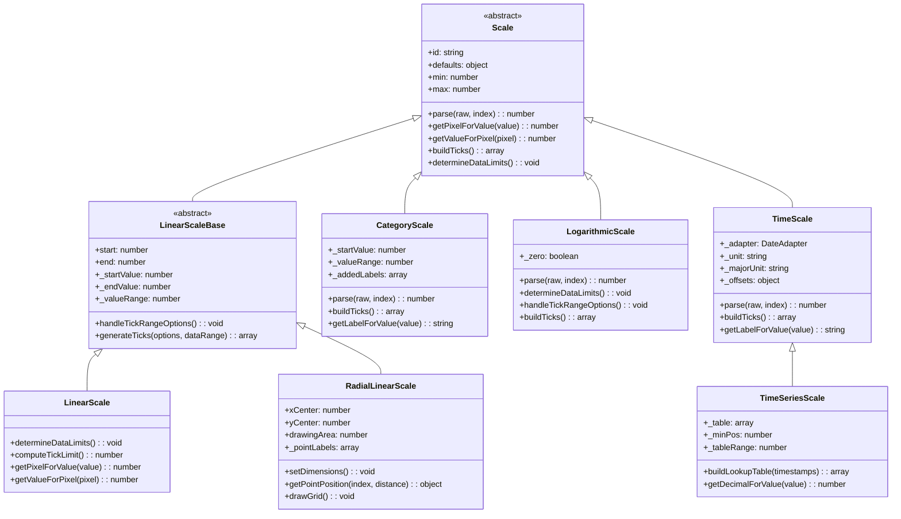
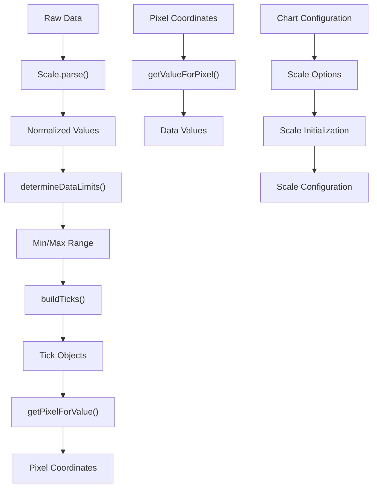
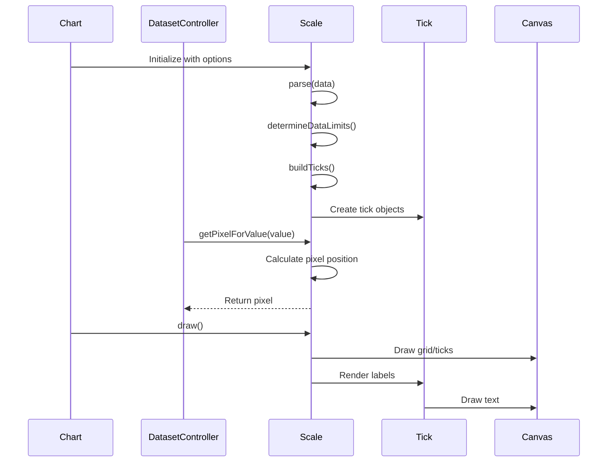

# Scales Module Documentation

## Introduction

The scales module is a fundamental component of the Chart.js library that provides the mathematical foundation for mapping data values to visual positions on charts. Scales are responsible for converting raw data values into pixel coordinates, generating appropriate tick marks, and managing the visual representation of axes in various chart types.

This module implements a hierarchical architecture with a base `Scale` class and specialized scale types that handle different data domains and visual representations, from simple linear scales to complex time-based and radial scales.

## Architecture Overview

The scales module follows an object-oriented design pattern with inheritance and composition to provide flexible scaling capabilities for different chart types and data types.


```mermaid
classDiagram
    class Scale {
        <<abstract>>
        +id: string
        +defaults: object
        +min: number
        +max: number
        +parse(raw, index): number
        +getPixelForValue(value): number
        +getValueForPixel(pixel): number
        +buildTicks(): array
        +determineDataLimits(): void
    }
    
    class LinearScaleBase {
        <<abstract>>
        +start: number
        +end: number
        +_startValue: number
        +_endValue: number
        +_valueRange: number
        +handleTickRangeOptions(): void
        +generateTicks(options, dataRange): array
    }
    
    class CategoryScale {
        +_startValue: number
        +_valueRange: number
        +_addedLabels: array
        +parse(raw, index): number
        +buildTicks(): array
        +getLabelForValue(value): string
    }
    
    class LinearScale {
        +determineDataLimits(): void
        +computeTickLimit(): number
        +getPixelForValue(value): number
        +getValueForPixel(pixel): number
    }
    
    class LogarithmicScale {
        +_zero: boolean
        +parse(raw, index): number
        +determineDataLimits(): void
        +handleTickRangeOptions(): void
        +buildTicks(): array
    }
    
    class RadialLinearScale {
        +xCenter: number
        +yCenter: number
        +drawingArea: number
        +_pointLabels: array
        +setDimensions(): void
        +getPointPosition(index, distance): object
        +drawGrid(): void
    }
    
    class TimeScale {
        +_adapter: DateAdapter
        +_unit: string
        +_majorUnit: string
        +_offsets: object
        +parse(raw, index): number
        +buildTicks(): array
        +getLabelForValue(value): string
    }
    
    class TimeSeriesScale {
        +_table: array
        +_minPos: number
        +_tableRange: number
        +buildLookupTable(timestamps): array
        +getDecimalForValue(value): number
    }
    
    Scale <|-- LinearScaleBase
    Scale <|-- CategoryScale
    LinearScaleBase <|-- LinearScale
    Scale <|-- LogarithmicScale
    LinearScaleBase <|-- RadialLinearScale
    Scale <|-- TimeScale
    TimeScale <|-- TimeSeriesScale
```

## Core Components

### Base Scale Class
The foundation of all scale types, providing common functionality for data parsing, pixel conversion, and tick generation. All scale types inherit from this base class and extend it with domain-specific behavior.

### Linear Scale Base
An abstract base class for linear scales that provides common functionality for numeric scales, including tick generation algorithms and range handling. This serves as the foundation for linear, logarithmic, and radial linear scales.

### Specialized Scale Types

#### CategoryScale
Handles discrete categorical data, mapping string labels to numerical positions. Automatically manages label discovery and maintains label-to-index mappings.

#### LinearScale
Implements standard linear scaling for continuous numeric data, providing evenly spaced ticks and straightforward value-to-pixel mapping.

#### LogarithmicScale
Handles logarithmic scaling for data spanning multiple orders of magnitude, with special handling for zero values and exponential tick generation.

#### RadialLinearScale
Extends linear scaling to polar coordinates, used in radar and polar area charts. Manages circular layout and point label positioning.

#### TimeScale
Specialized scale for temporal data, supporting multiple time units and automatic unit selection based on data range and available space.

#### TimeSeriesScale
Extends TimeScale with non-linear interpolation for irregular time series data, building lookup tables for accurate value mapping.

## Data Flow Architecture


```mermaid
flowchart TD
    A["Raw Data"] --> B["Scale.parse()"]
    B --> C["Normalized Values"]
    C --> D["determineDataLimits()"]
    D --> E["Min/Max Range"]
    E --> F["buildTicks()"]
    F --> G["Tick Objects"]
    G --> H["getPixelForValue()"]
    H --> I["Pixel Coordinates"]
    
    J["Pixel Coordinates"] --> K["getValueForPixel()"]
    K --> L["Data Values"]
    
    M["Chart Configuration"] --> N["Scale Options"]
    N --> O["Scale Initialization"]
    O --> P["Scale Configuration"]
```

## Component Interactions


```mermaid
sequenceDiagram
    participant Chart
    participant DatasetController
    participant Scale
    participant Tick
    participant Canvas
    
    Chart->>Scale: Initialize with options
    Scale->>Scale: parse(data)
    Scale->>Scale: determineDataLimits()
    Scale->>Scale: buildTicks()
    Scale->>Tick: Create tick objects
    
    DatasetController->>Scale: getPixelForValue(value)
    Scale->>Scale: Calculate pixel position
    Scale-->>DatasetController: Return pixel
    
    Chart->>Scale: draw()
    Scale->>Canvas: Draw grid/ticks
    Scale->>Tick: Render labels
    Tick->>Canvas: Draw text
```

## Scale Type Comparison

| Scale Type | Data Domain | Use Case | Tick Generation | Special Features |
|------------|-------------|----------|-----------------|------------------|
| Category | Discrete labels | Bar charts, line charts with categories | One per unique label | Automatic label discovery |
| Linear | Continuous numeric | Scatter plots, line charts | Evenly spaced | Configurable step size |
| Logarithmic | Positive numeric (log scale) | Data spanning orders of magnitude | Logarithmic spacing | Handles zero values |
| RadialLinear | Numeric in polar coords | Radar charts, polar charts | Circular layout | Point label positioning |
| Time | Temporal data | Time series charts | Time-based intervals | Multiple unit support |
| TimeSeries | Irregular time data | Non-uniform time series | Interpolated | Lookup table optimization |

## Key Algorithms

### Tick Generation Algorithm (LinearScaleBase)
The linear scale base implements a sophisticated tick generation algorithm that balances readability with data coverage:

1. **Step Size Mode**: If step size is specified, generate ticks at regular intervals
2. **Count Mode**: If tick count is specified, calculate optimal spacing
3. **Auto Mode**: Use "nice number" algorithm for human-readable intervals
4. **Bounds Handling**: Respect user-specified min/max bounds

### Time Scale Unit Selection
The time scale automatically selects appropriate time units based on data range and available space:

```javascript
// Pseudo-code for unit selection
if (range < 1 second) use 'millisecond'
else if (range < 1 minute) use 'second'
else if (range < 1 hour) use 'minute'
else if (range < 1 day) use 'hour'
else if (range < 1 month) use 'day'
else if (range < 1 year) use 'month'
else use 'year'
```

### Logarithmic Scale Handling
Special considerations for logarithmic scales:
- Zero values are excluded (log(0) is undefined)
- Negative values are excluded (log of negative is complex)
- Tick values follow powers of 10 pattern
- Major ticks at 1, 10, 100, 1000, etc.

## Integration with Chart System

### Scale Registration
Scales are registered with the global registry and can be referenced by ID in chart configurations:

```javascript
// Scale registration pattern
Chart.register(CategoryScale, LinearScale, TimeScale, /* ... */);

// Usage in chart config
options: {
  scales: {
    x: {
      type: 'category'  // References CategoryScale.id
    },
    y: {
      type: 'linear'    // References LinearScale.id
    }
  }
}
```

### Dataset Controller Integration
Dataset controllers interact with scales to position data visually:

```javascript
// Typical interaction pattern
const pixelX = scaleX.getPixelForValue(dataX);
const pixelY = scaleY.getPixelForValue(dataY);
// Draw data point at (pixelX, pixelY)
```

## Configuration Options

### Common Scale Options
All scales support common configuration options:

- `min`/`max`: Explicit scale bounds
- `reverse`: Reverse scale direction
- `bounds`: Data vs ticks boundary strategy
- `offset`: Add padding to scale range
- `grid`: Grid line configuration
- `ticks`: Tick mark and label configuration

### Scale-Specific Options

#### CategoryScale
- No additional specific options
- Automatically discovers labels from data

#### LinearScale
- `beginAtZero`: Force scale to start at zero
- `ticks.stepSize`: Fixed tick interval

#### LogarithmicScale
- `beginAtZero`: Special handling for zero values
- Exponential tick generation

#### TimeScale
- `time.unit`: Force specific time unit
- `time.round`: Round to time unit boundaries
- `time.displayFormats`: Custom formatting per unit

#### RadialLinearScale
- `startAngle`: Starting angle for scale
- `pointLabels`: Configuration for radial labels

## Performance Considerations

### Tick Generation Optimization
- Caching of tick calculations when possible
- Limiting maximum tick count to prevent performance degradation
- Efficient algorithms for "nice number" calculation

### Time Scale Performance
- Date adapter abstraction for efficient date operations
- Lookup table optimization for time series scales
- Automatic unit selection based on data density

### Memory Management
- Cleanup of cached data when scales are destroyed
- Efficient storage of tick objects
- Minimal object creation during animation

## Error Handling

### Data Validation
- Null/undefined value handling in parse methods
- Invalid numeric value detection
- Range validation for logarithmic scales

### Configuration Validation
- Invalid option combinations are handled gracefully
- Fallback to sensible defaults when options are missing
- Warning messages for potentially problematic configurations

## Extension Points

### Custom Scale Types
Developers can create custom scales by extending the base Scale class:

```javascript
class CustomScale extends Scale {
  static id = 'custom';
  
  parse(raw, index) {
    // Custom parsing logic
  }
  
  buildTicks() {
    // Custom tick generation
  }
  
  getPixelForValue(value) {
    // Custom value-to-pixel mapping
  }
}
```

### Date Adapters
Time scales support pluggable date adapters for different date libraries:
- Moment.js adapter (default)
- Luxon adapter
- Day.js adapter
- Custom adapters

## Dependencies

The scales module has dependencies on several core modules:

- **[core_engine](core_engine.md)**: Base Scale class and core functionality
- **[helpers](../helpers/index.js)**: Mathematical utilities, type checking, and formatting functions
- **[adapters](../core/core.adapters.js)**: Date handling for time scales
- **[ticks](../core/core.ticks.js)**: Tick formatting utilities

## Testing Considerations

### Unit Testing Strategy
- Individual scale type testing with mock data
- Edge case testing (empty data, single values, extreme ranges)
- Integration testing with dataset controllers
- Performance testing with large datasets

### Visual Testing
- Pixel-perfect positioning validation
- Tick label overlap detection
- Grid line rendering accuracy
- Animation smoothness verification

## Future Enhancements

### Potential Improvements
- WebGL-accelerated scale calculations for large datasets
- Machine learning-based tick optimization
- Automatic scale type detection based on data characteristics
- Enhanced accessibility features for screen readers
- Real-time data streaming optimizations

### API Evolution
- Promise-based scale initialization for async data
- Plugin system for custom tick generation algorithms
- Enhanced configuration validation with TypeScript support
- Better integration with modern JavaScript frameworks

---

This documentation provides a comprehensive overview of the scales module, its architecture, and its role within the Chart.js ecosystem. The module's design enables flexible, performant scaling across a wide variety of chart types and data domains while maintaining extensibility for custom use cases.