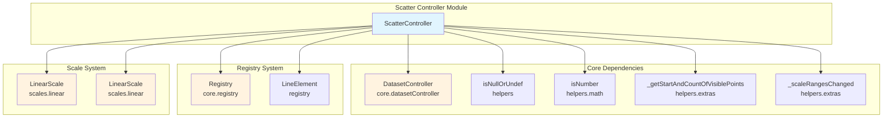
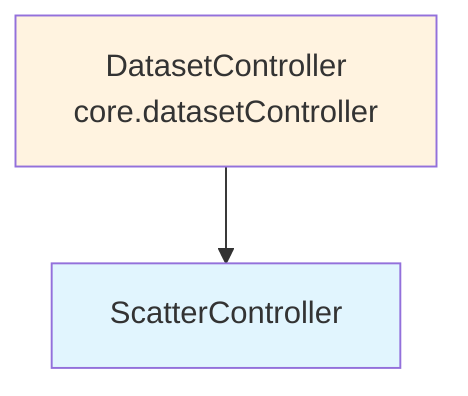
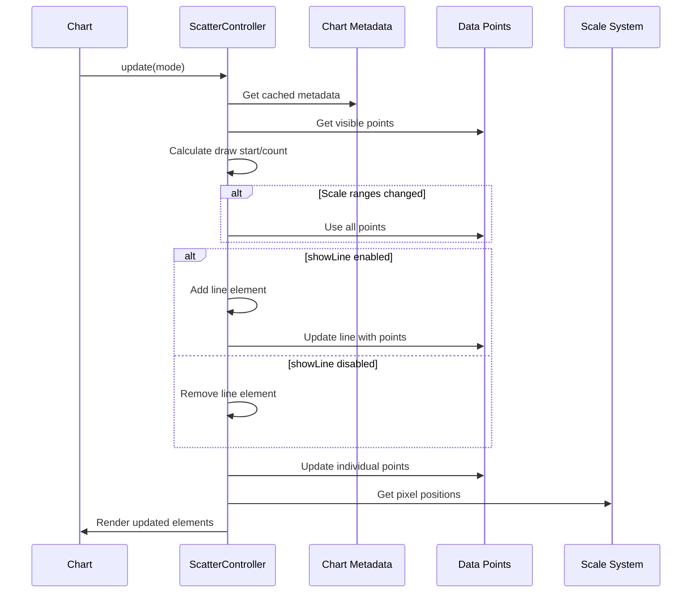
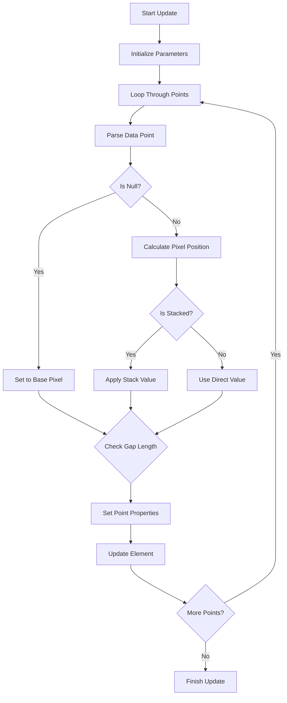
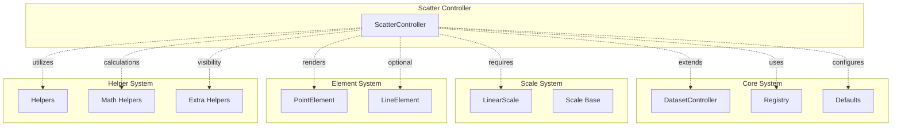

# Scatter Controller Module

## Introduction

The Scatter Controller module is a specialized chart controller in Chart.js that handles the creation and management of scatter plots. Scatter plots are used to display the relationship between two numerical variables, with data points plotted on both x and y axes. This controller extends the base DatasetController to provide scatter-specific functionality including point rendering, optional line connections, and specialized data parsing for coordinate-based datasets.

## Architecture

### Core Component Structure



### Inheritance Hierarchy



## Component Details

### ScatterController Class

The `ScatterController` is the main component of this module, extending the base `DatasetController` to provide scatter plot-specific functionality.

#### Key Properties

- **Static Properties:**
  - `id`: 'scatter' - Unique identifier for the controller
  - `defaults`: Default configuration including dataset element type, data element type, and display options
  - `overrides`: Chart-specific overrides for interaction mode and scale types

#### Configuration Defaults

```javascript
// Default configuration for scatter charts
defaults = {
    datasetElementType: false,    // No dataset element by default
    dataElementType: 'point',     // Data points are rendered as points
    showLine: false,              // No connecting lines by default
    fill: false                   // No fill under the line
}

// Override configurations
overrides = {
    interaction: {
        mode: 'point'             // Point-based interaction
    },
    scales: {
        x: { type: 'linear' },    // Linear x-axis
        y: { type: 'linear' }     // Linear y-axis
    }
}
```

## Data Flow

### Chart Update Process



### Point Update Algorithm



## Key Features

### 1. Coordinate-Based Data Handling

The scatter controller specializes in handling data as (x, y) coordinate pairs, making it ideal for correlation analysis and scientific data visualization.

### 2. Optional Line Connections

Unlike other chart types, scatter plots can optionally display connecting lines between points, controlled by the `showLine` configuration option.

### 3. Point-Specific Interactions

The controller implements point-based interaction mode, allowing users to interact with individual data points rather than datasets or categories.

### 4. Gap Handling

Supports intelligent gap detection and handling, with configurable maximum gap length for line connections.

## Integration with Other Modules

### Dependency Relationships



### Related Modules

- **[dataset-controller.md](dataset-controller.md)**: Base controller that ScatterController extends
- **[registry-system.md](registry-system.md)**: Manages element registration and retrieval
- **[scale-system.md](scale-system.md)**: Provides linear scaling for x and y axes
- **[configuration-system.md](configuration-system.md)**: Handles default configurations and overrides

## Usage Patterns

### Basic Scatter Chart Configuration

```javascript
const config = {
    type: 'scatter',
    data: {
        datasets: [{
            label: 'Scatter Dataset',
            data: [
                {x: 10, y: 20},
                {x: 15, y: 25},
                {x: 20, y: 30}
            ],
            backgroundColor: 'rgb(255, 99, 132)',
            showLine: false  // Default behavior
        }]
    },
    options: {
        scales: {
            x: {
                type: 'linear',
                position: 'bottom'
            },
            y: {
                type: 'linear'
            }
        }
    }
};
```

### Scatter with Connecting Lines

```javascript
const config = {
    type: 'scatter',
    data: {
        datasets: [{
            label: 'Connected Scatter',
            data: scatterData,
            showLine: true,  // Enable line connections
            fill: false,
            tension: 0.1
        }]
    }
};
```

## Performance Considerations

### Optimization Strategies

1. **Visible Point Calculation**: Uses `_getStartAndCountOfVisiblePoints` to limit processing to visible data points
2. **Animation Awareness**: Respects animation settings to optimize update cycles
3. **Scale Range Monitoring**: Detects scale changes to minimize unnecessary updates
4. **Direct Updates**: Uses direct property updates when animations are disabled

### Memory Management

- Efficiently manages point element lifecycle
- Properly cleans up line elements when `showLine` is toggled
- Implements shared options pattern to reduce object creation

## Error Handling

### Data Validation

- Handles null/undefined data points gracefully
- Validates numerical coordinates before processing
- Implements proper fallback for invalid pixel calculations

### Edge Cases

- Empty datasets
- Single data point scenarios
- Scale range validation
- Element type availability checks

## Extension Points

### Customization Options

The scatter controller provides several extension points:

1. **Custom Point Elements**: Through the registry system
2. **Line Styling**: Via dataset element options
3. **Interaction Modes**: Configurable through chart options
4. **Data Parsing**: Extensible through the dataset controller base class

### Plugin Integration

Compatible with Chart.js plugin system for:
- Custom data transformations
- Additional rendering layers
- Interaction enhancements
- Animation extensions

---

*This documentation covers the scatter-controller module's architecture, functionality, and integration within the Chart.js framework. For related functionality, see [dataset-controller.md](dataset-controller.md), [registry-system.md](registry-system.md), and [scale-system.md](scale-system.md).*