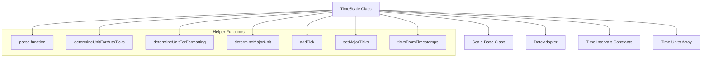
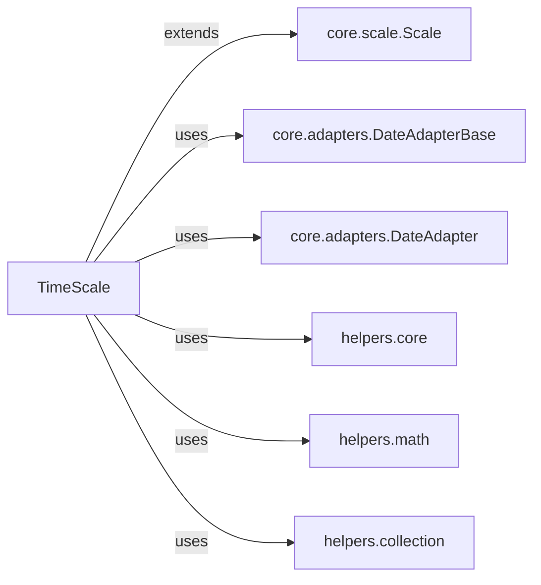
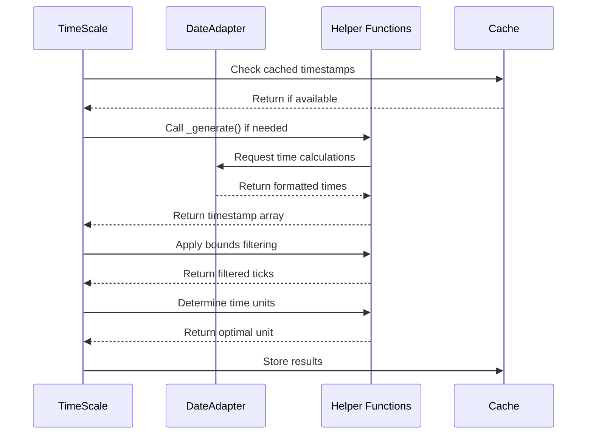
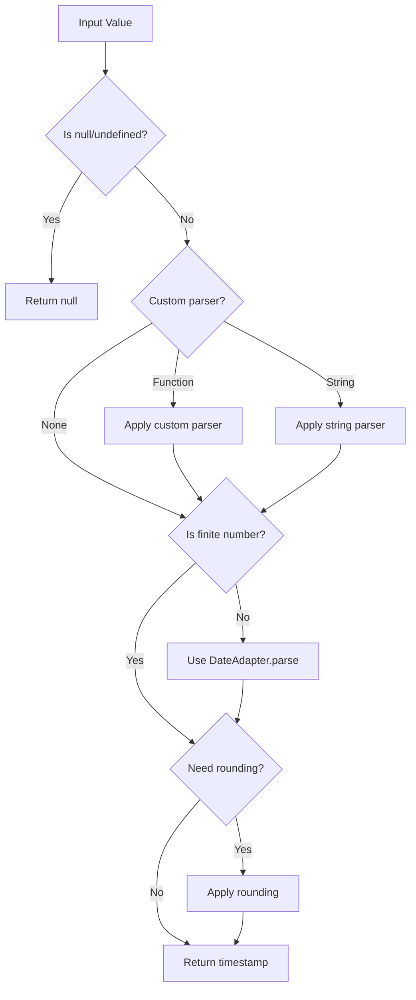
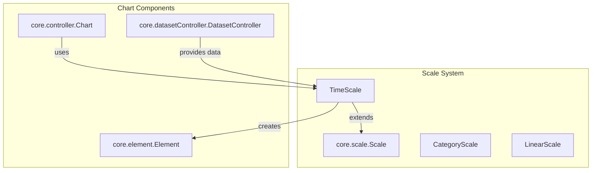

# Time Scale Module Documentation

## Overview

The time-scale module provides temporal axis functionality for Chart.js, enabling charts to display time-based data along an axis. This module implements the `TimeScale` class which extends the base `Scale` class to handle time-specific operations including date parsing, tick generation, time unit determination, and time-based formatting.

## Purpose and Core Functionality

The time-scale module serves as a specialized scale implementation that:

- Handles time-based data parsing and validation
- Generates appropriate time intervals for tick marks
- Provides intelligent time unit selection based on data range and available space
- Supports multiple time formats and display options
- Manages time-based offsets and boundaries
- Integrates with date adapters for flexible date handling

## Architecture

### Component Structure



### Dependencies



## Core Components

### TimeScale Class

The `TimeScale` class is the main component of this module, extending the base `Scale` class with time-specific functionality:

#### Key Properties

- `_cache`: Stores parsed timestamps for data, labels, and all values
- `_unit`: Current time unit (day, month, year, etc.)
- `_majorUnit`: Major tick unit for emphasis
- `_offsets`: Start/end offsets for proper tick positioning
- `_normalized`: Flag indicating if data is normalized
- `_parseOpts`: Parsing options including parser, round, and isoWeekday settings

#### Configuration Defaults

```javascript
{
  bounds: 'data',
  adapters: {},
  time: {
    parser: false,
    unit: false,
    round: false,
    isoWeekday: false,
    minUnit: 'millisecond',
    displayFormats: {}
  },
  ticks: {
    source: 'auto',
    callback: false,
    major: { enabled: false }
  }
}
```

## Data Flow

### Tick Generation Process



### Time Parsing Flow



## Time Unit Management

### Supported Time Units

The module supports the following time units with their respective intervals:

| Unit | Size (ms) | Common | Steps |
|------|-----------|--------|-------|
| millisecond | 1 | true | 1000 |
| second | 1,000 | true | 60 |
| minute | 60,000 | true | 24 |
| hour | 3,600,000 | true | 30 |
| day | 86,400,000 | true | 30 |
| week | 604,800,000 | false | 4 |
| month | 2.628e9 | true | 12 |
| quarter | 7.884e9 | false | 4 |
| year | 3.154e10 | true | - |

### Unit Selection Algorithm

The module uses sophisticated algorithms to determine the optimal time unit:

1. **Auto Ticks**: Selects the largest unit that fits within the capacity constraints
2. **Formatting**: Chooses the smallest unit that provides sufficient granularity
3. **Major Unit**: Identifies the next larger common unit for emphasis

## Integration with Chart.js System

### Scale System Integration



### Date Adapter Integration

The time-scale module relies on the [adapter system](core.md#adapter-system) for date parsing and formatting:

- Uses `DateAdapter` for all date operations
- Supports custom date adapters through the adapter pattern
- Provides fallback to native JavaScript Date when no adapter is specified
- Enables internationalization through adapter configuration

## Key Methods

### Data Processing

- `parse(raw, index)`: Parses input values into timestamps
- `getDataTimestamps()`: Extracts timestamps from dataset controllers
- `getLabelTimestamps()`: Parses timestamps from labels
- `normalize(values)`: Removes duplicates and sorts timestamps

### Tick Management

- `buildTicks()`: Generates tick objects with positions and labels
- `_generate()`: Creates timestamp array for tick generation
- `initOffsets(timestamps)`: Calculates start/end offsets
- `afterAutoSkip()`: Adjusts offsets after auto-skip optimization

### Formatting

- `format(value, format)`: Formats timestamps using display formats
- `_tickFormatFunction(time, index, ticks, format)`: Custom tick formatting
- `getLabelForValue(value)`: Gets tooltip labels

### Bounds and Limits

- `determineDataLimits()`: Calculates min/max bounds
- `_getLabelBounds()`: Gets bounds from labels
- `getUserBounds()`: Retrieves user-specified bounds

## Configuration Options

### Time Options

- `parser`: Custom parsing function or format string
- `unit`: Force specific time unit (false for auto)
- `round`: Round to specific unit (week, month, year, etc.)
- `isoWeekday`: ISO weekday for week calculations
- `minUnit`: Minimum time unit (default: 'millisecond')
- `displayFormats`: Format strings for each time unit

### Tick Options

- `source`: Tick source ('auto', 'data', 'labels')
- `callback`: Custom tick formatting function
- `major.enabled`: Enable major tick emphasis

### Bounds Options

- `bounds`: Boundary strategy ('data' or 'ticks')
- `offset`: Enable offset calculations
- `offsetAfterAutoskip`: Recalculate offsets after auto-skip

## Error Handling

The module includes several safety mechanisms:

- **Null Safety**: Handles null/undefined input values gracefully
- **Range Validation**: Prevents excessive time ranges that could freeze the browser
- **Type Checking**: Validates input types before processing
- **Fallback Values**: Provides sensible defaults for missing configuration

## Performance Considerations

### Caching Strategy

- Caches parsed timestamps to avoid re-parsing
- Stores normalized data arrays for reuse
- Implements lazy evaluation for expensive operations

### Optimization Techniques

- Uses binary search for timestamp lookup
- Implements efficient filtering algorithms
- Minimizes date adapter calls through batching
- Applies auto-skip logic to reduce tick count

## Usage Examples

### Basic Time Scale Configuration

```javascript
const config = {
  type: 'line',
  data: data,
  options: {
    scales: {
      x: {
        type: 'time',
        time: {
          unit: 'day',
          displayFormats: {
            day: 'MMM dd'
          }
        }
      }
    }
  }
};
```

### Custom Time Parser

```javascript
scales: {
  x: {
    type: 'time',
    time: {
      parser: 'YYYY-MM-DD HH:mm',
      displayFormats: {
        hour: 'MMM dd HH:mm'
      }
    }
  }
}
```

## Related Documentation

- [Core Scale System](core.md#scale-system) - Base scale functionality
- [Date Adapter System](core.md#adapter-system) - Date parsing and formatting
- [Chart Configuration](configuration-system.md) - Overall chart configuration
- [Dataset Controllers](dataset-controller.md) - Data management and parsing