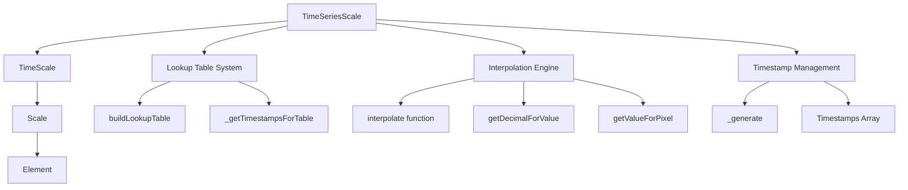
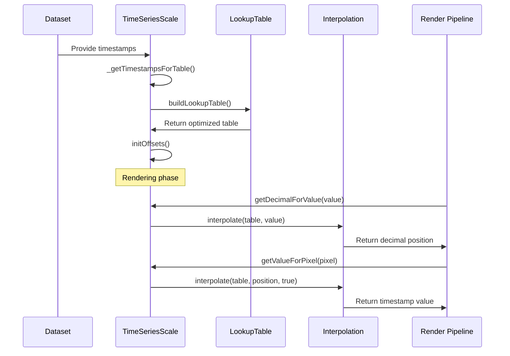
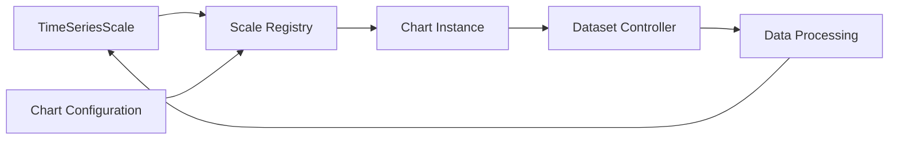

# Time Series Scale Module

## Introduction

The Time Series Scale module provides specialized scaling functionality for time-based data visualization in Chart.js. It extends the TimeScale to handle irregular time intervals and provides optimized positioning for time series data points that may not be evenly distributed across the time axis.

## Core Functionality

The TimeSeriesScale class is the primary component of this module, inheriting from TimeScale to provide enhanced capabilities for time series data visualization. It implements a lookup table mechanism that enables efficient interpolation and positioning of data points across irregular time intervals.

## Architecture

### Component Hierarchy



### Key Components

#### TimeSeriesScale Class
- **Location**: `src.scales.scale.timeseries.TimeSeriesScale`
- **Inheritance**: Extends [TimeScale](time-scale.md)
- **Purpose**: Handles irregular time intervals in time series data

#### Interpolation System
- **Core Function**: `interpolate(table, val, reverse)`
- **Purpose**: Linearly interpolates values using lookup tables
- **Features**: Bidirectional interpolation (time-to-position and position-to-time)

#### Lookup Table Management
- **Build Function**: `buildLookupTable(timestamps)`
- **Purpose**: Creates optimized lookup tables for efficient value mapping
- **Optimization**: Only includes points that break scale linearity

## Data Flow



## Key Features

### 1. Irregular Time Interval Support
Unlike standard time scales, TimeSeriesScale handles datasets with non-uniform time intervals efficiently by building optimized lookup tables.

### 2. Bidirectional Interpolation
Supports both:
- **Time-to-Position**: Converting timestamps to pixel positions
- **Position-to-Time**: Converting pixel positions back to timestamps

### 3. Automatic Timestamp Generation
The `_generate()` method automatically includes min/max bounds and ensures proper sorting of timestamps.

### 4. Lookup Table Optimization
The `buildLookupTable()` method creates efficient lookup tables by only including timestamps that break scale linearity, reducing computational overhead during interpolation.

## Configuration

### Default Settings
```javascript
static defaults = TimeScale.defaults;
```

The TimeSeriesScale inherits all configuration options from [TimeScale](time-scale.md), including:
- Time display formats
- Tick configuration
- Bounds settings
- Distribution options

## Integration with Chart.js Ecosystem

### Scale System Integration


### Related Modules
- **[Time Scale](time-scale.md)**: Parent class providing base time scaling functionality
- **[Scale System](scale-system.md)**: Core scaling infrastructure and registry
- **[Dataset Controllers](dataset-controller.md)**: Handle data-to-visual mapping
- **[Configuration System](configuration-system.md)**: Manage scale configuration options

## Usage Patterns

### Typical Implementation
```javascript
// Chart configuration with time series scale
const config = {
  type: 'line',
  data: data,
  options: {
    scales: {
      x: {
        type: 'timeseries',
        time: {
          unit: 'day'
        }
      }
    }
  }
};
```

### Data Requirements
- Timestamps can be irregularly spaced
- Automatic handling of missing time intervals
- Support for various timestamp formats (milliseconds, Date objects, ISO strings)

## Performance Considerations

### Lookup Table Efficiency
- Tables are built once during initialization
- Only non-linear points are stored
- Binary search used for efficient interpolation

### Memory Management
- Cache system for timestamps (`this._cache.all`)
- Minimal storage of interpolation points
- Efficient range calculations

## Error Handling

### Edge Cases
- **Single Data Point**: Returns min/max bounds
- **Empty Dataset**: Falls back to configured min/max
- **Out of Bounds**: Uses edge values for interpolation

### Validation
- Automatic timestamp normalization
- Bounds checking for interpolation
- Graceful handling of invalid timestamps

## Extension Points

### Custom Interpolation
The interpolation function can be overridden for custom time-to-position mapping logic.

### Timestamp Processing
The `_generate()` method can be extended to implement custom timestamp generation strategies.

### Lookup Table Optimization
The `buildLookupTable()` method can be customized for specific data patterns or performance requirements.

## Dependencies

### Core Dependencies
- **TimeScale**: Provides base time scaling functionality
- **helpers.collection**: Utility functions for array operations (`_lookupByKey`)

### Type Definitions
- Refer to [types module](types.md) for complete type definitions related to scales and time series data

## Best Practices

### Data Preparation
- Ensure timestamps are properly formatted
- Consider data density when building large datasets
- Use appropriate time units for the data range

### Performance Optimization
- Leverage built-in caching mechanisms
- Consider data decimation for large datasets
- Optimize lookup table generation with appropriate timestamp filtering

### Configuration
- Set appropriate min/max bounds when possible
- Use time units that match data granularity
- Configure tick display based on data density