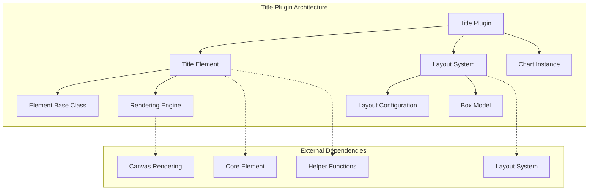
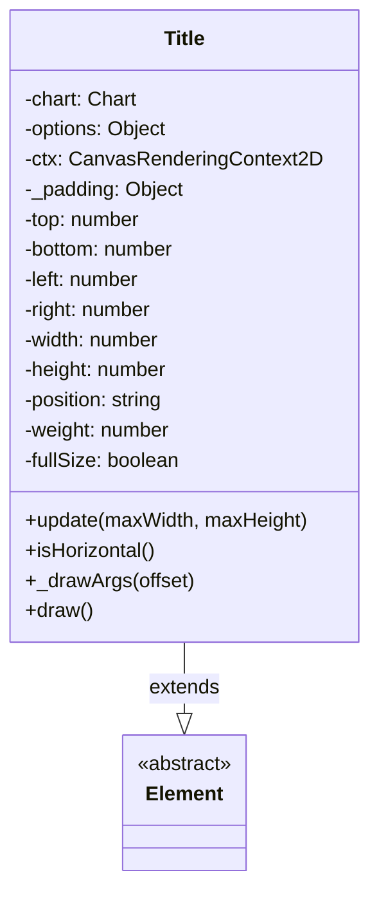
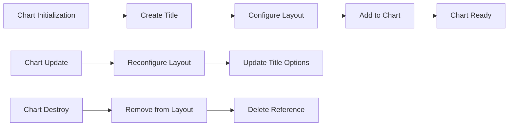
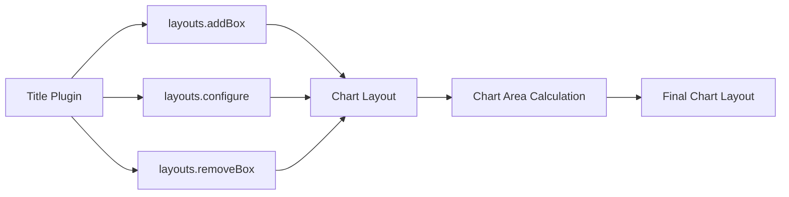
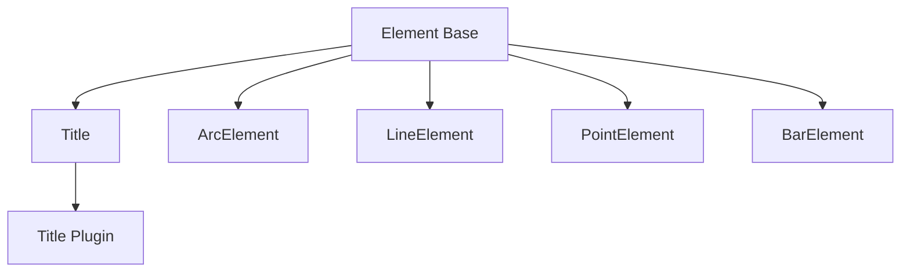

# Title Plugin Module Documentation

## Introduction

The title-plugin module provides chart title functionality for Chart.js, enabling developers to add customizable titles to their charts. This plugin handles title rendering, positioning, styling, and lifecycle management within the Chart.js plugin architecture.

## Architecture Overview

The title-plugin is built around the `Title` class, which extends the core `Element` class and integrates with Chart.js's layout system. The plugin follows Chart.js's standard plugin architecture with lifecycle hooks for initialization, updates, and cleanup.



## Core Components

### Title Class

The `Title` class is the main component that handles title rendering and positioning. It extends the core `Element` class and implements the following key functionality:

- **Position Management**: Supports multiple title positions (top, bottom, left, right)
- **Text Rendering**: Handles single and multi-line text rendering
- **Styling**: Manages font, color, alignment, and padding
- **Layout Integration**: Works with the chart's layout system for proper positioning



## Plugin Lifecycle

The title-plugin implements the standard Chart.js plugin lifecycle:



## Configuration and Options

The title-plugin provides extensive configuration options:

### Default Configuration
```javascript
defaults: {
    align: 'center',        // Text alignment: 'start', 'center', 'end'
    display: false,         // Whether to display the title
    font: {
        weight: 'bold',     // Font weight
    },
    fullSize: true,         // Use full chart width/height
    padding: 10,            // Padding around title
    position: 'top',        // Position: 'top', 'bottom', 'left', 'right'
    text: '',               // Title text (string or array)
    weight: 2000            // Layout weight (higher than legend)
}
```

### Configuration Routes
```javascript
defaultRoutes: {
    color: 'color'  // Inherit color from chart options
}
```

### Descriptor Options
```javascript
descriptors: {
    _scriptable: true,   // Allow scriptable options
    _indexable: false    // Disable indexable options
}
```

## Rendering Process

The title rendering process involves several steps:

1. **draw() called** - Plugin initiates rendering
2. **Display check** - Verify if title should be displayed
3. **Font metrics** - Calculate text dimensions
4. **Offset calculation** - Determine positioning
5. **Draw arguments** - Calculate rotation and alignment
6. **Text rendering** - Render text on canvas
7. **Title displayed** - Final title appears on chart

### Position Calculations

The plugin supports both horizontal and vertical title positioning:

- **Horizontal positions** (top/bottom): Title spans full width, height based on text
- **Vertical positions** (left/right): Title spans full height, width based on text
- **Rotation**: Vertical titles are rotated ±90 degrees for proper readability

### Text Rendering Features

- **Multi-line support**: Handles arrays of text strings
- **Text alignment**: Supports start, center, and end alignment
- **Font styling**: Configurable font family, size, weight, and color
- **Rotation**: Automatic rotation for vertical titles
- **Clipping**: Respects maxWidth constraints

## Integration with Chart.js System

### Layout System Integration

The title-plugin integrates with Chart.js's layout system through the `layouts` module:



### Element Hierarchy

The Title element fits into Chart.js's element hierarchy:



## Dependencies

The title-plugin relies on several Chart.js core components and helpers:

### Core Dependencies
- **[Element](core.md)**: Base class for all chart elements
- **[Layout System](core.md)**: Manages chart layout and positioning

### Helper Dependencies
- **Canvas Helpers**: Text rendering and measurement utilities
- **Math Helpers**: Alignment and positioning calculations
- **Type Helpers**: Array checking and padding calculations
- **Font Helpers**: Font parsing and metric calculations

## Usage Examples

### Basic Title Configuration
```javascript
const chart = new Chart(ctx, {
    options: {
        plugins: {
            title: {
                display: true,
                text: 'Chart Title',
                position: 'top',
                align: 'center'
            }
        }
    }
});
```

### Multi-line Title
```javascript
plugins: {
    title: {
        display: true,
        text: ['Main Title', 'Subtitle'],
        font: {
            size: 16,
            weight: 'bold'
        }
    }
}
```

### Vertical Title
```javascript
plugins: {
    title: {
        display: true,
        text: 'Y-Axis Title',
        position: 'left',
        align: 'center'
    }
}
```

## Performance Considerations

- **Layout Weight**: Default weight of 2000 ensures titles appear above legend elements
- **Early Return**: Quick exit when display is false to avoid unnecessary calculations
- **Caching**: Font metrics and padding calculations are performed once per update cycle
- **Efficient Rendering**: Uses optimized canvas text rendering functions

## Extension Points

The title-plugin provides several extension points:

- **Custom Positioning**: Override `_drawArgs()` method for custom positioning logic
- **Text Processing**: Extend `draw()` method for custom text rendering
- **Styling**: Use scriptable options for dynamic styling based on data
- **Layout Integration**: Custom layout behavior through layout system configuration

## Related Documentation

- [Core Module](core.md) - Base element system and layout integration
- [Legend Plugin](legend-plugin.md) - Similar plugin for chart legends
- [Configuration System](configuration-system.md) - Plugin configuration patterns
- [Element System](element-system.md) - Element base class and hierarchy