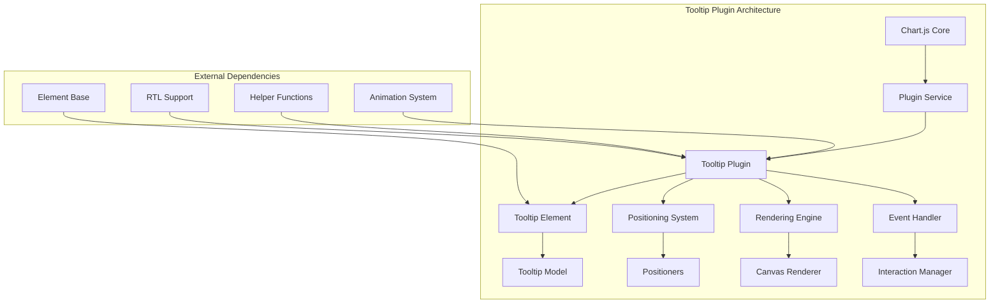
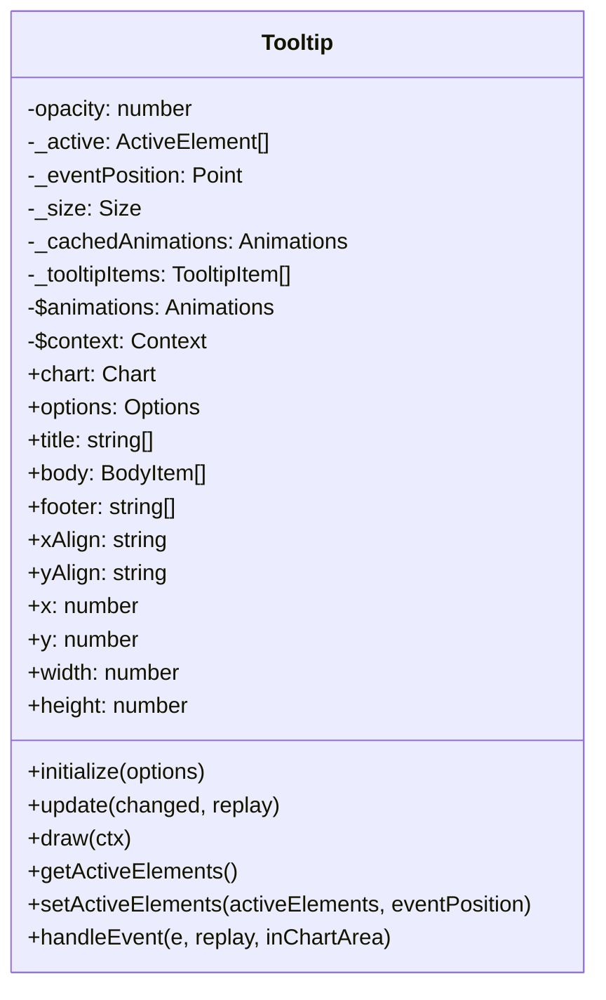
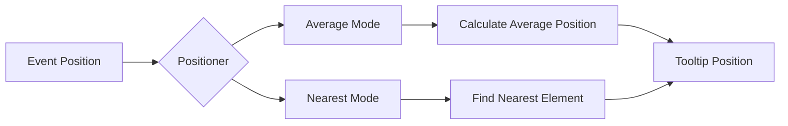
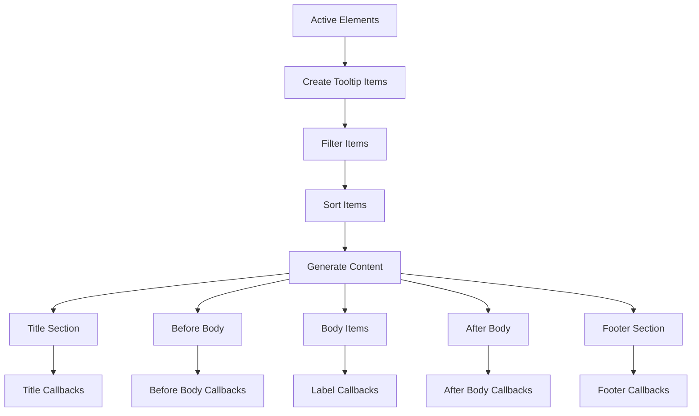
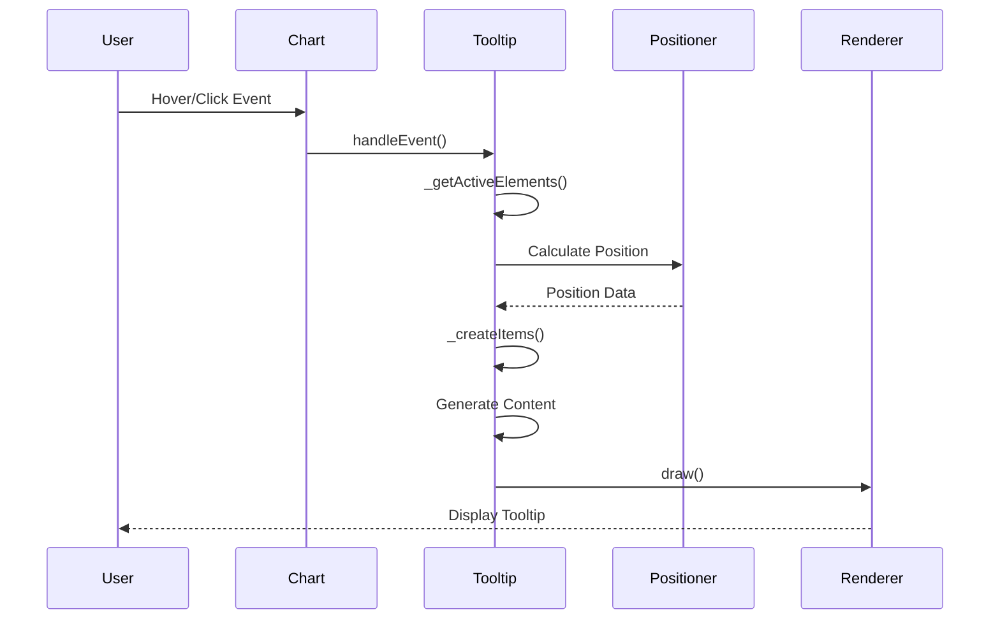
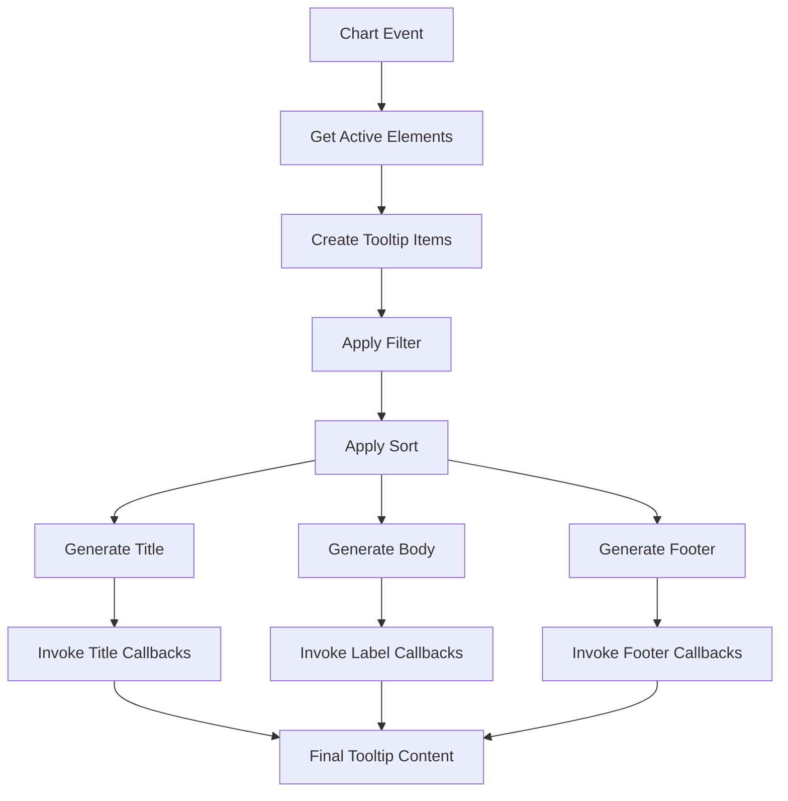
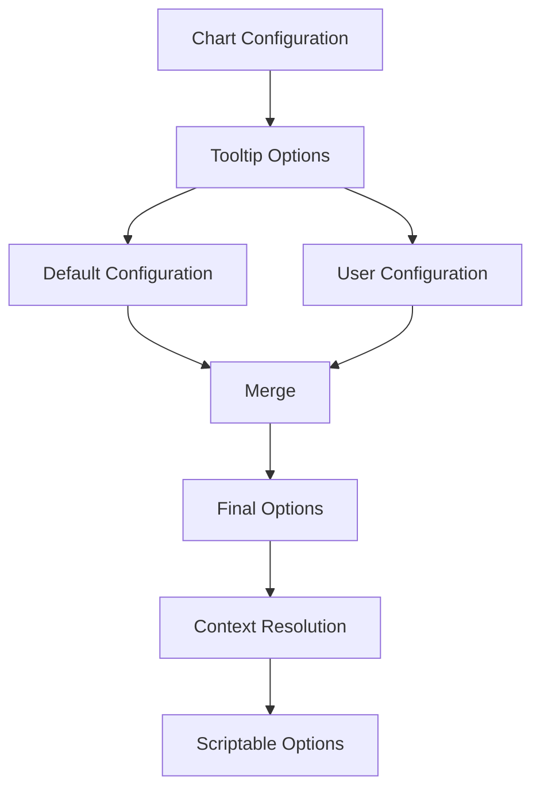
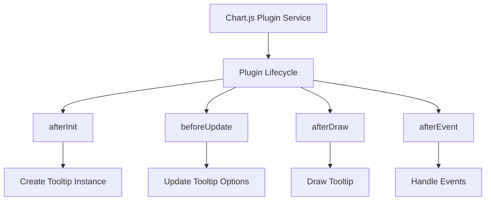
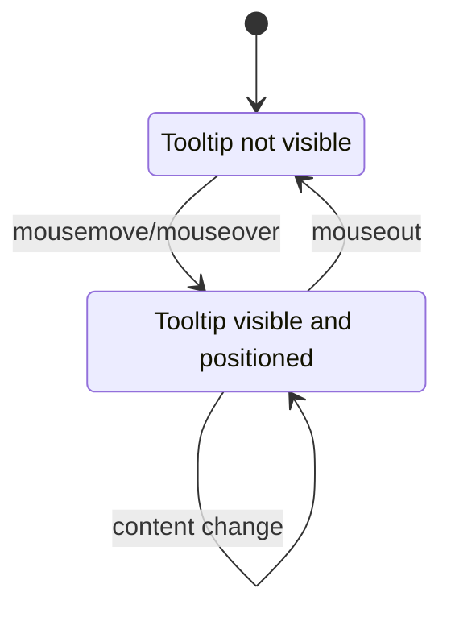

# Tooltip Plugin Module

## Introduction

The Tooltip Plugin is a core component of Chart.js that provides interactive tooltip functionality for charts. It displays contextual information about data points when users hover over or interact with chart elements, enhancing the user experience by providing detailed data insights without cluttering the chart interface.

## Architecture Overview

The Tooltip Plugin follows a modular architecture that integrates seamlessly with Chart.js's plugin system. It manages tooltip state, positioning, styling, and rendering while providing extensive customization options through configuration and callbacks.



## Core Components

### Tooltip Class

The `Tooltip` class extends the `Element` base class and serves as the main tooltip implementation. It manages tooltip state, handles events, and coordinates the rendering process.



### Positioning System

The tooltip plugin includes a flexible positioning system with built-in positioners:

- **Average Positioner**: Places tooltip at the average position of active elements
- **Nearest Positioner**: Positions tooltip near the element closest to the event



### Content Generation

The tooltip content is generated through a callback system that allows customization of each section:



## Data Flow

### Tooltip Update Process



### Content Generation Flow



## Key Features

### 1. Flexible Positioning
- Multiple positioning modes (average, nearest)
- Automatic alignment based on chart boundaries
- Caret positioning for visual connection to data points

### 2. Customizable Content
- Section-based content structure (title, body, footer)
- Extensive callback system for content customization
- Support for custom styling and formatting

### 3. Visual Customization
- Configurable colors, fonts, and spacing
- Border and background styling
- Corner radius and caret customization
- Color box display for data series

### 4. Animation Support
- Smooth fade-in/out animations
- Position and size animations
- Configurable animation duration and easing

### 5. RTL Support
- Right-to-left text support
- Automatic text direction detection
- Proper alignment for RTL languages

## Configuration System

The tooltip plugin uses Chart.js's configuration system with extensive defaults:



### Default Configuration Structure

- **Enabled**: Toggle tooltip functionality
- **Position**: Positioning mode and strategy
- **Styling**: Colors, fonts, spacing, borders
- **Callbacks**: Content generation functions
- **Animation**: Animation settings and timing
- **External**: External tooltip handling

## Integration with Chart.js

The tooltip plugin integrates with Chart.js through the plugin system:



### Plugin Hooks

- **afterInit**: Creates tooltip instance and attaches to chart
- **beforeUpdate**: Updates tooltip configuration
- **afterDraw**: Renders tooltip on canvas
- **afterEvent**: Processes interaction events

## Dependencies

The tooltip plugin relies on several Chart.js subsystems:

### Core Dependencies
- **[Element](core.md#element)**: Base class for tooltip element
- **[Animation System](animation-system.md)**: Animation support for smooth transitions
- **[Plugin Service](core.md#plugin-service)**: Plugin lifecycle management

### Helper Dependencies
- **Canvas Helpers**: Drawing utilities for shapes and text
- **Math Helpers**: Distance calculations and value limiting
- **Options Helpers**: Font and padding processing
- **RTL Helpers**: Right-to-left text support

### Type Dependencies
- **[Tooltip Types](types.md#tooltip-types)**: TypeScript definitions for tooltip interfaces
- **[Chart Types](types.md#chart-types)**: Chart configuration and data types

## Event Handling

The tooltip plugin processes various chart events to manage tooltip visibility and content:



### Event Processing

1. **Event Capture**: Intercepts chart interaction events
2. **Element Detection**: Identifies active data elements
3. **Content Generation**: Creates tooltip content based on active elements
4. **Position Calculation**: Determines optimal tooltip position
5. **Rendering**: Draws tooltip with current content and position

## Performance Considerations

### Optimization Strategies

1. **Caching**: Animation and size calculations are cached
2. **Conditional Rendering**: Only renders when content changes
3. **Efficient Positioning**: Smart positioning to minimize recalculations
4. **Event Throttling**: Handles rapid event sequences efficiently

### Memory Management

- Proper cleanup of event handlers
- Animation cache management
- Context object reuse

## Usage Examples

### Basic Configuration

```javascript
const chart = new Chart(ctx, {
    type: 'line',
    data: data,
    options: {
        plugins: {
            tooltip: {
                enabled: true,
                position: 'nearest',
                backgroundColor: 'rgba(0,0,0,0.8)',
                titleColor: '#fff',
                bodyColor: '#fff'
            }
        }
    }
});
```

### Custom Callbacks

```javascript
tooltip: {
    callbacks: {
        title: function(tooltipItems) {
            return 'Custom Title: ' + tooltipItems[0].label;
        },
        label: function(context) {
            return context.dataset.label + ': $' + context.parsed.y;
        }
    }
}
```

## Related Documentation

- [Core Module](core.md) - Base Chart.js functionality
- [Animation System](animation-system.md) - Animation and transition system
- [Types Module](types.md) - TypeScript definitions and interfaces
- [Plugin System](core.md#plugin-system) - Plugin architecture and lifecycle

## API Reference

For detailed API documentation, see the [Tooltip API Reference](api-tooltip.md) which includes:

- Configuration options
- Callback signatures
- Positioner methods
- Public methods and properties
- Event handling methods