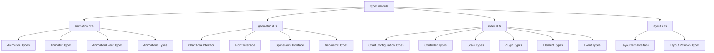

# Types Module Documentation

## Overview

The `types` module serves as the central TypeScript type definition system for Chart.js, providing comprehensive type definitions for all chart components, configurations, and interactions. This module ensures type safety across the entire Chart.js ecosystem and enables developers to build robust, type-safe chart applications.

## Architecture

The types module is organized into several key sub-modules that define the complete type system for Chart.js:



## Core Functionality

### Type Safety and IntelliSense
The types module provides complete TypeScript coverage for:
- Chart configurations and options
- Dataset structures and data points
- Scale configurations and options
- Plugin interfaces and options
- Element properties and behaviors
- Animation specifications
- Event handling
- Layout management

### Chart Type Registry
A sophisticated type registry system that maps chart types to their specific configurations, data structures, and options, enabling type-safe chart creation and manipulation.

### Scriptable Contexts
Comprehensive context types for scriptable options, allowing dynamic styling and behavior based on chart state, data, and user interactions.

## Sub-modules

### [Animation Types](animation.d.md)
Defines types for chart animations, including animation specifications, timing functions, and animation events. This sub-module provides the type foundation for the [animation-system](../core.md#animation-system) in the core module.

### [Geometric Types](geometric.d.md)
Provides fundamental geometric types used throughout Chart.js for positioning, sizing, and coordinate systems. These types are essential for the [elements module](elements.md) and [scales module](scales.md) implementations.

### [Index Types](index.d.md)
The main type definition file containing the core Chart.js types including chart configurations, controllers, scales, plugins, and all major interfaces. This is the central hub that connects types for all other modules including [controllers](controllers.md), [elements](elements.md), [scales](scales.md), and [plugins](plugins.md).

### [Layout Types](layout.d.md)
Defines types for layout management, positioning, and chart area calculations. These types support the layout system used by the [core module](core.md) and various [plugins](plugins.md) like legend and title.

## Integration with Other Modules

The types module serves as the foundation for all other Chart.js modules:

- **Core Module**: Uses types for configuration, elements, and registry management
- **Controllers Module**: Implements typed dataset controllers for different chart types
- **Elements Module**: Defines typed visual elements (points, lines, bars, arcs)
- **Scales Module**: Provides type-safe scale configurations and implementations
- **Plugins Module**: Defines plugin interfaces and options
- **Platform Module**: Types for platform-specific implementations
- **Helpers Module**: Utility types and helper function signatures

## Key Features

### Type Guards and Validation
The module includes utility types and interfaces that enable runtime type checking and validation of chart configurations.

### Extensibility
Designed to be extended by custom chart types, plugins, and scales while maintaining type safety.

### Backward Compatibility
Maintains compatibility with JavaScript usage while providing full TypeScript support for enhanced development experience.

### Performance Optimization
Type definitions are structured to enable efficient TypeScript compilation and tree-shaking in production builds.

## Usage Examples

### Basic Chart Configuration
```typescript
import { ChartConfiguration, ChartType } from 'chart.js';

const config: ChartConfiguration<'line'> = {
  type: 'line',
  data: {
    labels: ['January', 'February', 'March'],
    datasets: [{
      label: 'Sales',
      data: [10, 20, 30]
    }]
  }
};
```

### Custom Plugin with Types
```typescript
import { Plugin } from 'chart.js';

const customPlugin: Plugin = {
  id: 'customPlugin',
  beforeDraw: (chart, args, options) => {
    // Type-safe plugin implementation
  }
};
```

### Scale Configuration
```typescript
import { ScaleOptions } from 'chart.js';

const scaleOptions: ScaleOptions<'linear'> = {
  type: 'linear',
  min: 0,
  max: 100,
  ticks: {
    stepSize: 10
  }
};
```

## Best Practices

1. **Use Specific Types**: Always use the most specific type available for your use case
2. **Leverage Type Inference**: Let TypeScript infer types where possible to reduce verbosity
3. **Extend Types Safely**: When creating custom components, extend existing types rather than redefining them
4. **Use Scriptable Options**: Take advantage of scriptable options for dynamic behavior
5. **Type Custom Plugins**: Always provide proper type definitions for custom plugins

## Migration and Versioning

The types module follows semantic versioning and provides migration paths for breaking changes. When upgrading Chart.js versions, review the type definitions for any changes that might affect your implementations.

## Related Documentation

- [Core Module Documentation](core.md)
- [Controllers Module Documentation](controllers.md)
- [Elements Module Documentation](elements.md)
- [Scales Module Documentation](scales.md)
- [Plugins Module Documentation](plugins.md)
- [Platform Module Documentation](platform.md)
- [Helpers Module Documentation](helpers.md)