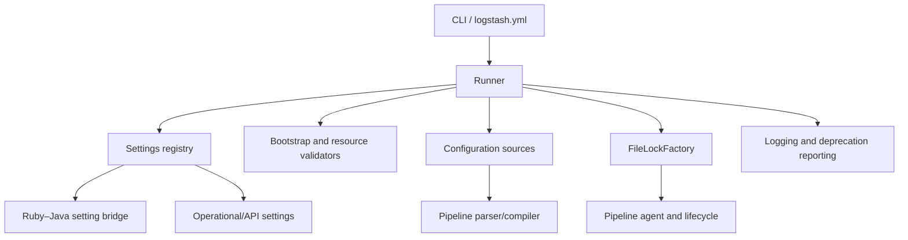
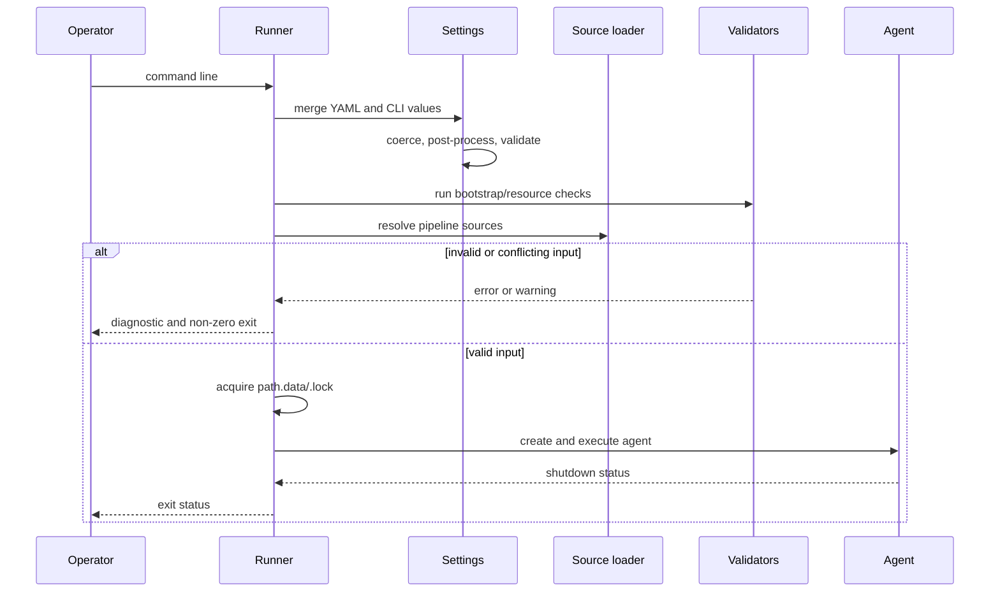

# Application bootstrap and settings

The `application_bootstrap_and_settings` module is Logstash’s process-level foundation. It turns command-line and YAML inputs into validated typed settings, performs safety and resource preflight checks, resolves pipeline configuration, and starts the agent under exclusive ownership of the data path. It spans Ruby orchestration and Java-backed primitives because startup configuration is shared by both runtimes.

## Architecture overview

## Submodules

- [Bootstrap, settings, and startup validation](application_bootstrap_and_settings_runtime.md) covers `Runner`, the Ruby settings registry and setting classes, bootstrap checks, persistent-queue validation, and pipeline resource estimation.
- [Bootstrap platform utilities](application_bootstrap_and_settings_platform_utilities.md) covers `FileLockFactory`, Java-version handling, shared setting-key constants, and Elastic Cloud ID/auth parsing.
- [Ruby–Java setting bridge](application_bootstrap_and_settings_setting_bridge.md) covers `Coercible`, `Boolean`, `SettingDelegator`, deprecated aliases, and the lifecycle shared by Ruby and Java settings.

## End-to-end process

## Module boundaries and dependencies

Configuration source discovery is described in [configuration_sources_and_loading.md](configuration_sources_and_loading.md); this module consumes its results and owns the decision to proceed. Pipeline parsing and IR compilation are documented in [pipeline_configuration_parser.md](pipeline_configuration_parser.md) and [pipeline_ir_and_compilation.md](pipeline_ir_and_compilation.md). Agent lifecycle behavior belongs to [pipeline_lifecycle_and_execution.md](pipeline_lifecycle_and_execution.md), while persistent queue implementation details belong to [persistent_queue.md](persistent_queue.md). Secret material is handled by [secret_store.md](secret_store.md), and runtime diagnostics are exposed through [monitoring_http_api.md](monitoring_http_api.md) and [logging.md](logging.md).

The bootstrap layer therefore acts as an orchestrator and policy boundary: it validates enough context to start safely, delegates configuration interpretation and execution to neighboring modules, and guarantees process-level cleanup when startup or runtime fails.
