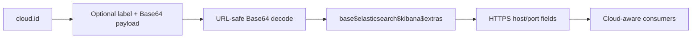

# Bootstrap platform utilities

This submodule contains small JVM-facing services used by startup and settings code. They provide process exclusivity, Java-version detection, shared setting-key names, and parsing of Elastic Cloud connection settings.

## Components and responsibilities

### `FileLockFactory`

`FileLockFactory.obtainLock` creates the target directory and `.lock` file, resolves its canonical path, prevents duplicate acquisition in the same JVM, and obtains an operating-system file lock through `FileChannel.tryLock`. It tracks locks in both a held-path set and a lock-to-path map. `releaseLock` releases the channel and removes both records. The runner uses this to ensure only one Logstash process owns `path.data`.

### `JavaVersionUtils`

`isJavaAtLeast(int)` parses both pre-Java-9 (`1.X`) and modern (`X`) specification-version formats and compares the major version. The runner separately reports a deprecation warning when the runtime is below the supported Java baseline.

### `SettingKeyDefinitions`

This constants-only class prevents spelling drift when Java components refer to pipeline and queue settings, including pipeline identity, worker/batch sizing, queue paths, page capacity, checkpoints, and maximum queue bytes.

### `CloudSettingAuth`

Parses a cloud authentication value in `<username>:<password>` form and exposes the original value, username, and password object. Invalid or incomplete input raises a Ruby argument error through the JRuby bridge.

### `CloudSettingId`

Decodes the URL-safe Base64 payload of a `cloud.id`, optionally preserving its unencoded label. It validates the `$`-separated payload, derives HTTPS Elasticsearch and Kibana hosts and ports, preserves extra identifiers, and provides `cloudIdEncode` for constructing an encoded payload.

## Lock ownership flow

```mermaid
flowchart TD
    R[Runner starts] --> O[obtainLock(path.data, .lock)]
    O --> D{Directory exists?}
    D -- no --> MK[Create directory]
    D -- yes --> F[Resolve real lock path]
    MK --> F
    F --> JVM{Held in this JVM?}
    JVM -- yes --> FAIL[LockException]
    JVM -- no --> OS{tryLock succeeds?}
    OS -- no --> FAIL
    OS -- yes --> RUN[Agent runs]
    RUN --> REL[releaseLock]
    REL --> CLOSE[Release channel and clear tracking]
```

## Cloud ID data flow



## Related modules

- Runtime orchestration and use of the lock: [application_bootstrap_and_settings_runtime.md](application_bootstrap_and_settings_runtime.md)
- Secret storage and credential handling: [secret_store.md](secret_store.md)
