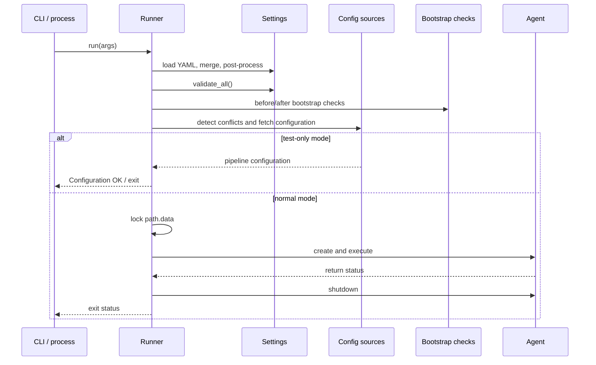
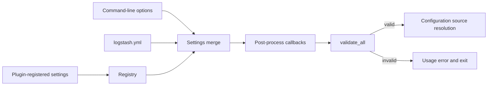

# Bootstrap, settings, and startup validation

This submodule contains the Ruby-side startup coordinator and the setting model used by Logstash before pipelines are created. Its responsibilities are to assemble command-line and YAML settings, normalize and validate values, run preflight checks, acquire the data-path lock, and hand control to the agent.

## Components

### `LogStash::Runner`

`Runner` is the `Clamp::StrictCommand` entry point. It declares CLI options, clones the global settings registry for system-level use, initializes configuration sources, and executes the startup lifecycle:

1. Load YAML and post-process settings.
2. Reject unsafe or unsupported runtime conditions, such as unauthorized superuser execution or JavaScript Log4j configuration.
3. Handle informational modes such as `--version`, `--interactive`, and `--config.test_and_exit`.
4. Validate settings and run registered bootstrap checks.
5. Resolve configuration sources and reject conflicts or missing configuration.
6. Lock `path.data`, construct `LogStash::Agent`, install signal handlers, and wait for the agent.
7. Shut down the agent, logging system, signal traps, and data-path lock in a guaranteed cleanup path.

The runner emits lifecycle hooks through the plugin registry around bootstrap checks and agent creation, allowing extensions to participate without changing the command entry point.

### `LogStash::Settings` and setting types

`Settings` is a name-to-setting registry. It supports registration, cloning, YAML flattening, merging, pipeline-scoped whitelisting, post-processing callbacks, validation, formatting, and conversion to a hash. `LogStash::SETTINGS` is the process-wide registry consumed by the runner.

The setting implementations enforce type and domain rules:

- `Port` validates values in `1..65535`.
- `PortRange` coerces integers and strings such as `5044-5050` into ranges.
- `Coercible` converts external values before validation; its Java counterpart provides the same contract for JVM-backed settings.
- `ValidatedPassword` applies configured length and character-class policies.
- `SplittableStringArray` accepts arrays or delimiter-separated strings.
- `Validator` delegates validation to a validator class.
- `SettingWithDeprecatedAlias` and `DeprecatedAlias` preserve compatibility while warning when an obsolete key is set or queried.

The registry deliberately keeps unknown YAML keys as transient settings. This permits plugins to register their settings before the final `validate_all` pass.

### Bootstrap and resource validators

- `DefaultConfig` is the default extension point in the ordered bootstrap-check list. It currently performs no check itself; source-specific conflict checks remain with configuration sources.
- `PersistedQueueConfigValidator` validates persistent-queue capacity, current usage, and aggregate filesystem free space. It caches the last result and rechecks when queue-related pipeline settings change.
- `PipelineResourceUsageValidator` estimates heap pressure as `pipeline.batch.size * pipeline.workers * 2 KB` across loaded pipelines and warns at or above 10% of the configured maximum heap.

## Startup sequence

## Setting precedence and validation

## Related modules

- Configuration discovery and loading: [configuration_sources_and_loading.md](configuration_sources_and_loading.md)
- Pipeline startup and lifecycle: [pipeline_lifecycle_and_execution.md](pipeline_lifecycle_and_execution.md)
- Persistent queues and queue recovery: [persistent_queue.md](persistent_queue.md)
- Logging and deprecation output: [logging.md](logging.md)
