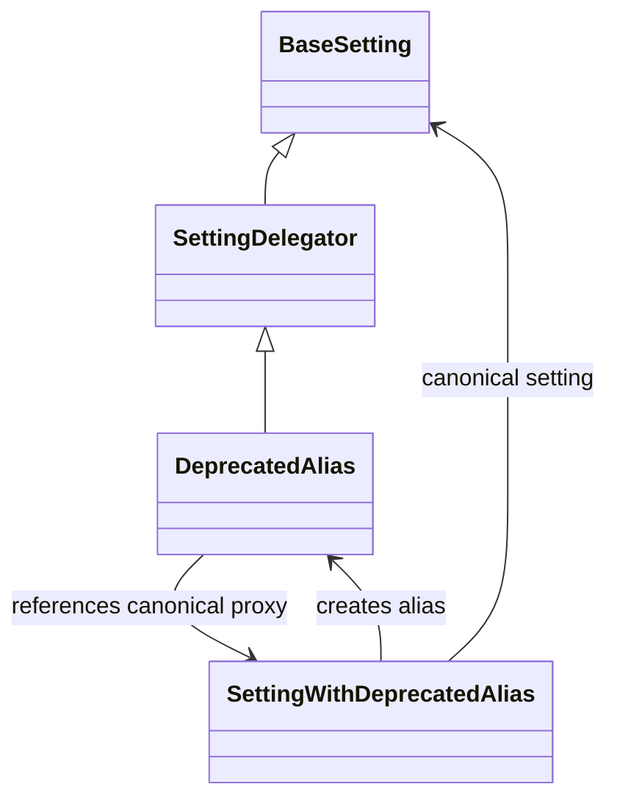
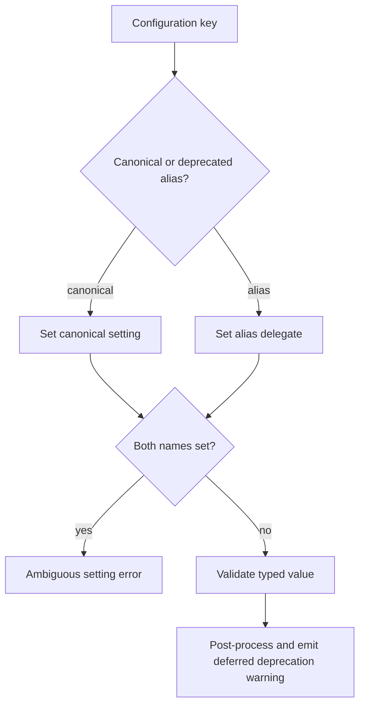

# Ruby–Java setting bridge

This submodule documents the JVM setting primitives used by `logstash/settings.rb`. Ruby settings are backed by Java setting objects so that coercion, validation, defaults, mutation state, cloning, and formatting behave consistently across the JRuby and Java portions of Logstash.

## Components

### `Coercible<T>`

Extends the base setting contract with `coerce(Object)`. Strict settings coerce and validate their defaults during construction. Calls to `set` coerce and validate before safely storing the typed value. Subclasses such as Java `Boolean` accept native booleans and the strings `true` and `false`.

### `SettingDelegator<T>`

Forwards the common setting API—name, value, set state, default, validation, formatting, reset, and safe mutation—to a wrapped `BaseSetting`. It is the foundation for aliases and other setting decorators.

### `DeprecatedAlias<T>`

Delegates to a canonical setting while retaining an alias name and optional removal version. It warns when queried and lazily emits a deprecation message after settings post-processing. Validation avoids producing a query warning merely because the alias is being checked.

### Ruby setting decorators

Ruby’s `SettingWithDeprecatedAlias` creates the canonical/alias pair and rejects configurations that set both names. `Nullable` permits `nil`; `CoercibleString`, `Bytes`, `TimeValue`, `ArrayCoercible`, and `StringArray` provide domain-specific coercion and validation. These decorators use the same wrapped Java setting lifecycle as primitive Java settings.

## Alias behavior

## Design constraints

- Strict settings validate defaults immediately; non-strict settings can retain values until later processing.
- Unknown YAML settings remain transient so dynamically loaded plugins can register them before final validation.
- Deprecated aliases are omitted from `Settings#to_hash`, preventing duplicate configuration keys from leaking into downstream consumers.
- Pipeline-specific merges are restricted by `PIPELINE_SETTINGS_WHITE_LIST`.

## Related modules

- Overall setting registry and startup flow: [application_bootstrap_and_settings_runtime.md](application_bootstrap_and_settings_runtime.md)
- Configuration source settings and pipeline loading: [configuration_sources_and_loading.md](configuration_sources_and_loading.md)
