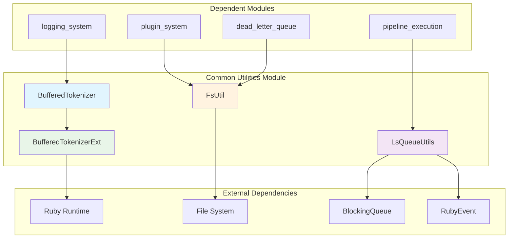
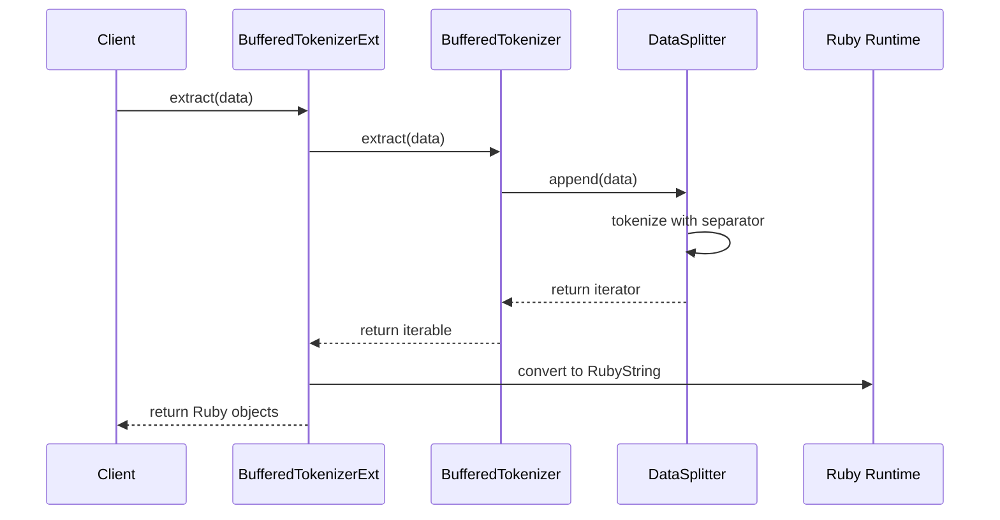

# Common Utilities Module

## Overview

The Common Utilities module provides essential utility classes and helper functions that support various operations across the Logstash system. This module serves as a foundational layer offering text processing, file system operations, and queue management utilities that are used throughout the Logstash pipeline processing system.

## Purpose

The common_utilities module acts as a shared utility layer that provides:

- **Text Processing**: Buffered tokenization for efficient string parsing and delimiter-based splitting
- **File System Operations**: Cross-platform file system utilities with Windows compatibility considerations
- **Queue Management**: Specialized utilities for managing blocking queues with Ruby event objects
- **Ruby Integration**: Bridge components that enable seamless integration between Java utilities and Ruby runtime

## Architecture Overview



## Core Components

### BufferedTokenizer
**Location**: `org.logstash.common.BufferedTokenizer`

A high-performance text tokenization utility that provides efficient string splitting with configurable delimiters and size limits. Features include:

- **Streaming Processing**: Handles large text streams without loading entire content into memory
- **Configurable Delimiters**: Supports custom separator strings for tokenization
- **Size Limiting**: Prevents memory exhaustion with configurable token size limits
- **Iterator Pattern**: Provides clean iteration interface for processed tokens

**Key Features**:
- Thread-safe operations with synchronized methods
- Memory-efficient accumulator with cleanup mechanisms
- Support for incomplete token handling and flushing
- Nested `IteratorDecorator` class for extensible iteration patterns

### BufferedTokenizerExt
**Location**: `org.logstash.common.BufferedTokenizerExt`

Ruby integration wrapper for BufferedTokenizer that enables seamless usage from Ruby code within Logstash pipelines.

**Key Features**:
- **JRuby Integration**: Native Ruby class implementation using JRuby annotations
- **Encoding Preservation**: Maintains character encoding across Java-Ruby boundaries
- **Ruby String Conversion**: Automatic conversion between Java strings and Ruby strings
- **Iterator Adaptation**: Provides Ruby-compatible iteration interfaces

### FsUtil
**Location**: `org.logstash.common.FsUtil`

Cross-platform file system utility providing essential file operations with platform-specific optimizations.

**Key Features**:
- **Free Space Checking**: Validates available disk space before operations
- **Windows Compatibility**: Special handling for Windows SUBST drives
- **Path Validation**: Ensures file system paths are accessible and valid
- **Logging Integration**: Comprehensive logging for troubleshooting file system issues

### LsQueueUtils
**Location**: `org.logstash.common.LsQueueUtils`

Specialized utilities for managing BlockingQueue operations with RubyEvent objects, optimized for Logstash's event processing patterns.

**Key Features**:
- **Bulk Operations**: Efficient batch adding and draining of events
- **Timeout Management**: Configurable timeouts for queue operations
- **Memory Optimization**: Pre-sized collections to minimize memory allocation
- **Interrupt Handling**: Proper handling of thread interruptions during blocking operations

## Component Interactions



## Integration with Other Modules

### Pipeline Execution Integration
The common_utilities module integrates closely with the [pipeline_execution](pipeline_execution.md) module:

- **LsQueueUtils** provides queue management for worker loops and event dispatching
- **BufferedTokenizer** supports input parsing in pipeline stages
- **FsUtil** validates storage paths for pipeline state management

### Plugin System Integration
Integration with the [plugin_system](plugin_system.md) includes:

- **FsUtil** validates plugin installation paths and temporary directories
- **BufferedTokenizer** supports plugin configuration parsing
- **Ruby integration** components enable plugin interoperability

### Dead Letter Queue Integration
The [dead_letter_queue](dead_letter_queue.md) module relies on common utilities for:

- **FsUtil** for DLQ file path validation and space checking
- **LsQueueUtils** for managing DLQ event queues
- **BufferedTokenizer** for DLQ file format parsing

## Usage Patterns

### Text Processing Pattern
```java
// Create tokenizer with custom delimiter and size limit
BufferedTokenizer tokenizer = new BufferedTokenizer("\n", 1024);

// Process streaming data
for (String chunk : dataStream) {
    Iterable<String> tokens = tokenizer.extract(chunk);
    for (String token : tokens) {
        processToken(token);
    }
}

// Handle remaining data
String remaining = tokenizer.flush();
if (!remaining.isEmpty()) {
    processToken(remaining);
}
```

### Queue Management Pattern
```java
// Drain events with timeout
Collection<RubyEvent> events = LsQueueUtils.drain(
    eventQueue, 
    batchSize, 
    TimeUnit.SECONDS.toNanos(5)
);

// Process drained events
for (RubyEvent event : events) {
    processEvent(event);
}
```

### File System Validation Pattern
```java
// Check available space before operations
Path dataPath = Paths.get("/var/logstash/data");
long requiredSpace = 1024 * 1024 * 100; // 100MB

if (FsUtil.hasFreeSpace(dataPath, requiredSpace)) {
    // Proceed with file operations
    performFileOperations(dataPath);
} else {
    // Handle insufficient space
    handleInsufficientSpace();
}
```

## Performance Considerations

### Memory Management
- **BufferedTokenizer**: Uses StringBuilder with cleanup mechanisms to prevent memory leaks
- **LsQueueUtils**: Pre-sizes collections to minimize allocation overhead
- **Encoding Handling**: Efficient charset conversion in Ruby integration

### Thread Safety
- **Synchronized Operations**: Critical sections in BufferedTokenizer are properly synchronized
- **Interrupt Handling**: Queue operations properly handle thread interruptions
- **Concurrent Access**: Utilities designed for multi-threaded pipeline environments

### Platform Optimization
- **Windows Compatibility**: Special handling for Windows file system limitations
- **Cross-platform Paths**: Consistent path handling across different operating systems
- **Encoding Support**: Proper character encoding handling for international text

## Error Handling

The module implements comprehensive error handling strategies:

- **Size Limit Violations**: Throws IllegalStateException when token size limits are exceeded
- **Encoding Errors**: Proper handling of character encoding conversion failures
- **File System Errors**: Graceful handling of file system access issues
- **Queue Interruptions**: Proper propagation of InterruptedException in queue operations

## Dependencies

### External Dependencies
- **JRuby Runtime**: For Ruby integration components
- **Apache Log4j**: For logging functionality
- **Java NIO**: For file system operations
- **Java Concurrent**: For queue management utilities

### Internal Dependencies
- **RubyUtil**: For Ruby object conversion utilities
- **JrubyEventExtLibrary**: For RubyEvent handling
- **Logstash Core Types**: For event and data structure integration

## Future Considerations

### Extensibility
- **Plugin Integration**: Components designed for extension by plugin developers
- **Custom Tokenizers**: Framework supports custom tokenization strategies
- **Queue Adapters**: Utilities can be extended for different queue implementations

### Performance Optimization
- **Memory Pooling**: Potential for object pooling in high-throughput scenarios
- **Async Operations**: Future support for asynchronous file system operations
- **Batch Processing**: Enhanced batch processing capabilities for queue operations

This module serves as a critical foundation for Logstash's data processing capabilities, providing reliable, efficient, and cross-platform utility functions that enable the higher-level pipeline processing functionality.