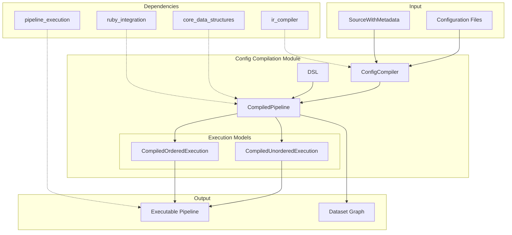
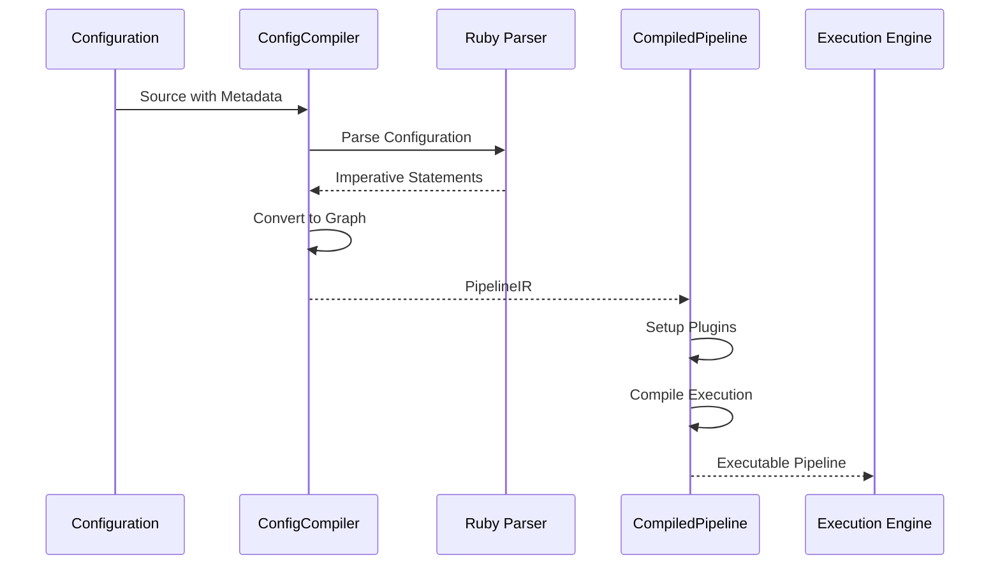

# Config Compilation Module

## Overview

The `config_compilation` module is a critical component of the Logstash system responsible for transforming pipeline configuration into executable code. This module serves as the bridge between the declarative pipeline configuration and the runtime execution engine, converting high-level configuration definitions into optimized, compiled execution units.

## Purpose

The config compilation module performs several key functions:

1. **Configuration Parsing**: Transforms Logstash configuration syntax into intermediate representation (IR)
2. **Code Generation**: Compiles IR into executable Java code for optimal runtime performance
3. **Pipeline Optimization**: Applies execution strategies (ordered vs unordered) based on pipeline requirements
4. **DSL Processing**: Provides a domain-specific language for programmatic pipeline construction

## Architecture Overview



## Core Components

### 1. ConfigCompiler
**File**: `ConfigCompiler.java`
**Purpose**: Main entry point for configuration compilation

The ConfigCompiler is responsible for:
- Parsing source configuration with metadata
- Invoking Ruby-based LSCL (Logstash Configuration Language) parser
- Converting imperative statements to graph representation
- Coordinating the compilation pipeline

**Key Methods**:
- `configToPipelineIR()`: Main compilation entry point
- `compileSources()`: Processes multiple configuration sources
- `compileImperative()`: Invokes Ruby parser for syntax analysis

### 2. CompiledPipeline
**File**: `CompiledPipeline.java`
**Purpose**: Represents a fully compiled, executable pipeline

The CompiledPipeline contains:
- **Plugin Management**: Organized collections of inputs, filters, and outputs
- **Execution Models**: Support for both ordered and unordered execution
- **Configuration Expansion**: Variable substitution and secret management
- **Graph Compilation**: Converts IR graph to executable datasets

**Key Features**:
- Plugin factory integration for dynamic plugin instantiation
- Configuration variable expansion with secret store support
- Conditional evaluation with error handling
- Memory-efficient execution with dataset caching

### 3. DSL (Domain Specific Language)
**File**: `DSL.java`
**Purpose**: Provides programmatic API for pipeline construction

The DSL offers:
- **Expression Builders**: For conditional logic and value comparisons
- **Statement Composers**: For sequential and parallel execution blocks
- **Plugin Definitions**: Programmatic plugin configuration
- **Graph Construction**: Direct graph manipulation utilities

## Execution Models

### CompiledUnorderedExecution
- **Use Case**: Standard pipeline execution where event order is not critical
- **Performance**: Optimized for throughput with batch processing
- **Memory**: Efficient memory usage through event batching
- **Concurrency**: Supports parallel processing of event batches

### CompiledOrderedExecution
- **Use Case**: Pipelines requiring strict event ordering
- **Processing**: Single-event processing to maintain order
- **Guarantees**: Preserves event sequence throughout pipeline
- **Trade-offs**: Lower throughput for ordering guarantees

## Integration Points

### With IR Compiler Module
The config compilation module heavily depends on the [ir_compiler](ir_compiler.md) module for:
- **DatasetCompiler**: Generates executable dataset code from IR
- **EventCondition.Compiler**: Compiles conditional expressions
- **FilterDelegatorExt**: Manages filter plugin execution
- **OutputStrategyExt**: Handles output plugin strategies

### With Core Data Structures
Utilizes [core_data_structures](core_data_structures.md) for:
- **Type Conversion**: Javafier, Rubyfier, and Valuefier for data transformation
- **Object Mapping**: Serialization and deserialization support
- **Utility Operations**: String interpolation and common utilities

### With Ruby Integration
Leverages [ruby_integration](ruby_integration.md) for:
- **Plugin Factory**: Dynamic plugin instantiation
- **Ruby Interop**: Seamless Java-Ruby communication
- **Extension Libraries**: JRuby event and timestamp extensions

## Data Flow



## Configuration Processing Pipeline

1. **Source Parsing**: Configuration files are parsed with source metadata tracking
2. **Imperative Compilation**: Ruby parser converts LSCL to imperative statements
3. **Graph Generation**: Statements are transformed into directed graph representation
4. **Plugin Resolution**: Plugin definitions are resolved and instantiated
5. **Dataset Compilation**: Graph nodes are compiled into executable datasets
6. **Execution Model Selection**: Appropriate execution strategy is chosen
7. **Runtime Optimization**: Final optimizations are applied for execution

## Error Handling

The module implements comprehensive error handling:

- **Configuration Errors**: Invalid syntax and semantic errors are captured with source location
- **Compilation Errors**: Type mismatches and invalid operations are detected during compilation
- **Runtime Errors**: Conditional evaluation errors are handled gracefully with listener pattern
- **Plugin Errors**: Plugin instantiation and configuration errors are properly propagated

## Performance Considerations

### Memory Management
- **Dataset Caching**: Compiled datasets are cached to avoid recompilation
- **Buffer Management**: Input/output buffers are efficiently managed and cleared
- **Plugin Reuse**: Plugin instances are reused across execution cycles

### Execution Optimization
- **Conditional Compilation**: Boolean expressions are compiled to native Java code
- **Batch Processing**: Events are processed in batches for better throughput
- **Lazy Evaluation**: Datasets support lazy evaluation for memory efficiency

## Configuration Examples

### Basic Pipeline Compilation
```java
// Compile configuration sources
List<SourceWithMetadata> sources = loadConfigSources();
PipelineIR pipelineIR = ConfigCompiler.configToPipelineIR(
    sources, 
    supportEscapes, 
    configVariableExpander
);

// Create compiled pipeline
CompiledPipeline pipeline = new CompiledPipeline(
    pipelineIR, 
    pluginFactory, 
    secretStore, 
    errorListener
);

// Build execution model
CompiledPipeline.CompiledExecution execution = pipeline.buildExecution();
```

### DSL Usage
```java
// Create conditional expression
BooleanExpression condition = DSL.eEq(
    DSL.eEventValue("status"), 
    DSL.eValue(200)
);

// Create filter statement
Statement filterStmt = DSL.iPlugin(
    sourceMetadata,
    PluginDefinition.Type.FILTER,
    "mutate",
    DSL.pargs().put("add_field", Map.of("processed", "true")).build()
);

// Create conditional statement
Statement ifStmt = DSL.iIf(sourceMetadata, condition, filterStmt);
```

## Monitoring and Debugging

The module provides extensive monitoring capabilities:

- **Compilation Metrics**: Track compilation time and success rates
- **Execution Tracing**: Monitor dataset execution and performance
- **Error Reporting**: Detailed error messages with source location
- **Plugin Monitoring**: Track plugin instantiation and configuration

## Future Enhancements

Planned improvements include:

- **Advanced Optimizations**: More sophisticated compilation optimizations
- **Parallel Compilation**: Multi-threaded compilation for large configurations
- **Configuration Validation**: Enhanced static analysis and validation
- **Performance Profiling**: Built-in performance analysis tools

## Related Documentation

- [IR Compiler Module](ir_compiler.md) - Low-level compilation and code generation
- [Core Data Structures](core_data_structures.md) - Fundamental data types and utilities
- [Ruby Integration](ruby_integration.md) - Java-Ruby interoperability layer
- [Pipeline Execution](pipeline_execution.md) - Runtime execution engine