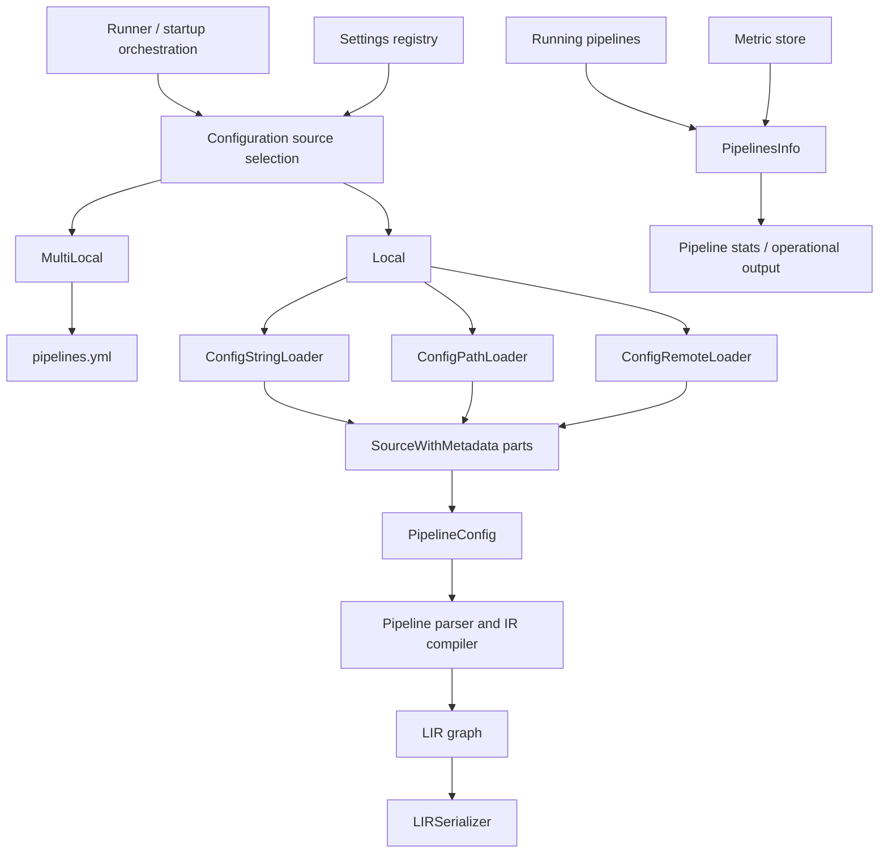

# Configuration sources and loading

The `configuration_sources_and_loading` module converts Logstash configuration inputs into `PipelineConfig` objects and exposes the resulting pipeline state in serialized and operational forms. It supports inline configuration, local files/globs, HTTP(S) configuration, and `pipelines.yml`-driven multi-pipeline startup.

## Architecture overview



`Base` defines the source contract and reads the relevant settings. `Local` implements single-pipeline loading; `MultiLocal` overrides selection and creates one pipeline per `pipelines.yml` entry. Both ultimately delegate to `Local#local_pipeline_configs`, which packages source fragments into `PipelineConfig` instances. The parser/compiler and IR graph are owned by [pipeline_configuration_parser.md](pipeline_configuration_parser.md) and [pipeline_ir_and_compilation.md](pipeline_ir_and_compilation.md).

## Submodules

- [Source selection and local loading](configuration_sources_and_loading_source_loading.md) documents `Base`, `Local`, `ConfigStringLoader`, `ConfigPathLoader`, and `ConfigRemoteLoader`.
- [Multi-pipeline discovery](configuration_sources_and_loading_multi_pipeline.md) documents `MultiLocal`, `pipelines.yml` validation, substitution, and duplicate pipeline detection.
- [Pipeline information and LIR serialization](configuration_sources_and_loading_pipeline_representation.md) documents `PipelinesInfo` and `LIRSerializer`.

## Configuration source selection

```mermaid
flowchart TD
    START[Settings] --> MULTI{config.string or path.config set?}
    MULTI -->|yes| LOCAL[Local source]
    MULTI -->|no| YAML[MultiLocal reads path.settings/pipelines.yml]
    LOCAL --> STRING{config.string?}
    STRING -->|yes| INLINE[Inline string]
    STRING -->|no| PATHQ{path.config URI scheme}
    PATHQ -->|none / file| FILES[Local files or glob]
    PATHQ -->|http / https| HTTP[Remote HTTP(S)]
    INLINE --> ONE[One PipelineConfig]
    FILES --> ONE
    HTTP --> ONE
    YAML --> MANY[PipelineConfig per YAML entry]
```

`Local` rejects incompatible combinations: `config.string` and `path.config` are exclusive, and automatic reload cannot be combined with an inline configuration string. `MultiLocal` is selected when neither direct option is present; malformed, empty, unreadable, or duplicate-ID `pipelines.yml` content becomes a configuration error.

## Data and security boundaries

Each loader emits `SourceWithMetadata`, retaining protocol, source identifier, line, and column. The LIR serializer deliberately omits source text because configuration can contain passwords. Remote loading accepts successful responses only and does not follow redirects. File loading normalizes `file://` URIs, sorts matches, skips directories and temporary files ending in `~`, and requires valid UTF-8.

## Runtime relationship

Configuration loading is startup input handling, not pipeline execution. The resulting IR is consumed by the compiler and lifecycle components; running pipeline statistics are formatted by `PipelinesInfo` and can include queue and plugin-vertex metrics. See [application_bootstrap_and_settings.md](application_bootstrap_and_settings.md) for startup policy and [pipeline_lifecycle_and_execution.md](pipeline_lifecycle_and_execution.md) for execution ownership.
