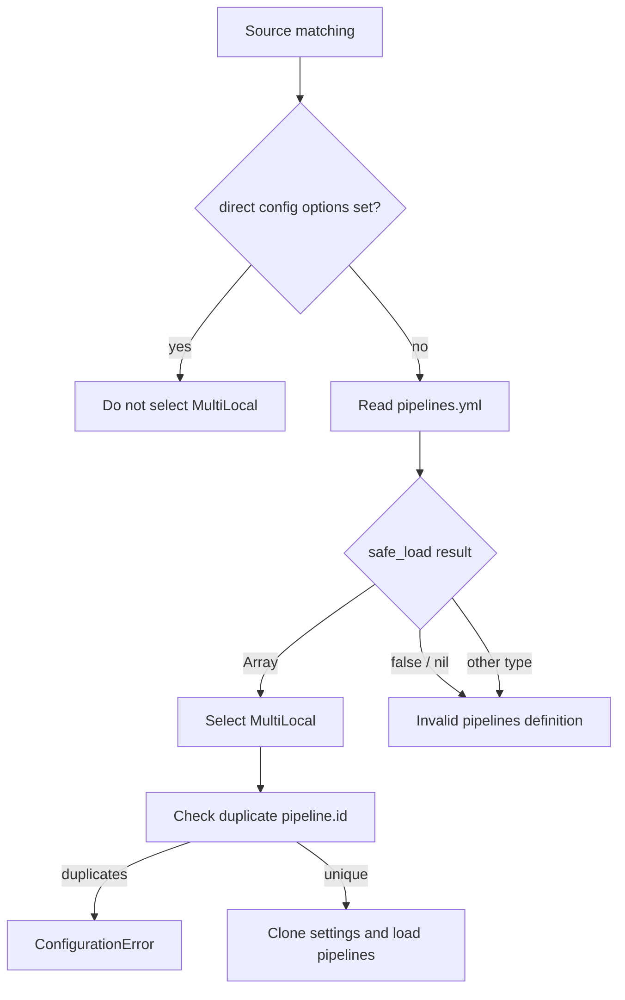

# Multi-pipeline discovery

`LogStash::Config::Source::MultiLocal` handles the `pipelines.yml` mode. It creates independent settings clones for each YAML entry, applies substitution variables, validates the set, and reuses `Local` loading behavior to build one or more `PipelineConfig` objects per entry.

## Selection and detection

When neither `config.string` nor `path.config` is configured, `MultiLocal#match?` inspects `path.settings/pipelines.yml`. Detection is cached in `@detected_marker` so repeated source checks do not repeatedly read the file. The marker distinguishes valid arrays, empty content, missing/unreadable content, invalid YAML types, and captured `ConfigurationError`s.

## Pipeline construction

`pipeline_configs` performs the following sequence:

1. Read and validate the YAML array.
2. Apply `SubstitutionVariables#deep_replace` to pipeline settings.
3. Clone the original settings and merge each pipeline’s settings.
4. Reject duplicate `pipeline.id` values.
5. Temporarily assign each clone to `@settings` and invoke the inherited local loader.
6. Restore the original settings object and flatten the resulting lists.

The temporary assignment is intentional: the inherited `Local` methods currently read `@settings` directly. A pipeline YAML entry can therefore use the same inline/path/remote source behavior as a single-pipeline invocation, while its settings remain isolated from sibling pipelines.

## Errors and precedence

Unreadable files, parse failures, empty content, invalid YAML root types, and duplicate IDs are reported as configuration errors with the `pipelines.yml` path. If direct command-line configuration is supplied, `MultiLocal` is not selected; it may emit a one-time warning that `pipelines.yml` is being ignored.

## Related components

The produced `PipelineConfig` instances flow into the parser/compiler documented in [pipeline_configuration_parser.md](pipeline_configuration_parser.md) and [pipeline_ir_and_compilation.md](pipeline_ir_and_compilation.md). Startup source precedence and command validation are described in [application_bootstrap_and_settings.md](application_bootstrap_and_settings.md).
