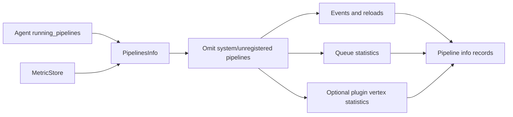
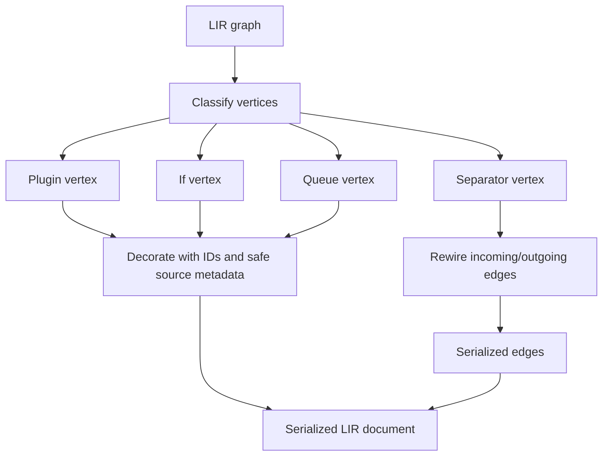

# Pipeline information and LIR serialization

This submodule represents already-loaded pipelines for two different consumers: operational reporting (`PipelinesInfo`) and graph-oriented configuration output (`LIRSerializer`). Neither component loads configuration files; both consume pipeline or metric objects produced by adjacent runtime/compiler modules.

## `PipelinesInfo`

`PipelinesInfo.format_pipelines_info` iterates the agent’s running pipelines, rather than the metric store’s pipeline keys, to avoid reporting pipelines that have metrics but are not yet owned by the agent. System pipelines and pipelines without registered metrics are omitted. Each returned record contains:

- pipeline ID, LIR hash, and ephemeral ID;
- event counters;
- queue type and persisted-queue capacity usage;
- successful and failed reload counts;
- optional per-plugin vertex metrics when extended performance collection is enabled.

Nested metrics are flattened into dotted names. Root event metrics are mapped to stable fields, while counter and numeric-gauge metrics are grouped into `long_counters` and `double_gauges`. Plugin metadata may add a cluster UUID.

## `LIRSerializer`

`LIRSerializer.serialize` converts a compiled LIR graph to a stable hash-and-graph document with `type: "lir"` and version `0.0.0`. Plugin, conditional, and queue vertices are serialized; separator vertices are omitted. Separator edges are rewired from the incoming vertex to each outgoing vertex, preserving boolean edge conditions when applicable.

Vertex metadata includes source protocol, identifier, line, and column, plus graph ID and whether the ID was explicit. Raw source text is intentionally excluded because it may contain secrets. Plugin vertices expose configuration name and plugin type; conditional vertices expose a human-readable expression.

## Boundaries

The graph structure and compiler contracts belong to [pipeline_ir_and_compilation.md](pipeline_ir_and_compilation.md). Runtime ownership, reloads, and agent state belong to [pipeline_lifecycle_and_execution.md](pipeline_lifecycle_and_execution.md), while metric collection and API exposure belong to [metrics_and_instrumentation.md](metrics_and_instrumentation.md) and [monitoring_http_api.md](monitoring_http_api.md).
