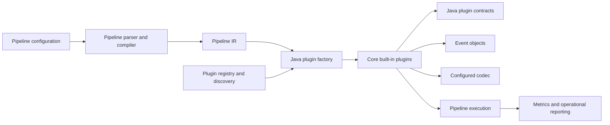
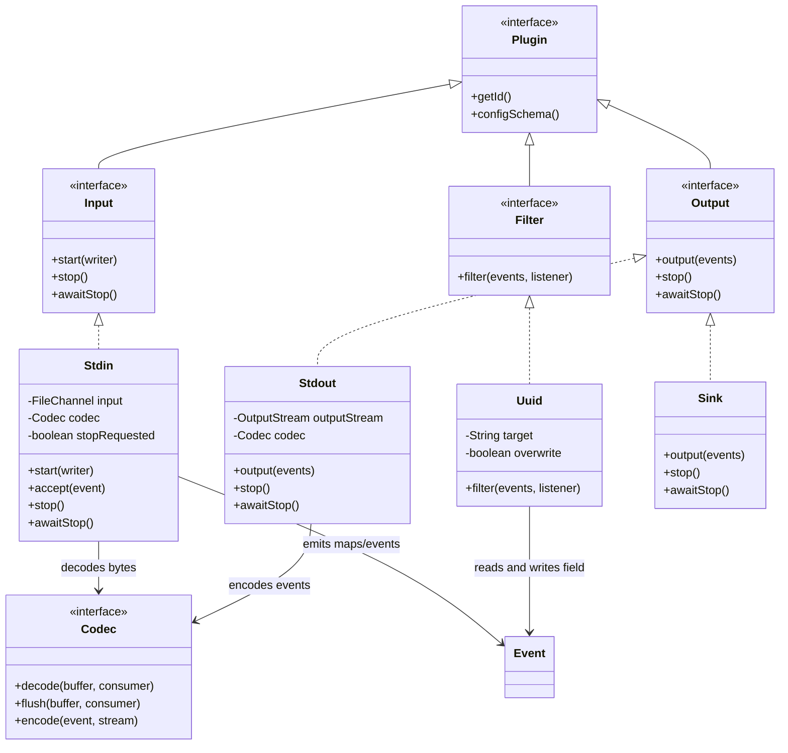
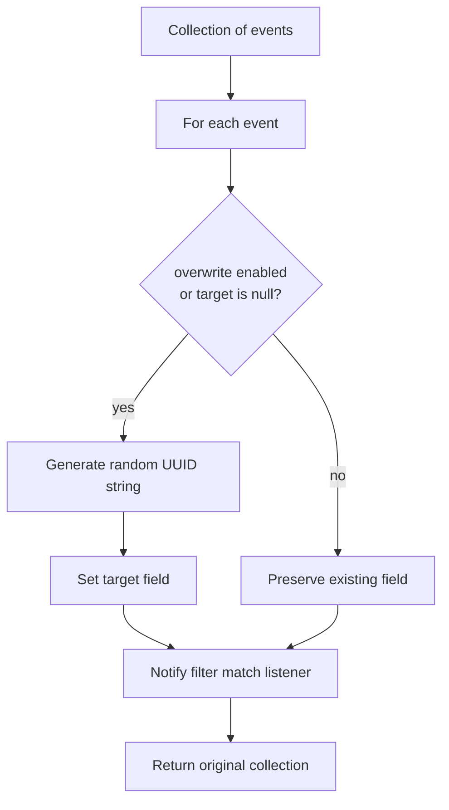
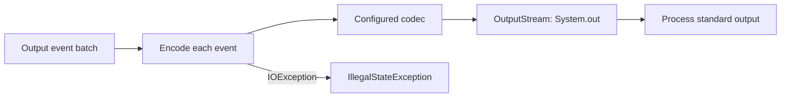
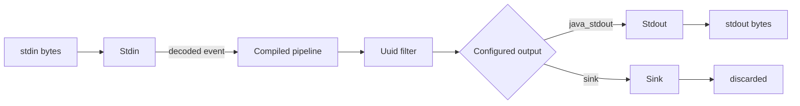

# Core Built-in Plugins

The `core_builtin_plugins` module contains four Java implementations that are shipped with Logstash core: the `java_stdin` input, the `java_uuid` filter, and the `java_stdout` and `sink` outputs. They are small reference plugins that connect operating-system streams and event transformations to the common Java plugin API.

These classes do not implement plugin discovery or pipeline compilation themselves. They declare plugin names and schemas consumed by the [plugin API and registry](plugin_api_and_registry.md), and are instantiated by the Java plugin factory when a compiled pipeline references them. Their event representation and Java/Ruby boundary are described in [event model and JRuby interop](event_model_and_jruby_interop.md).

## Module role in the system



The normal path is:

1. A pipeline configuration names a built-in plugin.
2. The compiler produces the executable representation; see [pipeline language and compilation](pipeline_language_and_compilation.md).
3. The plugin factory resolves the annotation name and constructs the Java class with an ID, configuration, and context.
4. The running pipeline invokes the input, filter, or output lifecycle methods.

## Architecture



All four classes expose a stable plugin ID through `getId()` and merge their plugin-specific settings with common settings through `PluginHelper`. The common contracts, schema validation, and lifecycle expectations are documented in [plugin contracts and base classes](plugin_api_and_registry_plugin_contracts_and_base_classes.md).

## Built-in plugin inventory

| Plugin name | Class | Type | Purpose | Plugin-specific setting |
| --- | --- | --- | --- | --- |
| `java_stdin` | `org.logstash.plugins.inputs.Stdin` | Input | Reads standard input, decodes records, and emits events | `codec`, default `java_line` |
| `java_uuid` | `org.logstash.plugins.filters.Uuid` | Filter | Adds a random UUID to a configured event field | Required `target`; `overwrite`, default `false` |
| `java_stdout` | `org.logstash.plugins.outputs.Stdout` | Output | Encodes events and writes them to standard output | `codec`, default `java_line` |
| `sink` | `org.logstash.plugins.outputs.Sink` | Output | Accepts and discards events | No plugin-specific settings |

The names are supplied by `@LogstashPlugin`; they are the names resolved by plugin lookup, not Java class names. `java_stdin` and `java_stdout` intentionally distinguish these Java implementations from similarly named plugin implementations.

## `java_stdin`: standard-input ingestion

`Stdin` implements both `Input` and `Consumer<Map<String,Object>>`. Its public constructor obtains a channel for `FileDescriptor.in`, determines the local hostname, and retrieves the configured codec. A package-private constructor accepts a `FileChannel`, which allows the read loop to be tested without replacing the process standard input.

### Read and decode flow

```mermaid
sequenceDiagram
    participant Pipeline as Pipeline runtime
    participant Input as Stdin
    participant Channel as FileDescriptor.in
    participant Codec as Configured codec
    participant Writer as Event writer

    Pipeline->>Input: start(writer)
    loop Until EOF or stop
        Input->>Channel: read(ByteBuffer)
        Channel-->>Input: bytes
        Input->>Codec: decode(buffer, Input)
        Codec->>Input: accept(decoded map)
        Input->>Writer: add hostname if absent; emit event
    end
    Input->>Codec: flush(remaining bytes, Input)
    Input-->>Pipeline: stopped latch released
```

The input allocates a 64 KiB direct buffer. Each read flips the buffer for decoding and then compacts it so incomplete records remain available to the next read. At end-of-input or shutdown, the remaining bytes are flushed through the codec.

Decoded maps are passed to the pipeline writer after `hostname` is added only when the decoded map does not already contain that key. If hostname lookup fails, the value is `[unknownHost]`.

### Shutdown and errors

`stop()` sets a volatile stop flag and closes the input channel. Closing the channel interrupts a blocked read; the resulting `AsynchronousCloseException` is treated as normal shutdown. Other `IOException` failures are logged, mark the input as stopping, and are rethrown as `IllegalStateException`. `awaitStop()` waits on a `CountDownLatch` released in the `finally` block, after channel cleanup and codec flushing.

## `java_uuid`: event UUID enrichment

`Uuid` implements the Java `Filter` contract. The required `target` setting identifies the event field to populate. For every event, it writes `UUID.randomUUID().toString()` when either:

- `overwrite` is `true`; or
- the target field is currently absent (`getField(target) == null`).

It then calls `filterMatchListener.filterMatched(e)` for every event, including events whose existing target value was preserved. The filter returns the same collection it received; it does not create or remove events.



The filter uses `PluginHelper.commonFilterSettings` in addition to `target` and `overwrite`, so standard plugin settings such as ID and tagging remain governed by the shared filter contract.

## `java_stdout`: codec-backed standard output

`Stdout` implements `Output` and writes each event in the received collection to `System.out` by default. It obtains a codec from the `codec` setting, whose default is `java_line`; a package-private stream-injection constructor supports tests and alternate targets.



`output` invokes `codec.encode` once per event and converts an `IOException` into `IllegalStateException`. It does not explicitly flush or close the stream, leaving ownership of the process standard output with the host runtime. `stop()` releases the completion latch, and `awaitStop()` waits on that latch.

## `sink`: discard output

`Sink` is a no-op output intended for cases where a pipeline needs to terminate events without producing an external side effect. Its constructor stores the plugin ID, `output` discards the supplied collection, and both lifecycle methods return immediately. Its schema consists only of common output settings.


Because `Sink` acknowledges no external destination and performs no buffering, it should be understood as a terminal discard point rather than a durable or observable delivery mechanism.

## Cross-component data flow

The four plugins can be composed into a minimal Java-plugin pipeline. The input and output codecs operate on different representations: `Stdin` decodes bytes into event maps, while `Stdout` encodes Logstash events back to bytes. The compiler and runtime handle the event-batch boundary between them.



This module therefore sits at the edge of the data plane while relying on sibling responsibilities:

- [Pipeline IR and compilation](pipeline_ir_and_compilation.md) turns configuration into executable plugin calls.
- [Java plugin factory and bridge](plugin_api_and_registry_java_plugin_factory.md) resolves and constructs these annotated classes.
- [Pipeline lifecycle and execution](pipeline_lifecycle_and_execution.md) starts, stops, and supervises plugin-bearing pipelines.
- [Event model and JRuby interop](event_model_and_jruby_interop.md) defines event storage and conversion across Java and Ruby.
- [Plugin registry and discovery](plugin_api_and_registry_plugin_registry.md) covers discovery of installed plugins; these four implementations are shipped as part of core rather than installed as separate plugin gems.

## Configuration and lifecycle reference

| Component | Construction | Runtime operation | Stop behavior | Failure behavior |
| --- | --- | --- | --- | --- |
| `Stdin` | Requires a codec; opens process stdin; resolves hostname | Blocking channel reads, codec decode, writer callback | Volatile flag plus channel close; waits for latch | Logs non-close read errors and raises `IllegalStateException` |
| `Uuid` | Requires `target`; reads `overwrite` | Mutates each event and reports a match | Not applicable to filter contract | No plugin-specific checked failure path |
| `Stdout` | Requires a codec; targets process stdout | Codec-encodes every event | Releases completion latch | Wraps encoding `IOException` in `IllegalStateException` |
| `Sink` | Stores plugin ID | Discards every batch | Immediate | None in no-op implementation |

## Operational considerations

- Codec choice controls record framing for `Stdin` and serialization for `Stdout`; the built-ins provide `java_line` as the default but accept any compatible configured codec.
- `Stdin` preserves partial codec input across reads and flushes it during shutdown, so codec behavior determines how trailing data is handled.
- `Uuid` is idempotent with respect to an existing target by default, but UUID generation is random whenever replacement is enabled or the field is absent.
- `Stdout` writes synchronously in the caller’s output invocation. Slow or blocked standard output therefore affects pipeline progress.
- `Sink` intentionally provides no delivery guarantee, retry, persistence, or output-side metrics beyond whatever the shared runtime wrapper supplies.
- Plugin IDs and common settings are supplied through the shared plugin API; consult [plugin contracts and base classes](plugin_api_and_registry_plugin_contracts_and_base_classes.md) for validation and metric context rather than duplicating those rules here.

## Source locations

- `logstash-core/src/main/java/org/logstash/plugins/inputs/Stdin.java`
- `logstash-core/src/main/java/org/logstash/plugins/filters/Uuid.java`
- `logstash-core/src/main/java/org/logstash/plugins/outputs/Stdout.java`
- `logstash-core/src/main/java/org/logstash/plugins/outputs/Sink.java`
