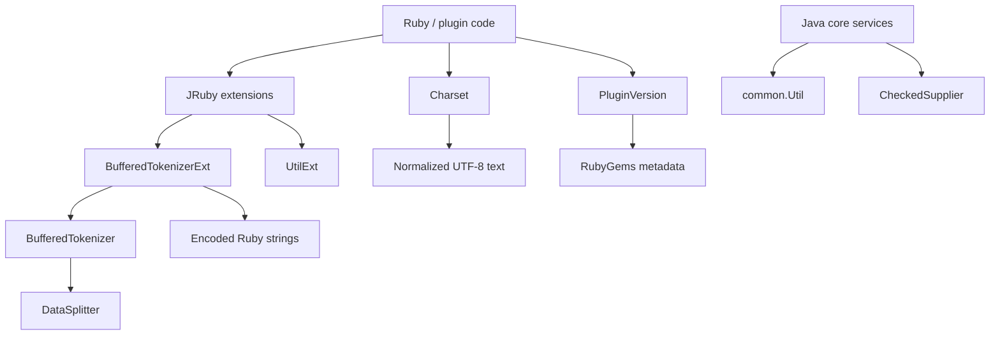
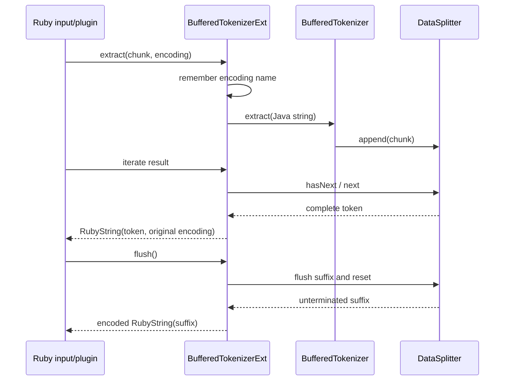
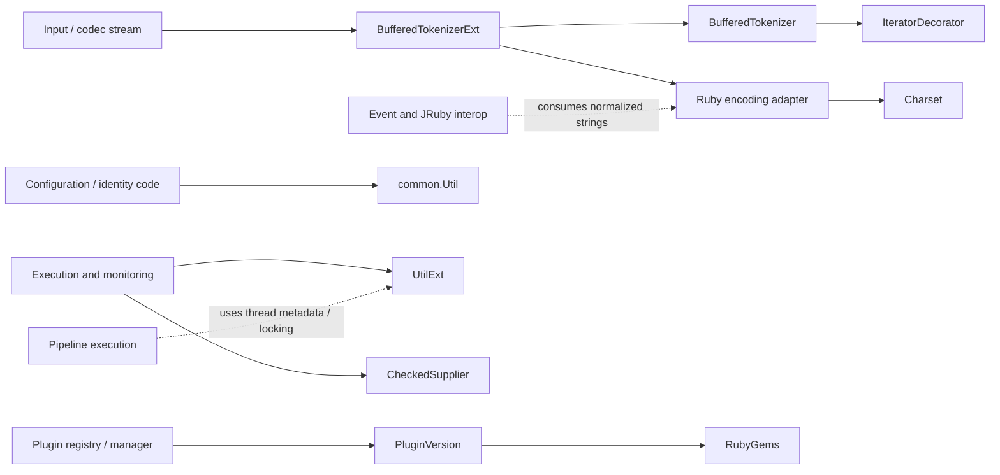
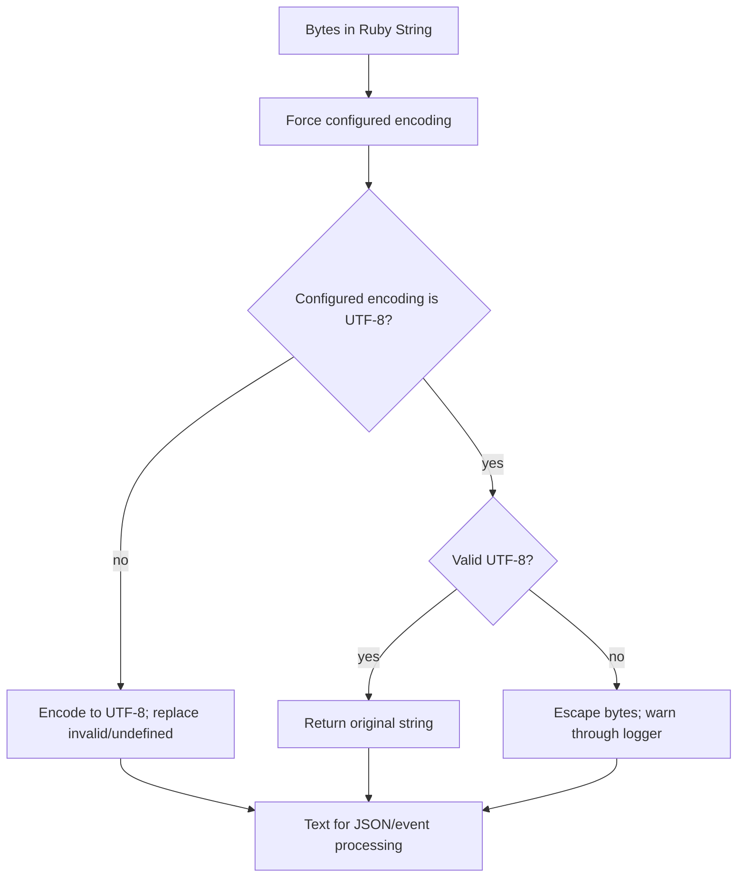

# Core data and I/O utilities

The `core_data_and_io_utilities` module provides small, shared primitives used at Logstash’s Ruby/Java boundary. It handles incremental delimiter-based tokenization, character-set normalization, stable SHA-256 digests, plugin version discovery and comparison, checked callback contracts, and JRuby access to Java thread metadata and synchronization.

These utilities are intentionally below the pipeline and plugin layers: they do not own pipeline lifecycle, configuration selection, event processing, or plugin installation. Their consumers are documented in [configuration_sources_and_loading.md](configuration_sources_and_loading.md), [pipeline_lifecycle_and_execution.md](pipeline_lifecycle_and_execution.md), [event_model_and_jruby_interop.md](event_model_and_jruby_interop.md), and [plugin_manager.md](plugin_manager.md).

## Architecture overview



The module has two implementation halves:

- Java supplies stateful, allocation-conscious stream helpers and JRuby extension methods.
- Ruby supplies integration with Ruby `Encoding` and `Gem::Version`, where the surrounding Logstash APIs already operate.

There is no shared mutable registry across these utilities. The tokenizer owns its buffer per instance; `Charset` owns a configured encoding per instance; `PluginVersion` wraps one immutable-style `Gem::Version`; and `Util` and `UtilExt` expose stateless operations.

## Component responsibilities

### `BufferedTokenizer` and `DataSplitter`

`BufferedTokenizer` accepts arbitrary chunks through `extract(String)` and exposes an `Iterable<String>` over every complete token delimited by the configured separator. The default separator is a newline, but any string separator is accepted. Delimiters are removed from returned tokens.

`DataSplitter` retains incomplete input in a `StringBuilder`. `hasNext()` searches from the current cursor; `next()` returns the substring before the next separator and advances the cursor. Once consumed data is no longer needed, the accumulator is compacted. `flush()` returns the remaining unterminated suffix and resets the buffer.

An optional positive `sizeLimit` protects callers from unbounded accumulation of a token that has not yet received its delimiter. Once a complete token is found, `next()` raises `IllegalStateException` if that token exceeds the configured limit. The append path also stops accumulating a delimiter-free trailing fragment after the limit has been reached. A limit is a token-length guard, not a maximum input-chunk size.

The iterator methods and buffer inspection are synchronized, allowing serialized access to the mutable splitter state. Callers should still treat one tokenizer instance as a single logical stream and should not interleave unrelated streams.

### `BufferedTokenizerExt`

`BufferedTokenizerExt` exposes the Java tokenizer as the JRuby class `BufferedTokenizer`. Its `initialize` method accepts an optional delimiter and optional size limit. `extract` records the source Ruby string’s charset, feeds its Java string content to `BufferedTokenizer`, and adapts each returned token back to a `RubyString` with the same charset.

The returned adapter is iterable and provides `isEmpty`, which lets Ruby callers distinguish “no complete token yet” from a token containing an empty string. `flush` returns the buffered suffix using the most recently observed encoding. If `flush` is called before any `extract`, a non-empty suffix is treated as an invariant violation; an empty suffix is returned normally.



### `Util`

`org.logstash.common.Util` provides deterministic SHA-256 hashing:

- `digest(String)` encodes the input as UTF-8, computes SHA-256, and returns lowercase hexadecimal.
- `bytesToHexString(byte[])` converts each byte to two hexadecimal characters, including a leading zero for values below `0x10`.
- `defaultMessageDigest()` centralizes construction and converts the theoretically unavailable SHA-256 algorithm into a runtime failure.

The digest is suitable for stable identifiers or content fingerprints. It is not encryption, password storage, or a collision-proof identity mechanism.

### `Charset`

`LogStash::Util::Charset` resolves a configured Ruby encoding once during initialization. `convert(data)` force-associates the incoming bytes with that encoding and then:

1. Converts non-UTF-8 input to UTF-8, replacing invalid and undefined sequences.
2. For configured UTF-8, returns valid data unchanged.
3. For invalid UTF-8, returns an escaped representation and logs a warning containing the configured charset and escaped text.

The object requires a logger for the invalid-UTF-8 warning path. `force_encoding` changes the interpretation of the bytes before conversion; callers therefore need to configure the charset correctly at the input boundary. This utility is commonly relevant to input and codec processing, whose extension points are described in [event_model_and_jruby_interop.md](event_model_and_jruby_interop.md).

### `PluginVersion`

`LogStash::Util::PluginVersion` wraps `Gem::Version`, delegates `to_s`, and includes `Comparable`. It accepts either an existing `Gem::Version` or version components joined with dots. `find_version!` resolves a gem specification, including a fallback through `find_all_by_name` for prerelease lookup situations. `find_plugin_version!` constructs the conventional gem name `logstash-<type>-<name>` before resolving it.

Missing gem metadata is translated from `Gem::LoadError` into `LogStash::PluginNoVersionError`. Comparisons delegate to the wrapped `Gem::Version`, so ordering follows RubyGems version semantics rather than lexical string ordering. Plugin discovery and installation workflows are documented in [plugin_manager.md](plugin_manager.md).

### `CheckedSupplier`

`CheckedSupplier<T>` is a Java functional interface equivalent to a supplier whose `get()` may throw any `Exception`. It allows Java callers to pass lambdas or method references through APIs that need deferred work while preserving checked-exception behavior. It has no lifecycle or storage responsibilities.

### `UtilExt`

`UtilExt` is registered as the JRuby module `LogStash::Util` and exposes three module methods:

- `get_thread_id(thread)` validates that the argument is a `RubyThread`, obtains its native Java thread, and returns its ID or `nil` when the native thread is no longer available.
- `get_thread_name(thread)` performs the same validation and returns the Java thread name or `nil` for a collected/dead native thread.
- `synchronize(target) { ... }` executes the Ruby block while holding Java’s monitor for `target`, returning the block result.

Invalid thread arguments raise a JRuby type error. The native-thread association is weak, so a Ruby thread object may outlive the Java thread object. The synchronization method provides mutual exclusion for code using the same target object; it does not create a broader application lock.

## Dependency relationships



The module is consumed horizontally. Configuration and loading may use hashing or charset conversion while producing pipeline inputs; plugins use version resolution; event and codec code uses tokenizer and encoding adapters; runtime and monitoring code can use thread metadata and synchronization. The higher-level ownership remains with those modules rather than these utilities.

## Data flows

### Incremental tokenization

```mermaid
flowchart TD
    C1[Input chunk 1] --> APP[append to accumulator]
    C2[Input chunk 2] --> APP
    APP --> FIND{Separator present?}
    FIND -- no --> WAIT[Retain partial token]
    FIND -- yes --> TOK[Return complete token(s)]
    TOK --> CURSOR[Advance current index]
    CURSOR --> FIND
    WAIT --> NEXT[Next extract call]
    NEXT --> APP
    EOF[Stream end] --> FLUSH[flush]
    FLUSH --> SUFFIX[Return remaining suffix and clear buffer]
```

### Charset normalization



### Plugin version lookup

```mermaid
flowchart LR
    REQUEST[type + plugin name] --> NAME[logstash-type-name]
    NAME --> SPEC[Gem::Specification lookup]
    SPEC --> FOUND{Specification found?}
    FOUND -- yes --> WRAP[PluginVersion(Gem::Version)]
    FOUND -- no --> FALLBACK[find_all_by_name fallback]
    FALLBACK --> WRAP
    FALLBACK -->|still missing / LoadError| ERR[PluginNoVersionError]
```

## Operational and maintenance notes

- A tokenizer’s state is retained between `extract` calls. Always call `flush` at a stream boundary when an unterminated final record must be processed.
- Configure `BufferedTokenizer`’s size limit when input can contain arbitrarily long delimiter-free data. Expect the limit failure when the oversized complete token is consumed.
- `BufferedTokenizerExt` preserves the encoding observed on the latest `extract`; avoid calling `flush` on a non-empty stream before establishing that encoding.
- `Charset` intentionally replaces malformed non-UTF-8 sequences, while malformed configured UTF-8 is escaped and warned. This is a recoverability choice and can alter the original byte representation.
- Use `PluginVersion` for semantic version comparisons. Do not compare its string form to determine ordering.
- `Util.digest` always hashes UTF-8 bytes, regardless of any Ruby-side encoding metadata.
- `UtilExt.synchronize` can block other users of the same monitor. Keep synchronized blocks small and avoid lock-order cycles.
- Thread IDs and names are observational values; a missing native thread is represented by `nil` rather than treated as an error.

## Related modules

- Runtime startup, settings, and JVM-facing utilities: [application_bootstrap_and_settings.md](application_bootstrap_and_settings.md)
- Configuration source loading and pipeline representation: [configuration_sources_and_loading.md](configuration_sources_and_loading.md)
- Pipeline parsing, IR construction, and compilation: [pipeline_language_and_compilation.md](pipeline_language_and_compilation.md)
- Pipeline lifecycle and execution: [pipeline_lifecycle_and_execution.md](pipeline_lifecycle_and_execution.md)
- Event model and JRuby conversion: [event_model_and_jruby_interop.md](event_model_and_jruby_interop.md)
- Plugin API, registry, and installation: [plugin_api_and_registry.md](plugin_api_and_registry.md) and [plugin_manager.md](plugin_manager.md)
- Metrics, monitoring, and operational APIs: [observability_and_operational_control.md](observability_and_operational_control.md)
