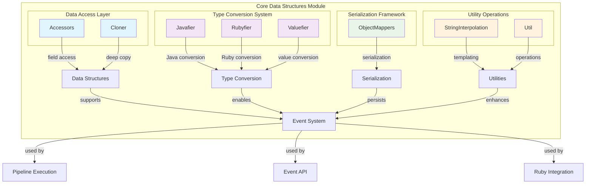
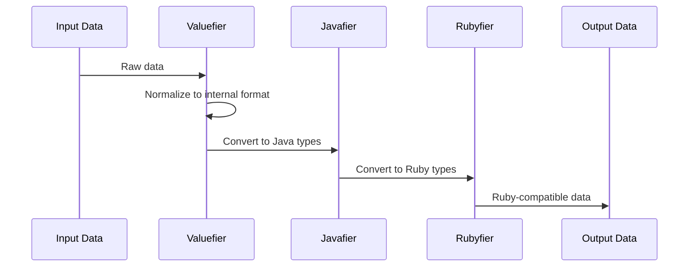

# Core Data Structures Module

## Overview

The `core_data_structures` module forms the foundational layer of the Logstash system, providing essential data manipulation, type conversion, and serialization capabilities. This module serves as the bridge between Java and Ruby environments, enabling seamless data transformation and access patterns throughout the Logstash pipeline.

## Purpose

The core data structures module is responsible for:

- **Data Access and Manipulation**: Providing field-based access to nested data structures
- **Type Conversion**: Converting between Java, Ruby, and native types
- **Object Serialization**: JSON and CBOR serialization/deserialization
- **String Interpolation**: Template-based string processing with field substitution
- **Deep Cloning**: Creating deep copies of complex data structures
- **Utility Operations**: Common data manipulation and merging operations

## Architecture Overview



## Component Relationships

The core data structures module components work together in a layered architecture:

### Data Access Layer
Provides fundamental data access and manipulation capabilities for nested structures.

**Key Components:**
- **Accessors**: Field-based access to nested data structures using dot notation
- **Cloner**: Deep copying of complex objects with type preservation

For detailed information, see: [Data Access Layer](data_access_layer.md)

### Type Conversion System
Handles seamless conversion between Java, Ruby, and internal data types.

**Key Components:**
- **Javafier**: Converts Ruby objects to Java equivalents
- **Rubyfier**: Converts Java objects to Ruby equivalents  
- **Valuefier**: Normalizes values into consistent internal representations

For detailed information, see: [Type Conversion System](type_conversion_system.md)

### Serialization Framework
Manages JSON and CBOR serialization with comprehensive Ruby type support.

**Key Components:**
- **ObjectMappers**: Custom serializers and deserializers for all supported types

For detailed information, see: [Serialization Framework](serialization_framework.md)

### Utility Operations
Provides common data manipulation and template processing capabilities.

**Key Components:**
- **StringInterpolation**: Template-based string processing with field substitution
- **Util**: Data manipulation operations like map merging

For detailed information, see: [Utility Operations](utility_operations.md)

## Key Features

### 1. Field Access Patterns
```java
// Nested field access using dot notation
Object value = Accessors.get(data, new FieldReference("[nested][field]"));
Accessors.set(data, new FieldReference("[array][0]"), newValue);
```

### 2. Type Conversion Chain


### 3. Serialization Support
- JSON serialization for logging and external APIs
- CBOR serialization for efficient storage and transmission
- Custom serializers for Ruby types (RubyString, RubyNil, etc.)
- Type preservation during serialization/deserialization

### 4. String Template Processing
- Field interpolation: `%{field.name}`
- Timestamp formatting: `%{+YYYY.MM.dd}` or `%{{yyyy-MM-dd}}`
- Complex object serialization within templates

## Integration Points

### With Ruby Integration Module
The core data structures module provides the foundation for Ruby-Java interoperability:
- Type converters enable seamless data exchange
- Ruby object serializers maintain type fidelity
- Field accessors work with Ruby data structures

See: [ruby_integration.md](ruby_integration.md)

### With Event API Module
Events rely heavily on core data structures for:
- Field access and manipulation
- Type conversion during event processing
- Serialization for persistence and transmission

See: [event_api.md](event_api.md)

### With Pipeline Execution Module
Pipeline components use core data structures for:
- Event data transformation
- Field-based routing and filtering
- Performance-optimized data access

See: [pipeline_execution.md](pipeline_execution.md)

## Performance Considerations

### Optimized Access Patterns
- Cached field reference parsing
- Efficient nested data traversal
- Minimal object allocation during conversions

### Memory Management
- Deep cloning with type preservation
- Efficient serialization formats (CBOR)
- Thread-local string builders for interpolation

### Type System Efficiency
- Converter caching for frequently used types
- Fallback conversion mechanisms
- Identity converters for pass-through types

## Error Handling

The module provides robust error handling for:
- Invalid field references
- Type conversion failures
- Serialization errors
- Template processing issues

Common exceptions:
- `InvalidFieldSetException`: When setting fields on incompatible types
- `MissingConverterException`: When no type converter is available
- `JsonProcessingException`: During serialization/deserialization

## Thread Safety

All core components are designed for concurrent access:
- Immutable field references
- Thread-safe converter maps
- Thread-local builders for string operations
- Concurrent hash maps for caching

## Usage Examples

### Basic Field Operations
```java
// Create a data structure
ConvertedMap data = new ConvertedMap();

// Set nested fields
Accessors.set(data, new FieldReference("[user][name]"), "john");
Accessors.set(data, new FieldReference("[user][age]"), 30);

// Get field values
Object name = Accessors.get(data, new FieldReference("[user][name]"));
```

### Type Conversion
```java
// Convert Ruby object to Java
Object javaValue = Javafier.deep(rubyObject);

// Convert Java object to Ruby
IRubyObject rubyValue = Rubyfier.deep(runtime, javaObject);
```

### String Interpolation
```java
// Template with field substitution
String template = "User %{user.name} logged in at %{@timestamp}";
String result = StringInterpolation.evaluate(event, template);
```

## Configuration

The module supports configuration through:
- Stream read constraints for JSON parsing
- Type validation policies
- Serialization format options
- Thread pool sizing for concurrent operations

## Monitoring and Metrics

Integration with the metrics system provides visibility into:
- Conversion operation counts
- Serialization performance
- Field access patterns
- Error rates by operation type

See: [metrics_system.md](metrics_system.md)

---

*This module serves as the foundation for all data operations in Logstash, providing the essential building blocks for event processing, type conversion, and data serialization across the entire system.*