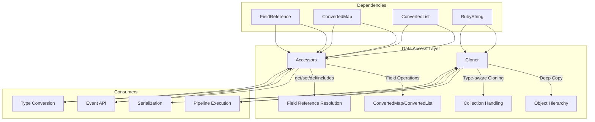
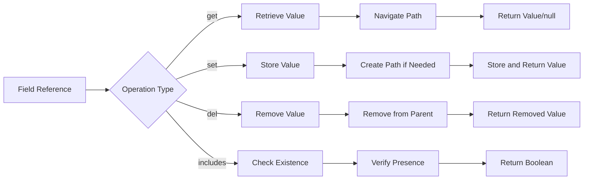
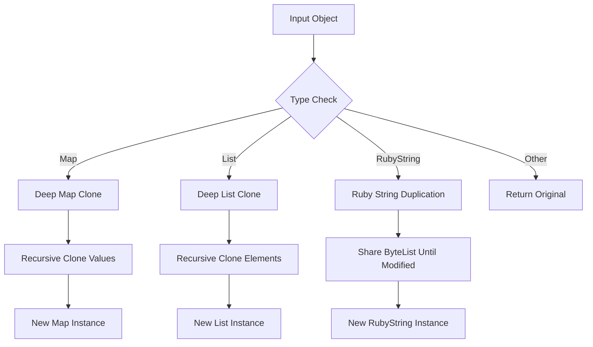
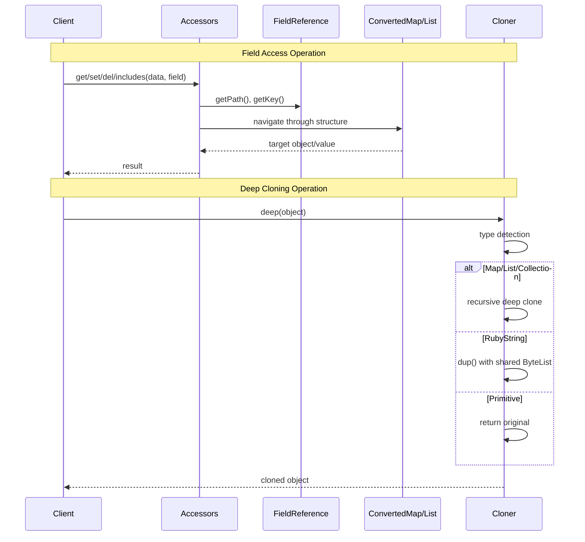
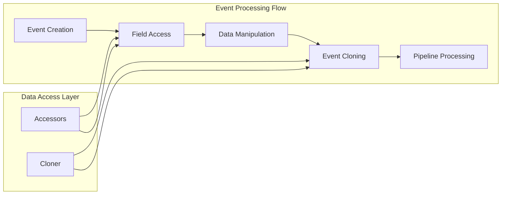
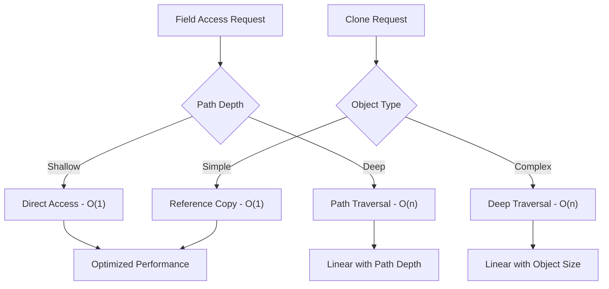

# Data Access Layer

The Data Access Layer module provides the foundational infrastructure for accessing, manipulating, and cloning data structures within the Logstash system. This module serves as the primary interface for field-based data operations and deep object cloning, ensuring consistent and safe data handling across the entire pipeline.

## Overview

The data_access_layer module is a critical component of Logstash's [core_data_structures](core_data_structures.md) system, providing two essential services:

1. **Field Access Operations**: Safe and efficient access to nested data structures using field references
2. **Deep Object Cloning**: Complete duplication of complex data structures while preserving type integrity

This module operates at the lowest level of data manipulation, serving as the foundation for higher-level operations in the [event_api](event_api.md) and [pipeline_execution](pipeline_execution.md) modules.

## Architecture



## Core Components

### Accessors

The `Accessors` class provides static utility methods for field-based data operations on `ConvertedMap` structures. It implements a path-based access pattern that allows navigation through nested data structures using dot notation and array indices.

#### Key Features

- **Path-based Navigation**: Traverses nested structures using field references
- **Type-safe Operations**: Handles both map and list data structures
- **Ruby-style Indexing**: Supports negative indices for list access
- **Automatic Structure Creation**: Creates intermediate structures when setting nested fields

#### Core Operations



#### Method Details

- **`get(ConvertedMap data, FieldReference field)`**: Retrieves a value at the specified field path
- **`set(ConvertedMap data, FieldReference field, Object value)`**: Sets a value at the specified field path, creating intermediate structures as needed
- **`del(ConvertedMap data, FieldReference field)`**: Removes a value at the specified field path
- **`includes(ConvertedMap data, FieldReference field)`**: Checks if a field exists at the specified path

### Cloner

The `Cloner` class provides deep cloning functionality for complex data structures, ensuring complete independence between original and cloned objects.

#### Supported Types



#### Cloning Strategy

- **Maps**: Creates new instances of HashMap, LinkedHashMap, TreeMap, or ConvertedMap
- **Lists**: Creates new instances of ArrayList or LinkedList
- **RubyString**: Creates a duplicate that shares the underlying ByteList until modification
- **Primitive Types**: Returns the original object (immutable)

## Data Flow



## Integration Points

### With Core Data Structures

The data_access_layer module is tightly integrated with the parent [core_data_structures](core_data_structures.md) module:

- **ConvertedMap/ConvertedList**: Primary data containers manipulated by Accessors
- **FieldReference**: Path specification for nested field access
- **Type System**: Coordinates with [type_conversion_system](type_conversion_system.md) for data transformation

### With Event Processing



### With Ruby Integration

The module provides seamless integration with Ruby objects:

- **RubyString Handling**: Efficient duplication strategy for Ruby strings
- **Ruby-style Indexing**: Negative index support for list operations
- **Memory Optimization**: Shared ByteList strategy reduces memory overhead

## Error Handling

### InvalidFieldSetException

```java
public static class InvalidFieldSetException extends RuntimeException
```

Thrown when attempting to set a field on an incompatible target object. This typically occurs when trying to set nested fields on primitive values or when the path structure conflicts with existing data types.

#### Common Scenarios

- Setting `[foo][bar]` when `foo` is a string or number
- Array index operations on non-list objects
- Type conflicts during path traversal

## Performance Considerations

### Memory Efficiency

- **Lazy Structure Creation**: Intermediate maps are only created when needed during set operations
- **Shared ByteList**: RubyString cloning shares underlying data until modification
- **Type-specific Cloning**: Optimized cloning strategies for different collection types

### Access Patterns



## Usage Examples

### Field Access Operations

```java
// Get a nested field value
Object value = Accessors.get(data, fieldRef);

// Set a nested field, creating intermediate structures
Accessors.set(data, fieldRef, newValue);

// Remove a field
Object removed = Accessors.del(data, fieldRef);

// Check field existence
boolean exists = Accessors.includes(data, fieldRef);
```

### Deep Cloning

```java
// Clone a complex data structure
ConvertedMap original = new ConvertedMap();
ConvertedMap clone = Cloner.deep(original);

// Clone preserves structure but creates independent objects
clone.put("key", "value"); // Does not affect original
```

## Thread Safety

The data_access_layer module components are **not thread-safe** by design:

- **Accessors**: Static utility methods operate on provided data structures
- **Cloner**: Creates new instances but doesn't synchronize access to source objects
- **Responsibility**: Thread safety is managed at higher levels in the [pipeline_execution](pipeline_execution.md) module

## Dependencies

### Internal Dependencies

- **ConvertedMap/ConvertedList**: Core data containers from [core_data_structures](core_data_structures.md)
- **FieldReference**: Path specification system
- **RubyString**: JRuby string integration

### External Dependencies

- **JRuby Runtime**: For RubyString handling and Ruby integration
- **Java Collections**: Standard collection interfaces and implementations

## Related Modules

- **[core_data_structures](core_data_structures.md)**: Parent module containing data containers and type systems
- **[type_conversion_system](type_conversion_system.md)**: Handles data type transformations
- **[event_api](event_api.md)**: Uses data access operations for event manipulation
- **[serialization_framework](serialization_framework.md)**: Relies on cloning for safe serialization
- **[ruby_integration](ruby_integration.md)**: Provides Ruby-Java interoperability features

## Future Considerations

### Potential Enhancements

1. **Performance Optimization**: Caching strategies for frequently accessed paths
2. **Memory Management**: More sophisticated memory pooling for temporary objects
3. **Type Safety**: Enhanced compile-time type checking for field operations
4. **Concurrency**: Thread-safe variants for high-concurrency scenarios

### Scalability Concerns

- **Deep Nesting**: Performance degradation with very deep object hierarchies
- **Large Collections**: Memory pressure during deep cloning of large data structures
- **Path Complexity**: Optimization opportunities for complex field reference patterns