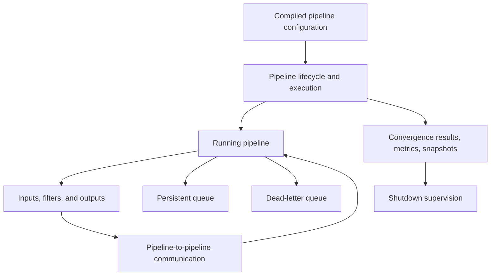
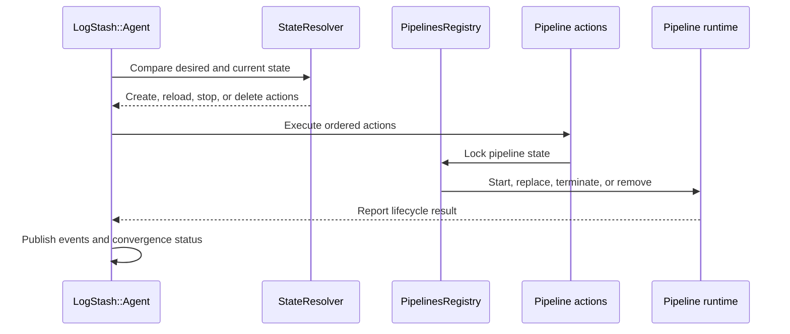
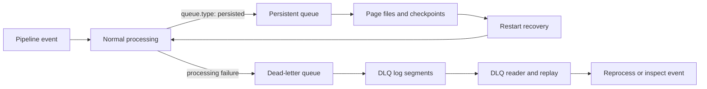
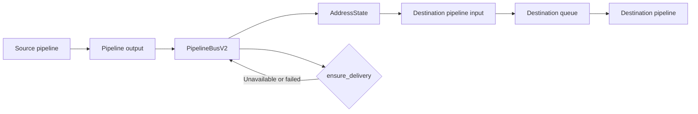

# Data Plane Execution and Reliability

## Purpose

The `data_plane_execution_and_reliability` module runs and supervises Logstash pipelines after configuration compilation. It reconciles desired and actual pipeline state, coordinates pipeline-to-pipeline event delivery, and provides durable handling for normal input buffering and processing failures.

Its main reliability mechanisms are:

- Lifecycle convergence, reporting, and graceful or guarded shutdown.
- In-process communication between pipelines.
- Persistent queues for acknowledged event durability.
- Dead-letter queues for failed-event retention and replay.

## Architecture



### Pipeline lifecycle and execution



Lifecycle coordination protects per-pipeline state, reports failures without abandoning other actions, and monitors stalled shutdowns through runtime snapshots.

### Durable data paths



Persistent queues protect normal pipeline delivery across restarts using page files, checkpoints, acknowledgements, checksums, and exclusive queue locks. Dead-letter queues separately preserve events rejected during processing and support ordered reading, seeking, replay, and acknowledgement-driven cleanup.

### Pipeline-to-pipeline communication



The pipeline bus is an in-process transport. It registers logical addresses, clones event batches for destinations, retries failed delivery when `ensure_delivery` is enabled, and coordinates sender/input shutdown.

## Repository structure

```text
data_plane_execution_and_reliability/
├── pipeline_lifecycle_and_execution/
│   ├── pipeline_lifecycle_and_execution_state_convergence/
│   └── pipeline_lifecycle_and_execution_reporting/
├── pipeline_to_pipeline_communication/
├── persistent_queue/
│   ├── persistent_queue_storage_and_recovery/
│   ├── persistent_queue_configuration_and_factory/
│   └── persistent_queue_queue_utilities/
└── dead_letter_queue/
```

The implementation is primarily under:

- `logstash-core` — lifecycle and execution coordination.
- `logstash-core/src/main/java/org/logstash/plugins/pipeline` — pipeline-to-pipeline transport.
- `logstash-core/src/main/java/org/logstash/ackedqueue` — persistent queue implementation.
- `logstash-core/src/main/java/org/logstash/common` — dead-letter queue implementation.

## Core component documentation

- [Pipeline lifecycle and execution](pipeline_lifecycle_and_execution.md)
  - [State convergence and registry](pipeline_lifecycle_and_execution_state_convergence.md)
  - [Execution reporting and shutdown](pipeline_lifecycle_and_execution_reporting.md)
- [Pipeline-to-pipeline communication](pipeline_to_pipeline_communication.md)
- [Persistent queue](persistent_queue.md)
  - [Storage and recovery](persistent_queue_storage_and_recovery.md)
  - [Configuration and factory](persistent_queue_configuration_and_factory.md)
  - [Queue utilities](persistent_queue_queue_utilities.md)
- [Dead-letter queue](dead_letter_queue.md)
  - [Writer and factory](dead_letter_queue_writer_and_factory.md)
  - [Reader and cleanup](dead_letter_queue_reader_and_cleanup.md)
  - [Record I/O](dead_letter_queue_record_io.md)