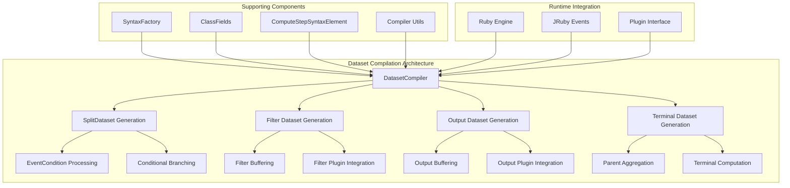
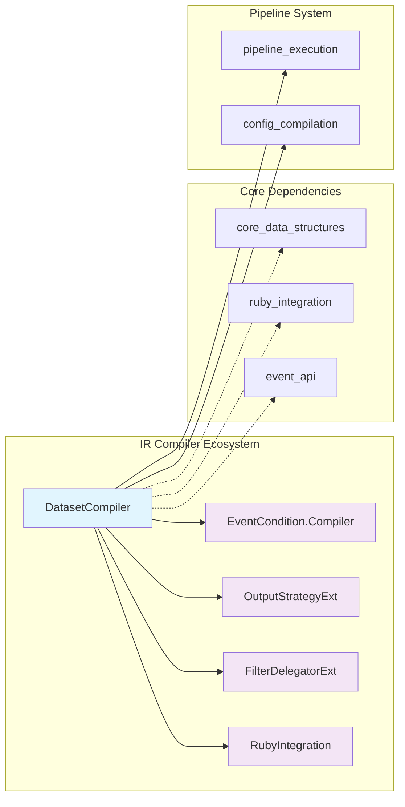
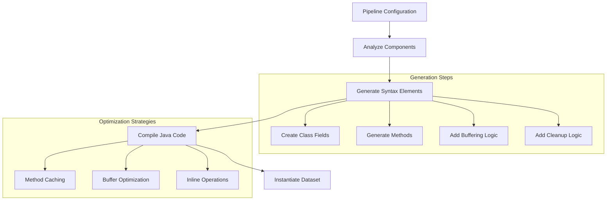
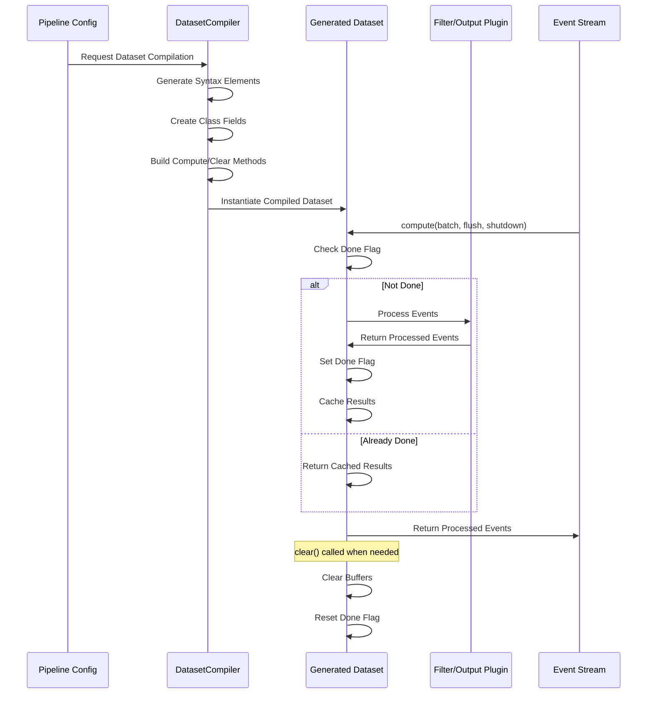

# Dataset Compilation Module

## Overview

The Dataset Compilation module is a critical component of Logstash's Intermediate Representation (IR) compiler system, responsible for dynamically generating optimized Java bytecode for data processing pipelines. This module transforms abstract pipeline configurations into executable dataset implementations that efficiently process event streams through filters, conditionals, and outputs.

## Core Purpose

The DatasetCompiler serves as the primary code generation engine that:
- Compiles abstract pipeline configurations into concrete Dataset implementations
- Generates optimized Java code for event processing workflows
- Manages data flow between pipeline components (filters, conditionals, outputs)
- Implements buffering strategies for efficient event handling
- Provides runtime compilation capabilities for dynamic pipeline optimization

## Architecture Overview



## Component Relationships



## Core Functionality

### 1. Dataset Compilation Types

The DatasetCompiler generates four primary types of datasets:

#### Split Datasets
- **Purpose**: Handle conditional branching in pipeline logic
- **Implementation**: Creates if/else branches based on event conditions
- **Key Features**:
  - Event condition evaluation
  - Dual-path data flow (if/else branches)
  - Exception handling for conditional errors
  - Complement dataset generation

#### Filter Datasets
- **Purpose**: Process events through filter plugins
- **Implementation**: Wraps filter plugins with buffering and lifecycle management
- **Key Features**:
  - Input/output buffering
  - Plugin lifecycle management (flush, shutdown)
  - Multi-filter event processing
  - Performance optimization through caching

#### Output Datasets
- **Purpose**: Send processed events to output destinations
- **Implementation**: Manages output plugin invocation and event delivery
- **Key Features**:
  - Efficient multi-receive operations
  - Plugin context management
  - Terminal and non-terminal output handling
  - Logging context integration

#### Terminal Datasets
- **Purpose**: Aggregate multiple parent datasets for final processing
- **Implementation**: Combines multiple data streams into unified processing
- **Key Features**:
  - Parent dataset aggregation
  - Optimized single-parent handling
  - Stream termination logic

### 2. Code Generation Process



### 3. Buffering Strategies

The compiler implements sophisticated buffering mechanisms:

#### Input Buffering
- Aggregates events from parent datasets
- Filters cancelled events
- Manages memory efficiently through clearing

#### Output Buffering
- Caches computation results
- Implements done-flag optimization
- Provides lazy evaluation capabilities

#### Conditional Buffering
- Separates events into if/else branches
- Maintains event ordering
- Handles exception scenarios

## Data Flow Architecture



## Integration Points

### Ruby Integration
- **JRuby Event Processing**: Seamless integration with Ruby event objects
- **Plugin Invocation**: Direct calls to Ruby filter and output plugins
- **Context Management**: Proper Ruby context handling for thread safety

### Pipeline Execution
- **Worker Loop Integration**: Datasets integrate with [pipeline_execution](pipeline_execution.md) worker loops
- **Event Dispatching**: Coordinates with event dispatcher for efficient processing
- **Shutdown Handling**: Proper cleanup during pipeline shutdown

### Configuration System
- **IR Compilation**: Works with [config_compilation](config_compilation.md) for pipeline IR generation
- **Plugin Resolution**: Integrates with plugin system for component instantiation

## Performance Optimizations

### 1. Method Caching
- Caches Ruby method call sites for repeated invocations
- Reduces reflection overhead in plugin calls
- Optimizes multi-receive operations for outputs

### 2. Buffer Management
- Implements efficient buffer clearing strategies
- Reuses buffer instances to reduce garbage collection
- Optimizes memory allocation patterns

### 3. Conditional Optimization
- Generates optimized branching code for conditionals
- Minimizes event copying in split operations
- Implements fast-path execution for common cases

### 4. Compilation Strategies
- Synchronizes compilation to avoid duplicate class generation
- Implements lazy instantiation for performance
- Optimizes generated bytecode for JVM execution

## Error Handling

### Conditional Evaluation Errors
- Catches and handles conditional evaluation exceptions
- Provides error notification mechanisms
- Maintains pipeline stability during condition failures

### Plugin Integration Errors
- Manages plugin lifecycle errors gracefully
- Implements proper cleanup on failure scenarios
- Provides error context for debugging

## Usage Patterns

### Filter Dataset Creation
```java
// Compile filter dataset with parent aggregation
ComputeStepSyntaxElement<Dataset> filterDataset = 
    DatasetCompiler.filterDataset(parentDatasets, filterPlugin);
```

### Split Dataset Creation
```java
// Create conditional split with error handling
ComputeStepSyntaxElement<SplitDataset> splitDataset = 
    DatasetCompiler.splitDataset(parents, condition, errorListener);
```

### Output Dataset Creation
```java
// Generate output dataset with terminal optimization
ComputeStepSyntaxElement<Dataset> outputDataset = 
    DatasetCompiler.outputDataset(parents, outputPlugin, isTerminal);
```

## Related Modules

- **[event_condition_system](event_condition_system.md)**: Provides conditional evaluation logic
- **[plugin_delegation](plugin_delegation.md)**: Manages filter plugin delegation
- **[output_strategy_management](output_strategy_management.md)**: Handles output strategy implementation
- **[ruby_integration_layer](ruby_integration_layer.md)**: Provides Ruby-Java integration
- **[core_data_structures](core_data_structures.md)**: Supplies fundamental data handling components
- **[pipeline_execution](pipeline_execution.md)**: Executes compiled datasets in worker loops
- **[config_compilation](config_compilation.md)**: Provides IR compilation context

## Technical Specifications

### Supported Dataset Types
- **SplitDataset**: Conditional branching datasets
- **FilterDataset**: Filter processing datasets  
- **OutputDataset**: Output delivery datasets
- **TerminalDataset**: Stream termination datasets

### Compilation Features
- Dynamic Java code generation
- Runtime class instantiation
- Method-level syntax element composition
- Field-based state management

### Performance Characteristics
- O(1) cached result retrieval
- Optimized buffer management
- Minimal object allocation
- JVM-optimized bytecode generation

The Dataset Compilation module represents a sophisticated code generation system that transforms abstract pipeline configurations into highly optimized executable code, forming the foundation of Logstash's high-performance event processing capabilities.