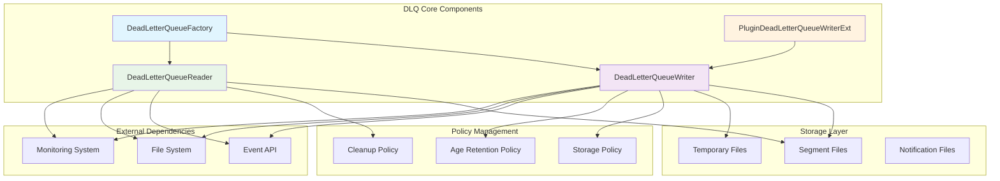
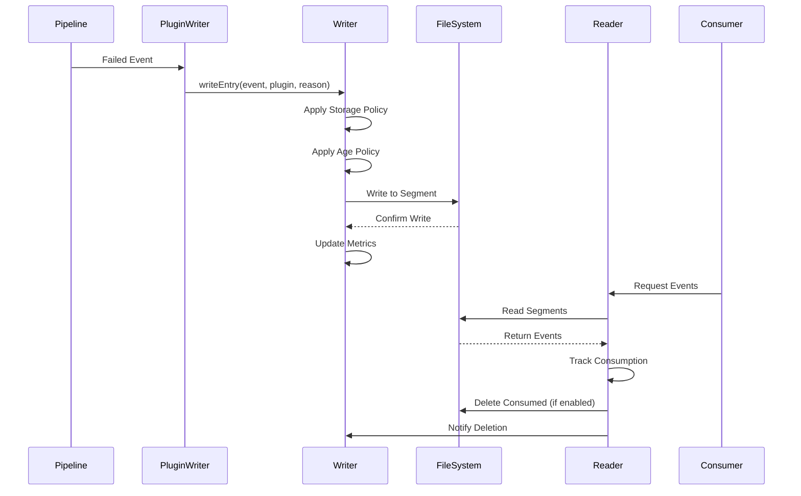

# Dead Letter Queue Module

## Overview

The Dead Letter Queue (DLQ) module is a critical component of the Logstash system that provides fault tolerance and error handling capabilities. It captures and stores events that fail to be processed by the pipeline, allowing for later inspection, reprocessing, or analysis. The module implements a robust, file-based storage system with configurable retention policies, storage limits, and cleanup mechanisms.

## Purpose

The DLQ module serves several key purposes:

- **Error Recovery**: Captures events that fail during pipeline processing
- **Data Integrity**: Prevents data loss by storing failed events persistently
- **Debugging Support**: Provides detailed context about processing failures
- **Operational Monitoring**: Tracks metrics about failed events and queue health
- **Resource Management**: Implements storage and age-based retention policies

## Architecture Overview

The DLQ module follows a producer-consumer pattern with sophisticated file management and policy enforcement:



## Component Architecture

The DLQ module is organized into three main sub-systems, each handling specific aspects of dead letter queue functionality:

### Core Components Overview

- **DeadLetterQueueFactory**: Central registry and factory for managing DLQ writer instances
- **DeadLetterQueueWriter**: Primary component for writing events to DLQ with policy enforcement
- **DeadLetterQueueReader**: Manages reading events and cleanup of consumed segments
- **PluginDeadLetterQueueWriterExt**: Ruby-Java integration layer for plugin access

### Sub-Modules

1. **[DLQ Reader System](dlq_reader_system.md)**: Manages reading events from DLQ segments, handles cleanup of consumed segments, and provides coordination with writer processes through filesystem notifications.

2. **[DLQ Writer System](dlq_writer_system.md)**: Handles writing events to DLQ with comprehensive policy enforcement, segment management, and factory-based writer creation and lifecycle management.

3. **[Plugin Integration Layer](plugin_integration_layer.md)**: Provides Ruby-Java integration for plugin access to DLQ functionality, including wrapper classes and JRuby extensions for seamless plugin interaction.

### Data Flow



## Key Features

### 1. Segment-Based Storage
- Events are stored in segment files with configurable maximum size (default: 10MB)
- Atomic operations ensure data consistency
- Temporary files prevent corruption during writes

### 2. Policy Enforcement
- **Storage Policy**: Controls behavior when queue reaches maximum size
  - `DROP_NEWER`: Reject new events when full
  - `DROP_OLDER`: Remove oldest segments to make space
- **Age Retention**: Automatically removes segments older than configured duration
- **Size Management**: Maintains queue within specified byte limits

### 3. Concurrent Access Management
- File locking prevents multiple writers on same queue
- Watch services monitor filesystem changes
- Thread-safe operations with proper synchronization

### 4. Cleanup and Maintenance
- Automatic cleanup of temporary files on startup
- Segment deletion notifications between reader and writer
- Metrics tracking for monitoring and alerting

## Integration Points

### Event API Integration
The DLQ module integrates closely with the [event_api](event_api.md) module:
- Uses `Event` objects for data representation
- Leverages event metadata for duplicate detection
- Integrates with plugin lifecycle management

### Monitoring Integration
Connects with the [monitoring](monitoring.md) and [metrics_system](metrics_system.md) modules:
- Tracks queue size, dropped events, and expired events
- Provides health indicators for operational monitoring
- Exposes metrics for external monitoring systems

### Plugin System Integration
Works with the [plugin_system](plugin_system.md) for:
- Plugin-specific DLQ writers
- Context-aware error handling
- Plugin lifecycle management

## Configuration

### Writer Configuration
```java
DeadLetterQueueWriter writer = DeadLetterQueueWriter
    .newBuilder(queuePath, maxSegmentSize, maxQueueSize, flushInterval)
    .storageType(QueueStorageType.DROP_OLDER)
    .retentionTime(Duration.ofDays(7))
    .build();
```

### Reader Configuration
```java
DeadLetterQueueReader reader = new DeadLetterQueueReader(
    queuePath, 
    cleanConsumed,  // Enable automatic cleanup
    segmentListener // Callback for segment events
);
```

## Error Handling and Recovery

### Write Failures
- Storage policy enforcement prevents queue overflow
- Duplicate detection prevents reprocessing same events
- Atomic operations ensure consistency

### Read Failures
- Graceful handling of missing or corrupted segments
- Automatic recovery from temporary file issues
- Notification system for cross-process coordination

### File System Issues
- Robust handling of file locks and permissions
- Recovery from abnormal shutdowns
- Cleanup of orphaned temporary files

## Performance Considerations

### Write Performance
- Buffered I/O for efficient segment writing
- Batch operations where possible
- Minimal locking for concurrent access

### Read Performance
- Sequential access patterns for optimal I/O
- Efficient segment traversal
- Lazy loading of segment data

### Storage Efficiency
- Compressed event serialization
- Efficient segment file format
- Automatic cleanup of consumed data

## Operational Monitoring

### Key Metrics
- Queue size (bytes and events)
- Dropped events count
- Expired events count
- Segment count and age
- Read/write throughput

### Health Indicators
- Queue availability
- Storage policy violations
- File system errors
- Lock contention issues

## Best Practices

### Configuration
1. Set appropriate segment size based on I/O patterns
2. Configure retention policies based on operational needs
3. Monitor queue growth and adjust limits accordingly

### Operations
1. Regular monitoring of DLQ metrics
2. Periodic review of failed events for pattern analysis
3. Proper cleanup configuration to prevent disk exhaustion

### Troubleshooting
1. Check file permissions and disk space
2. Monitor for lock contention issues
3. Review policy configurations for effectiveness

## Related Documentation

- [Event API](event_api.md) - Core event handling and metadata
- [Monitoring](monitoring.md) - System monitoring and health checks
- [Metrics System](metrics_system.md) - Performance and operational metrics
- [Plugin System](plugin_system.md) - Plugin integration and lifecycle
- [Common Utilities](common_utilities.md) - Shared utility functions