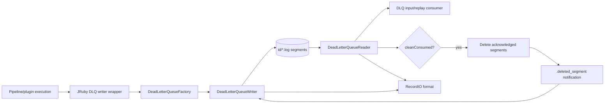
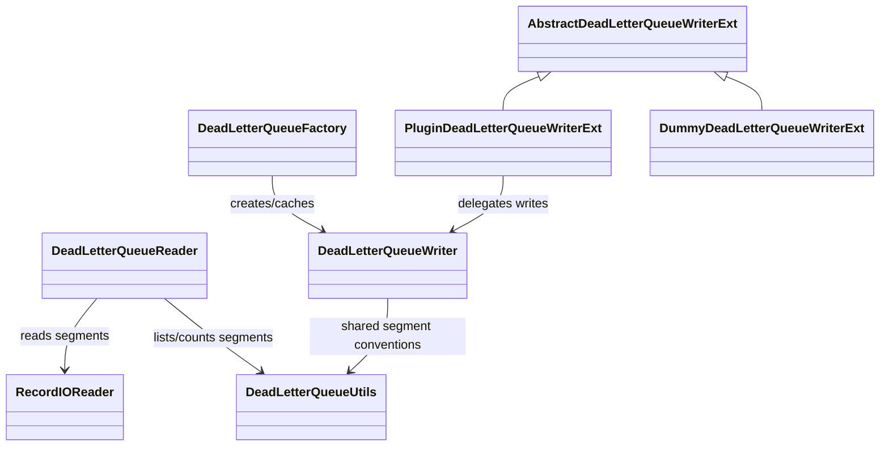
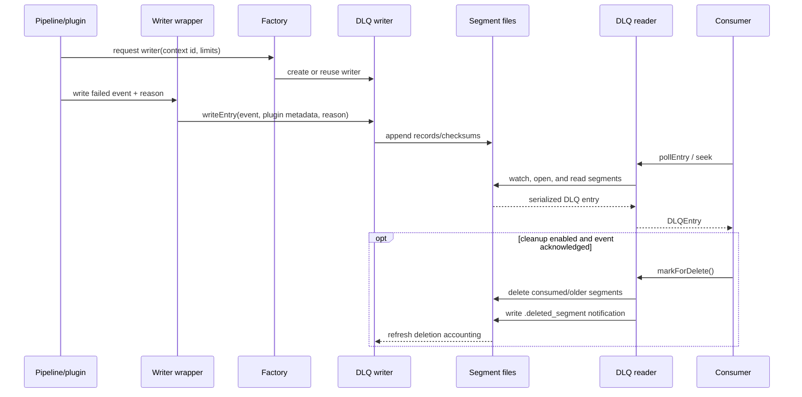

# Dead-letter queue

## Purpose

The `dead_letter_queue` module provides durable handling for events that cannot be processed by a Logstash plugin or pipeline stage. It connects JRuby-facing writer wrappers to per-context on-disk writers, and provides a reader that can replay entries, seek by event timestamp or byte position, and optionally remove consumed segments.

The module sits in Logstash's data-plane execution and reliability layer. It is distinct from [persistent_queue](persistent_queue.md): a persistent queue buffers normal pipeline input for delivery, whereas a DLQ preserves processing failures for later inspection or replay.

## Architecture overview

```mermaid
flowchart LR
    Pipeline[Pipeline/plugin execution] --> Wrapper[JRuby DLQ writer wrapper]
    Wrapper --> Factory[DeadLetterQueueFactory]
    Factory --> Writer[DeadLetterQueueWriter]
    Writer --> Segments[(id/*.log segments)]
    Segments --> Reader[DeadLetterQueueReader]
    Reader --> Input[DLQ input/replay consumer]
    Reader --> Cleanup{cleanConsumed?}
    Cleanup -->|yes| Delete[Delete acknowledged segments]
    Delete --> Notify[.deleted_segment notification]
    Notify --> Writer
    Writer --> Record[RecordIO format]
    Reader --> Record
```

The main runtime boundary is the segment directory. The writer appends versioned, checksummed records; the reader discovers and consumes those records independently, including when the reader and writer run in different Logstash processes.

## Component relationships

```mermaid
classDiagram
    class DeadLetterQueueFactory
    class AbstractDeadLetterQueueWriterExt
    class PluginDeadLetterQueueWriterExt
    class DummyDeadLetterQueueWriterExt
    class DeadLetterQueueReader
    class RecordIOReader
    class DeadLetterQueueUtils
    class DeadLetterQueueWriter

    DeadLetterQueueFactory --> DeadLetterQueueWriter : creates/caches
    AbstractDeadLetterQueueWriterExt <|-- PluginDeadLetterQueueWriterExt
    AbstractDeadLetterQueueWriterExt <|-- DummyDeadLetterQueueWriterExt
    PluginDeadLetterQueueWriterExt --> DeadLetterQueueWriter : delegates writes
    DeadLetterQueueReader --> RecordIOReader : reads segments
    DeadLetterQueueReader --> DeadLetterQueueUtils : lists/counts segments
    DeadLetterQueueWriter --> DeadLetterQueueUtils : shared segment conventions
```

## Sub-modules

- [Dead-letter queue writer and factory](dead_letter_queue_writer_and_factory.md) — manages the per-id writer registry, constructs writers with capacity/flush/retention policies, and bridges Java writers and Logstash JRuby events. It also defines inert behavior when DLQ writing is disabled.

- [Dead-letter queue reader and cleanup](dead_letter_queue_reader_and_cleanup.md) — watches segment directories, reads entries in order, supports seeking and restart positions, coordinates single-reader cleanup, and notifies writers when consumed segments are deleted.

- [Dead-letter queue record I/O](dead_letter_queue_record_io.md) — explains the versioned block/record format, CRC validation, event-fragment reconstruction, timestamp search, segment enumeration, and event counting.

## End-to-end processing

```mermaid
sequenceDiagram
    participant P as Pipeline/plugin
    participant W as Writer wrapper
    participant F as Factory
    participant D as DLQ writer
    participant S as Segment files
    participant R as DLQ reader
    participant C as Consumer

    P->>F: request writer(context id, limits)
    F->>D: create or reuse writer
    P->>W: write failed event + reason
    W->>D: writeEntry(event, plugin metadata, reason)
    D->>S: append records/checksums
    C->>R: pollEntry / seek
    R->>S: watch, open, and read segments
    S-->>R: serialized DLQ entry
    R-->>C: DLQEntry
    opt cleanup enabled and event acknowledged
        C->>R: markForDelete()
        R->>S: delete consumed/older segments
        R->>S: write .deleted_segment notification
        S-->>D: refresh deletion accounting
    end
```

## Design notes

- Writer instances are cached by string id, so the id is the isolation key for queue directories and lifecycle management.
- The writer enforces maximum queue size and full-queue policy; the factory fixes the maximum individual segment size at 10 MiB.
- Reader cleanup is acknowledgement-driven. Merely reading an entry does not delete its segment.
- Filesystem watching and missing-file handling are required because writer retention and reader cleanup may occur concurrently.
- The reader lock applies only when `cleanConsumed` is enabled and prevents multiple cleaning readers for one queue.
- Segment deletion is communicated through a notification file so a writer in another process can update its size metrics.

## Related modules

- Data-plane execution and reliability — pipeline execution and reliability components that host DLQ interactions.
- [Persistent queue](persistent_queue.md) — the separate durable buffering mechanism for normal pipeline events.
- [Runtime foundation and configuration](runtime_foundation_and_configuration.md) — shared settings and runtime infrastructure.
