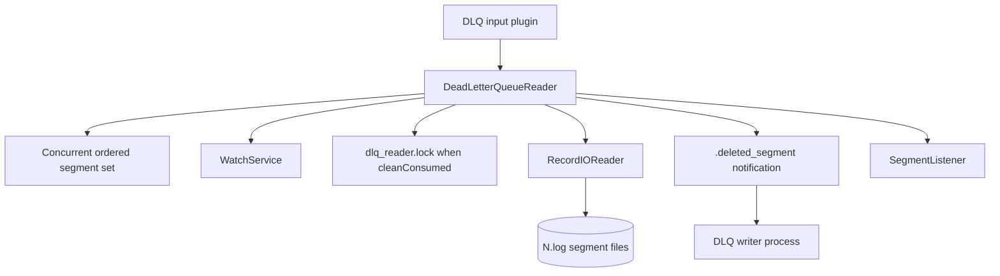
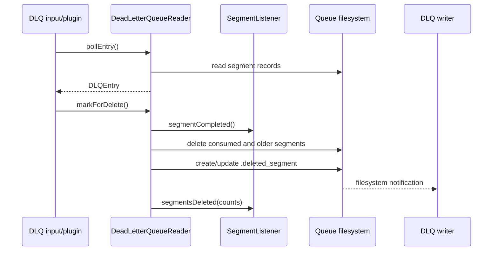

# Dead-letter queue reader and cleanup

## Purpose

This sub-module reads DLQ entries from numbered segment files, supports timestamp and byte-offset repositioning, follows segments created by another process, and optionally deletes consumed segments. It is the reader-side implementation used by the DLQ input plugin.

Writer construction and event production are covered by [dead_letter_queue_writer_and_factory](dead_letter_queue_writer_and_factory.md). Binary segment parsing is covered by [dead_letter_queue_record_io](dead_letter_queue_record_io.md).

## Architecture



## Segment discovery and reading

Construction registers the queue directory with a `WatchService`, loads non-trivial `.log` files, and orders them by numeric segment id. A reader opens only one segment at a time. Missing files are removed from the in-memory set because the writer may have deleted them concurrently.

`pollEntry(timeout)` waits for segment creation events when no current reader is available, reads one complete serialized event, and advances to the next existing segment at end of stream. `seekToNextEvent(timestamp)` uses each `RecordIOReader`'s timestamp-aware search to position at the first entry whose timestamp is at least the requested value. `setCurrentReaderAndPosition` restores a segment and byte offset, falling forward to the next available segment when the requested file no longer exists.

```mermaid
flowchart TD
    Poll[pollEntry(timeout)] --> Current{Current reader?}
    Current -- no --> Watch[Poll WatchService]
    Watch --> Available{Segments available?}
    Available -- no --> Null[Return null]
    Available -- yes --> Open[Open lowest segment]
    Current -- yes --> Read[Read complete event]
    Open --> Read
    Read --> More{Event returned?}
    More -- yes --> Event[Return DLQEntry]
    More -- no, not final --> Next[Close segment and open next existing]
    More -- no, final --> WatchAgain[Wait for new segment]
    Next --> Read
    WatchAgain --> Read
```

## Optional consumed-segment cleanup

`cleanConsumed` changes the reader from a passive consumer into an acknowledging consumer:

1. Construction requires a `SegmentListener` and obtains an exclusive `dlq_reader.lock`, allowing only one cleaning reader per queue.
2. When a segment reaches end of stream, it becomes the pending `lastConsumedReader`.
3. The caller must invoke `markForDelete()` after acknowledging the last returned event.
4. The reader deletes the consumed segment and any older segments, counts deleted events, and reports cumulative segment/event counts to the listener.
5. It writes or appends to `.deleted_segment`, allowing a writer in another Logstash process to refresh its size accounting.

The acknowledgement is intentionally separate from `pollEntry`: reading an event alone does not authorize deletion. If deletion fails, the reader logs the problem and continues to report the metrics it can establish.



## Operational and failure behavior

- A segment with an invalid version or checksum fails through `RecordIOReader`; the reader does not silently reinterpret the data.
- Concurrent writer-side retention or full-queue policies can remove files between discovery and open. The reader handles this by pruning missing paths and continuing.
- `close()` closes the active record reader and watch service, then releases the exclusive lock when cleanup is enabled.
- `getCurrentSegment()` and `getCurrentPosition()` expose restart/checkpoint state to callers; they require an active reader.
- Cleanup physically deletes files and is therefore an operationally significant option. The lock protects against multiple cleaning readers, not against every writer policy race.

