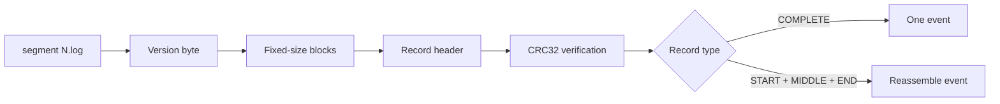
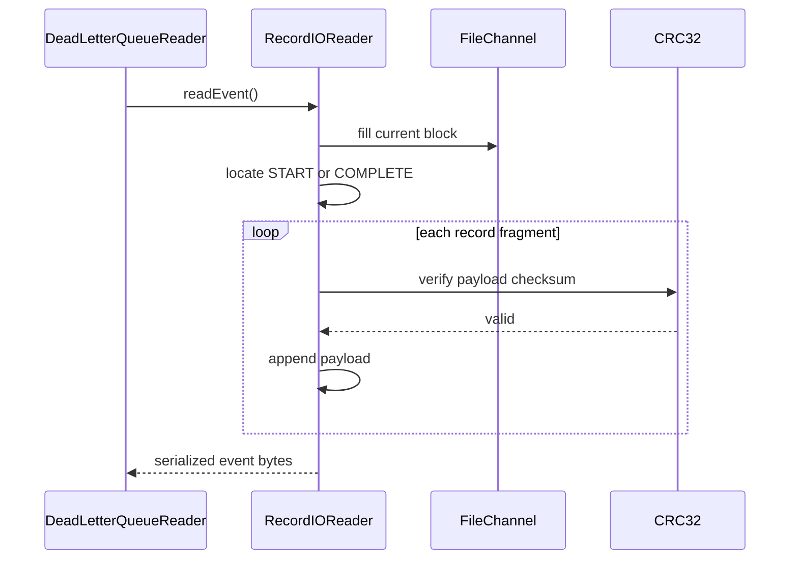

# Dead-letter queue record I/O

## Purpose

This sub-module defines the reader-side mechanics for DLQ segment files. `RecordIOReader` validates the segment version, reads block-framed records, reconstructs events split across records or blocks, verifies checksums, and supports binary-search-assisted timestamp seeking. `DeadLetterQueueUtils` supplies segment enumeration and event-counting helpers used by the reader and cleanup paths.

The high-level DLQ architecture is documented in [dead_letter_queue](dead_letter_queue.md); writer creation is documented in [dead_letter_queue_writer_and_factory](dead_letter_queue_writer_and_factory.md).

## Segment format assumptions

Segment files are named `<integer>.log` and begin with the DLQ format version byte. The remaining content is organized into fixed-size blocks containing record headers and payloads. Record types include `START`, `MIDDLE`, `END`, and `COMPLETE`; a large event can span multiple records and block boundaries.

Each record header carries its payload size, checksum, and, where applicable, total event size. `RecordIOReader` computes a CRC32 over each payload before accepting it. This means partial writes, corrupted payloads, and unexpected format versions are surfaced rather than returned as events.

## `RecordIOReader` responsibilities

| Operation | Behavior |
| --- | --- |
| Construction | Opens read-only, validates the version byte, and starts after the version. |
| `readEvent()` | Finds a start/complete record, reads all fragments, verifies each checksum, and returns serialized event bytes. |
| `seekToOffset()` / `seekToBlock()` | Repositions the channel and block buffer for restart or scanning. |
| `seekToNextEventPosition()` | Binary-searches blocks using a caller-supplied key extractor/comparator, then sequentially scans to the first matching event while restoring the matching event's buffer state. |
| `isEndOfStream()` | Indicates that the current block was shorter than the configured block size. |
| `getSegmentStatus()` | Classifies a segment as empty, valid, or invalid by attempting to read all events. |

The reader tracks both channel position and buffered-block position. Repositioning must update both; otherwise a caller could skip or duplicate records. `BufferState` captures these values so timestamp search can look ahead and restore the stream to the beginning of the matching event.

## `DeadLetterQueueUtils` responsibilities

- `extractSegmentId` parses the numeric prefix from a `.log` filename.
- `listFiles` and `listSegmentPaths` enumerate matching files without retaining an open directory stream.
- `listSegmentPathsSortedBySegmentId` provides numeric ordering rather than lexicographic ordering.
- `countEventsInSegment` scans record headers and counts `START` and `COMPLETE` records, which represent event beginnings. `MIDDLE` and `END` fragments advance the scan but do not increment the event count.

The counting method validates the minimum segment shape, skips the version byte, aligns when a record header would cross a block boundary, and returns zero for a too-small segment. It is used for cleanup metrics, not for deserializing event payloads.

## Important invariants

1. Segment ids must be numeric before `.log`; malformed names can fail numeric extraction.
2. The version byte must match the version expected by `RecordIOWriter`.
3. Record payload checksums must match CRC32 values stored in headers.
4. A split event must contain a valid start/complete record and all required continuation fragments.
5. Segment ordering is numeric, while cleanup ordering may additionally use filesystem modification time to account for repositioning.

