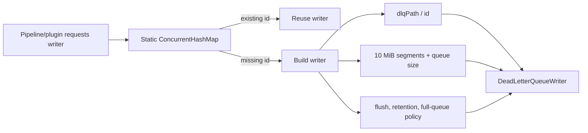
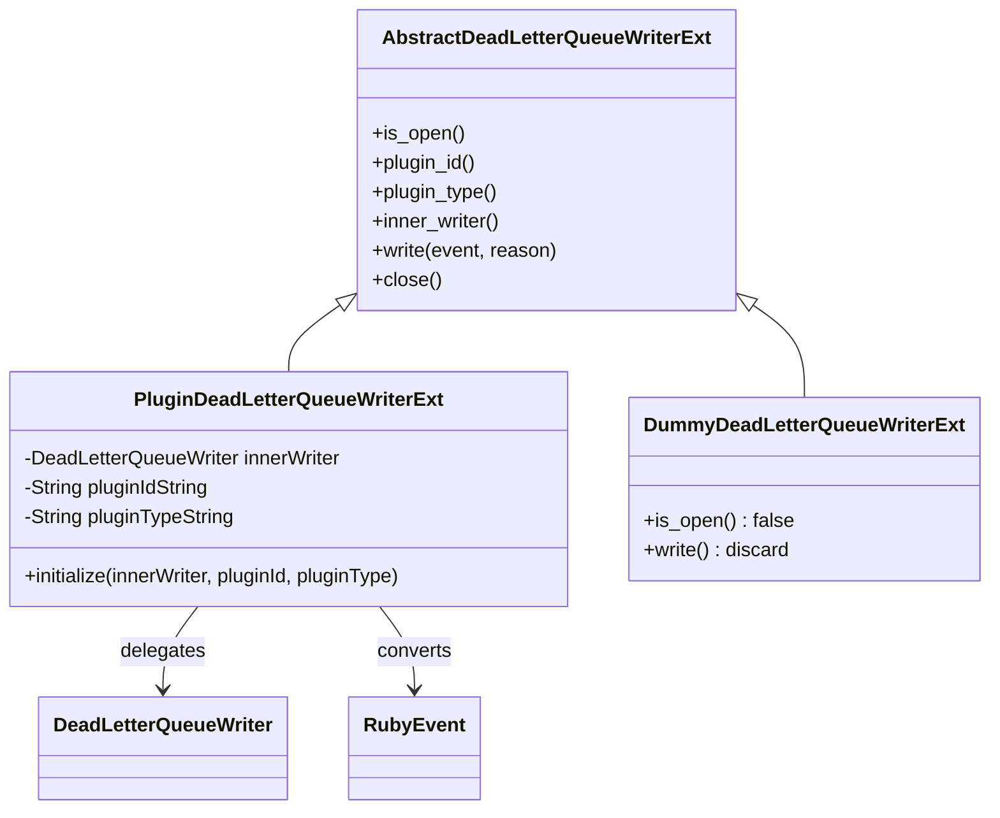
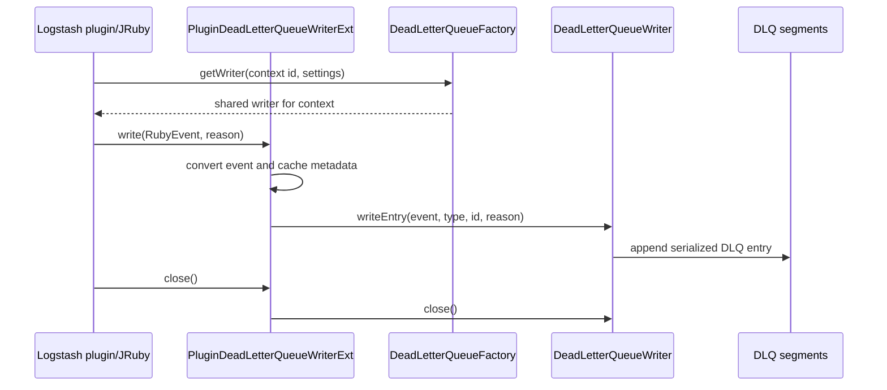

# Dead-letter queue writer and factory

## Purpose

This sub-module owns the writer-side entry point for Logstash dead-letter queues (DLQs). It provides a registry of per-context `DeadLetterQueueWriter` instances and exposes those writers to JRuby pipeline/plugin code through `AbstractDeadLetterQueueWriterExt`.

The reader and on-disk traversal behavior is documented in [dead_letter_queue_reader_and_cleanup](dead_letter_queue_reader_and_cleanup.md). The record format used by both sides is described in [dead_letter_queue_record_io](dead_letter_queue_record_io.md).

## Components

### `DeadLetterQueueFactory`

`DeadLetterQueueFactory` is a static factory and registry:

- `getWriter(id, ...)` returns the existing writer for an id or creates one atomically with `ConcurrentHashMap.computeIfAbsent`.
- The backing directory is `<dlqPath>/<id>`.
- Every writer uses a fixed maximum segment size of 10 MiB and receives the configured maximum queue size, flush interval, and full-queue storage policy (`drop_older` or `drop_newer`).
- The overload accepting `age` passes a retention period to the writer so expired segments can be removed automatically.
- `release(id)` removes the writer from the registry; ownership of closing the returned writer remains with the caller that created/retrieved it.

IO failures during construction are logged and cause the factory method to return `null`, so callers must treat writer creation as fallible.

### `AbstractDeadLetterQueueWriterExt`

This JRuby extension defines the common Ruby-visible API:

| Ruby method | Responsibility |
| --- | --- |
| `is_open` | Reports whether the underlying writer is usable. |
| `plugin_id` / `plugin_type` | Identifies the plugin that rejected or could not process the event. |
| `inner_writer` | Returns the wrapped writer object. |
| `write(event, reason)` | Writes a DLQ entry containing the event and failure reason. |
| `close` | Closes the underlying writer. |

`PluginDeadLetterQueueWriterExt` adapts a JRuby object to the Java `DeadLetterQueueWriter` interface. It caches string versions of plugin id/type and converts the JRuby event to the Java event representation before calling `writeEntry`. A closed or absent writer makes `write` and `close` no-ops; an `IOException` from the underlying writer is surfaced as an `IllegalStateException`.

`DummyDeadLetterQueueWriterExt` is an inert implementation used when no real DLQ writer is configured. It reports closed, returns `nil` metadata, and discards writes.

## Write flow

## Lifecycle and concurrency notes

The registry serializes creation per id, preventing duplicate writers for the same context within a JVM. It does not automatically close writers when they are released, and it does not coordinate distinct ids that point at the same physical directory. The caller must therefore use stable ids and explicitly close/release writers during pipeline shutdown.

