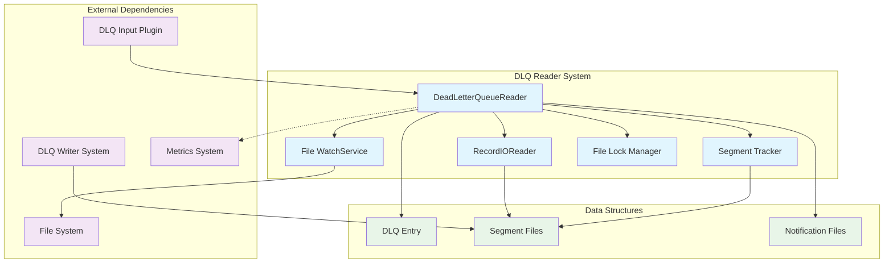
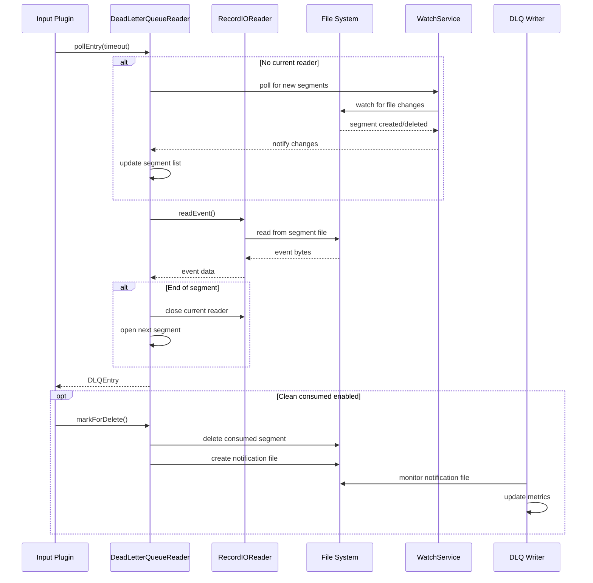
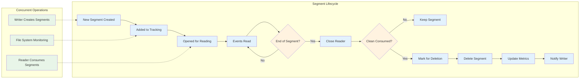
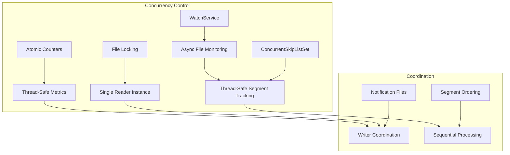

# Dead Letter Queue Reader System

The Dead Letter Queue Reader System is a critical component of Logstash's error handling and data recovery infrastructure. It provides the capability to read, process, and optionally clean up messages that have been written to the Dead Letter Queue (DLQ) when pipeline processing failures occur.

## Overview

The DLQ Reader System enables Logstash to recover and reprocess failed events by reading them from persistent storage. This system is primarily used by the Dead Letter Queue input plugin to retrieve messages from DLQ segments and supports automatic cleanup of consumed segments to manage storage space.

## Architecture



## Core Components

### DeadLetterQueueReader

The primary class responsible for reading messages from DLQ segments and managing segment lifecycle.

**Key Responsibilities:**
- Reading DLQ entries from segment files
- Managing segment file lifecycle and cleanup
- Coordinating with DLQ writer through notification files
- Providing thread-safe access to DLQ data
- Implementing file locking for exclusive access when cleanup is enabled

**Configuration Options:**
- `cleanConsumed`: Enables automatic deletion of consumed segments
- `segmentCallback`: Listener for segment completion and deletion events

## Data Flow



## Segment Management



## Key Features

### 1. Segment Discovery and Tracking
- Automatic discovery of existing segment files on initialization
- Real-time monitoring of new segments using Java NIO WatchService
- Concurrent-safe segment tracking using ConcurrentSkipListSet
- Segment ordering based on segment ID for sequential processing

### 2. Event Reading and Deserialization
- Sequential reading of DLQ entries from segment files
- Support for seeking to specific timestamps
- Automatic handling of corrupted or missing segments
- Integration with [core_data_structures](core_data_structures.md) for event deserialization

### 3. Cleanup and Storage Management
- Optional automatic cleanup of consumed segments
- File locking to ensure single reader instance when cleanup is enabled
- Notification mechanism to coordinate with DLQ writer
- Metrics tracking for consumed events and segments

### 4. Error Handling and Resilience
- Graceful handling of missing or deleted segment files
- Recovery from concurrent file operations
- Proper resource cleanup on shutdown
- Comprehensive logging for troubleshooting

## Integration Points

### With DLQ Writer System
The reader coordinates with the [dlq_writer_system](dlq_writer_system.md) through:
- Shared segment file format and naming conventions
- Notification files for cleanup coordination
- Metrics synchronization for accurate DLQ size reporting

### With Input Plugins
Integration with Logstash input plugins through:
- Standard polling interface for event retrieval
- Acknowledgment mechanism for processed events
- Position tracking for resume capability

### With Metrics System
Provides metrics to the [metrics_system](metrics_system.md):
- Number of consumed events
- Number of deleted segments
- Processing statistics

## Configuration and Usage

### Basic Usage
```java
// Simple reader without cleanup
DeadLetterQueueReader reader = new DeadLetterQueueReader(queuePath);

// Read entries
DLQEntry entry = reader.pollEntry(1000); // 1 second timeout
```

### Advanced Usage with Cleanup
```java
// Reader with automatic cleanup
SegmentListener callback = new MySegmentListener();
DeadLetterQueueReader reader = new DeadLetterQueueReader(
    queuePath, 
    true,  // cleanConsumed
    callback
);

// Read and acknowledge
DLQEntry entry = reader.pollEntry(1000);
if (entry != null) {
    // Process entry
    reader.markForDelete(); // Clean up consumed segment
}
```

### Seeking to Timestamp
```java
// Seek to specific timestamp
Timestamp seekTime = new Timestamp();
reader.seekToNextEvent(seekTime);
```

## Thread Safety and Concurrency

The DLQ Reader System implements several thread-safety mechanisms:



## Performance Considerations

### Memory Management
- Efficient segment tracking with minimal memory overhead
- Lazy loading of segment readers
- Proper resource cleanup to prevent memory leaks

### I/O Optimization
- Sequential file access patterns
- Minimal file system operations
- Efficient segment discovery and monitoring

### Scalability
- Support for large numbers of segments
- Efficient segment ordering and selection
- Minimal impact on DLQ writer operations

## Error Scenarios and Recovery

### Missing Segment Files
- Automatic removal from tracking when segments are not found
- Graceful continuation with next available segment
- Logging for audit and troubleshooting

### Concurrent Access Issues
- File locking prevents multiple cleanup-enabled readers
- Proper handling of writer-deleted segments
- Recovery from temporary file access issues

### Corruption Handling
- Skip corrupted segments with appropriate logging
- Continue processing with next valid segment
- Maintain system stability despite data issues

## Monitoring and Observability

The system provides comprehensive monitoring through:

### Metrics
- `consumedEvents`: Total number of events read
- `consumedSegments`: Total number of segments processed
- Segment processing statistics

### Logging
- Segment lifecycle events
- Error conditions and recovery actions
- Performance and timing information

### Health Indicators
Integration with [health_system](health_system.md) for:
- Reader status monitoring
- Segment processing health
- Error rate tracking

## Related Documentation

- [dead_letter_queue](dead_letter_queue.md) - Parent module overview
- [dlq_writer_system](dlq_writer_system.md) - Complementary writer functionality
- [plugin_integration_layer](plugin_integration_layer.md) - Plugin integration details
- [core_data_structures](core_data_structures.md) - Data serialization and access
- [metrics_system](metrics_system.md) - Metrics collection and reporting
- [common_utilities](common_utilities.md) - Shared utility functions
- [logging_system](logging_system.md) - Logging infrastructure