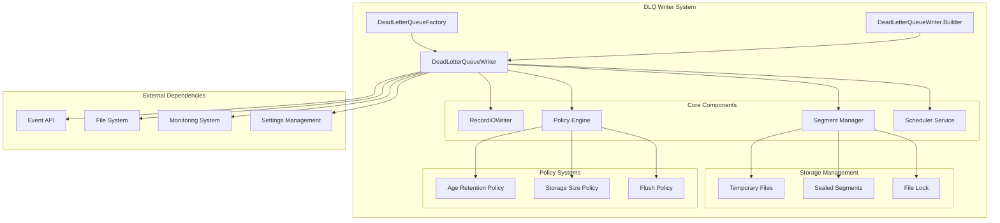
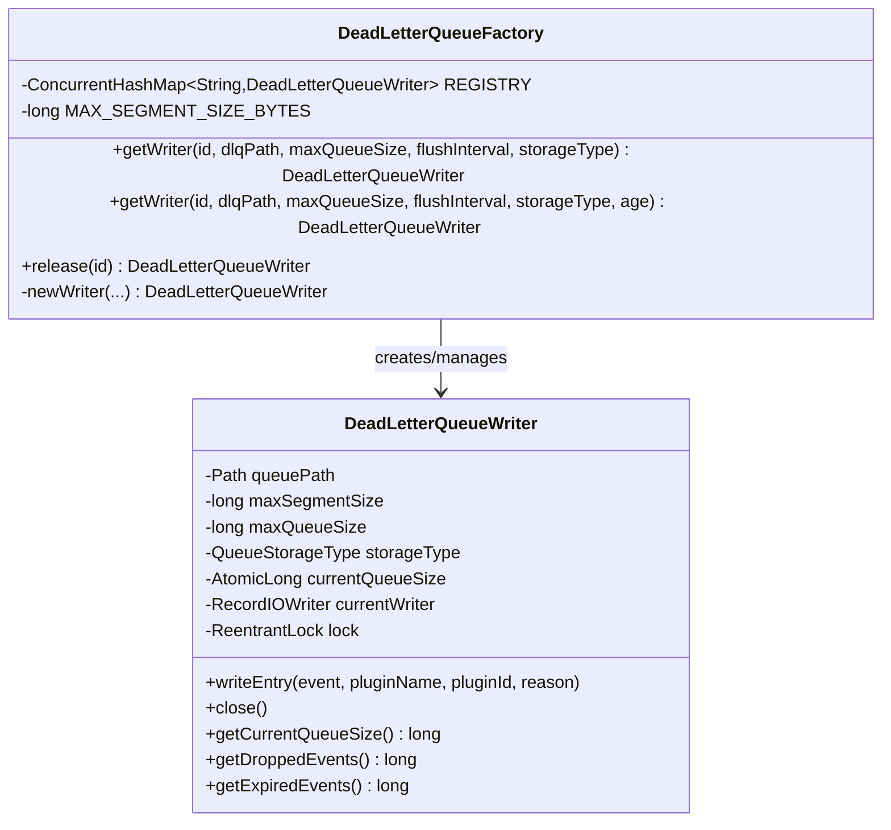
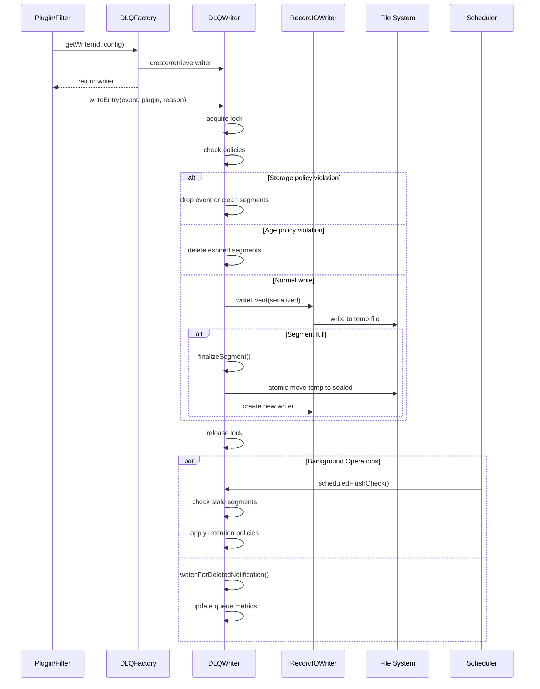
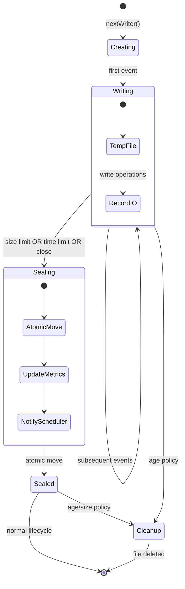
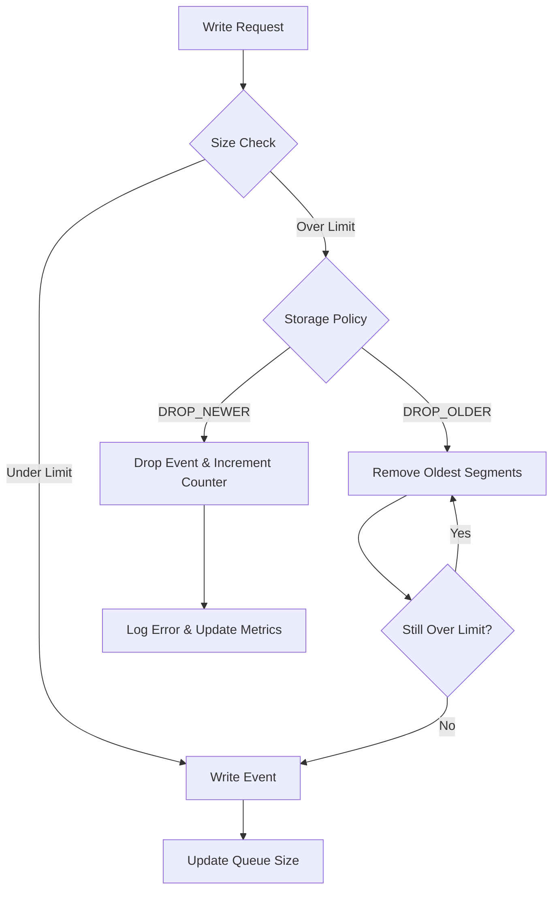
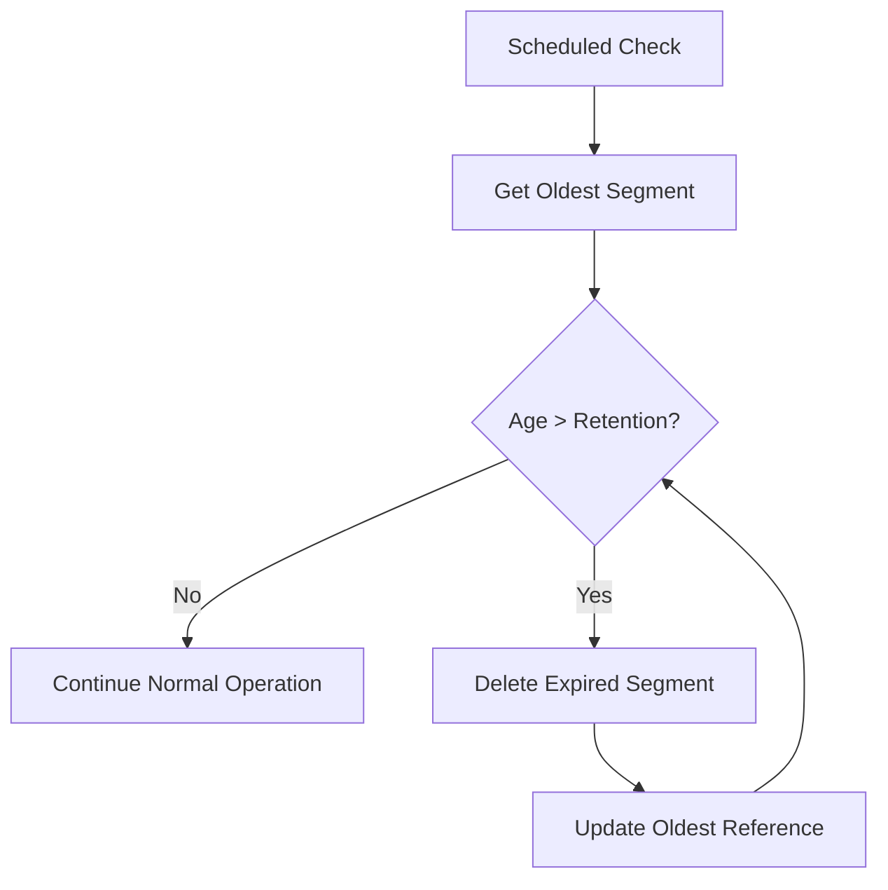
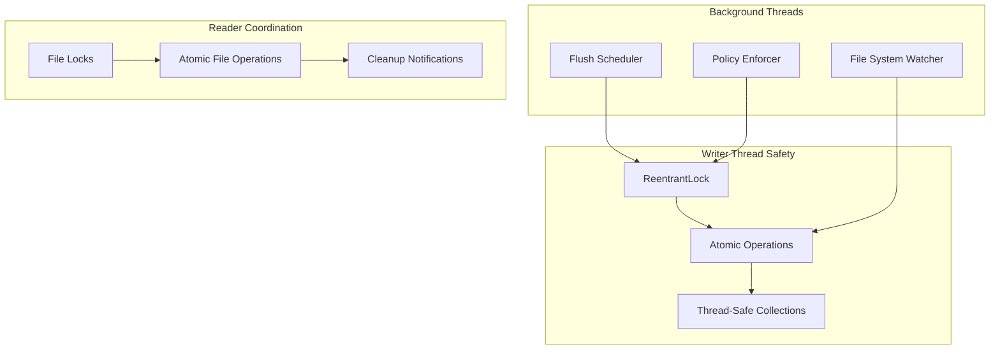

# Dead Letter Queue Writer System

## Overview

The Dead Letter Queue (DLQ) Writer System is a critical component of Logstash's error handling infrastructure that manages the persistent storage of events that cannot be processed successfully. This system provides reliable, thread-safe writing capabilities with advanced features including segment management, retention policies, storage quotas, and automatic cleanup mechanisms.

The system operates on a segment-based architecture where events are written to temporary files that are atomically moved to permanent segments when size or time thresholds are reached. This design ensures data integrity and enables concurrent access patterns between writers and readers.

## Architecture Overview



## Component Architecture

### DeadLetterQueueFactory

The factory class manages a static registry of DLQ writers, providing centralized access and lifecycle management:



### DeadLetterQueueWriter

The core writer component handles all DLQ operations with sophisticated segment and policy management:

**Key Responsibilities:**
- Thread-safe event writing with ReentrantLock synchronization
- Segment lifecycle management (creation, sealing, cleanup)
- Policy enforcement (age retention, storage limits, flush intervals)
- Concurrent access coordination with readers
- Metrics tracking and error reporting

## Data Flow Architecture



## Segment Management

The system uses a sophisticated segment-based storage model:



### Segment Lifecycle

1. **Creation**: New segments start as temporary files (`.log.tmp`)
2. **Writing**: Events are written using RecordIOWriter with proper serialization
3. **Sealing**: When limits are reached, segments are atomically moved to permanent files (`.log`)
4. **Monitoring**: Background processes monitor for cleanup and policy enforcement
5. **Cleanup**: Expired or oversized segments are removed based on configured policies

## Policy Management

### Storage Policies



### Age Retention Policy



## Concurrency and Thread Safety

The system handles multiple concurrent scenarios:



## Integration Points

### Event API Integration
- Integrates with [event_api](event_api.md) for event processing and metadata management
- Uses Event serialization and DLQEntry structures
- Implements duplicate detection through metadata inspection

### Plugin System Integration
- Works with [plugin_system](plugin_system.md) for plugin identification and error context
- Receives plugin name, ID, and failure reason for comprehensive error tracking
- Supports plugin-specific DLQ writers through factory pattern

### Monitoring Integration
- Provides metrics through [metrics_system](metrics_system.md) integration
- Tracks dropped events, expired events, queue size, and error states
- Supports real-time monitoring of DLQ health and performance

### Settings Management
- Configured through [settings_management](settings_management.md) system
- Supports dynamic configuration of retention policies, size limits, and flush intervals
- Validates configuration parameters and provides sensible defaults

## Configuration and Usage

### Builder Pattern Configuration

```java
DeadLetterQueueWriter writer = DeadLetterQueueWriter
    .newBuilder(queuePath, maxSegmentSize, maxQueueSize, flushInterval)
    .storageType(QueueStorageType.DROP_OLDER)
    .retentionTime(Duration.ofDays(7))
    .build();
```

### Factory-based Access

```java
DeadLetterQueueWriter writer = DeadLetterQueueFactory.getWriter(
    "pipeline-id", 
    "/var/log/logstash/dlq", 
    1024 * 1024 * 100, // 100MB
    Duration.ofSeconds(30),
    QueueStorageType.DROP_NEWER,
    Duration.ofDays(3)
);
```

## Error Handling and Recovery

The system implements comprehensive error handling:

1. **File System Errors**: Graceful handling of I/O exceptions with proper cleanup
2. **Corruption Recovery**: Automatic detection and handling of corrupted segments
3. **Lock Conflicts**: Proper file locking to prevent concurrent access issues
4. **Resource Management**: Automatic cleanup of resources and temporary files
5. **Graceful Shutdown**: Proper segment finalization during system shutdown

## Performance Characteristics

- **Write Performance**: Optimized for high-throughput sequential writes
- **Memory Usage**: Minimal memory footprint with streaming operations
- **Disk Usage**: Efficient segment-based storage with automatic cleanup
- **Concurrency**: Thread-safe operations with minimal lock contention
- **Scalability**: Supports multiple concurrent writers per pipeline

## Dependencies

### Internal Dependencies
- [core_data_structures](core_data_structures.md): Event serialization and data access
- [common_utilities](common_utilities.md): File system utilities and buffer management
- [logging_system](logging_system.md): Comprehensive logging and error reporting

### External Dependencies
- Java NIO for efficient file operations
- Apache Log4j for logging
- Google Guava for utility functions
- Java concurrent utilities for thread safety

## Related Components

- [dlq_reader_system](dlq_reader_system.md): Companion reader system for DLQ consumption
- [plugin_integration_layer](plugin_integration_layer.md): Plugin-specific DLQ integration
- [queue_management](queue_management.md): General queue management infrastructure
- [pipeline_execution](pipeline_execution.md): Pipeline integration and event flow

The DLQ Writer System serves as a critical reliability component in Logstash's architecture, ensuring that no events are lost during processing failures while maintaining system performance and resource constraints.