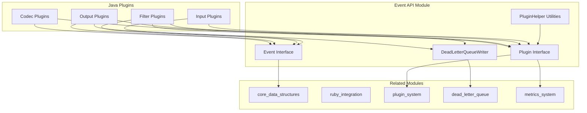
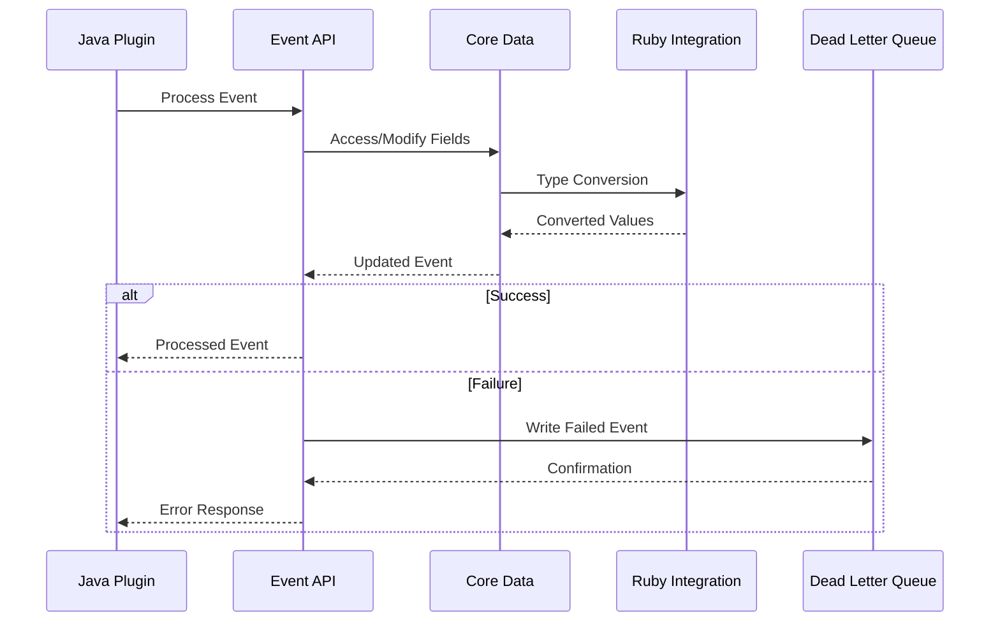
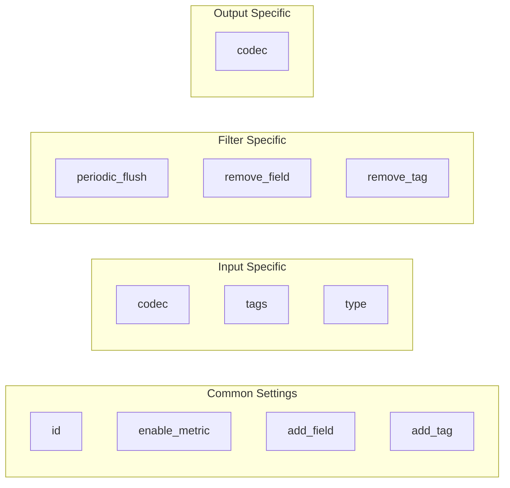

# Event API Module

## Overview

The Event API module serves as the primary interface layer for Logstash's Java plugin ecosystem. It provides the core abstractions and contracts that enable Java-based plugins to interact with Logstash events, manage plugin lifecycle, and handle error scenarios through the dead letter queue mechanism.

This module acts as the bridge between Logstash's internal Ruby-based architecture and Java plugins, offering a clean, type-safe API that abstracts away implementation details while providing essential functionality for event processing.

## Purpose and Scope

The Event API module is designed to:

- **Event Abstraction**: Provide a standardized interface for event manipulation across all Java plugins
- **Plugin Framework**: Define the base contracts and utilities for Java plugin development
- **Error Handling**: Offer mechanisms for handling failed events through the dead letter queue
- **Configuration Management**: Supply common configuration patterns and validation for plugins

## Architecture Overview



## Core Components

### Event Interface
The `Event` interface is the cornerstone of the Event API, providing a comprehensive contract for event manipulation. It offers methods for:

- **Data Access**: Getting and setting field values with support for nested field references
- **Metadata Management**: Handling event metadata separately from event data
- **Event Lifecycle**: Managing event state (cancellation, cloning, transformation)
- **Timestamp Handling**: Working with event timestamps using Java 8 time APIs
- **String Interpolation**: Supporting Logstash's sprintf functionality

**Key Dependencies**: 
- Integrates with [core_data_structures](core_data_structures.md) for field access patterns
- Utilizes [ruby_integration](ruby_integration.md) for Ruby-Java type conversions

### Plugin Interface
The `Plugin` interface establishes the foundation for all Java plugins in Logstash. It defines:

- **Configuration Schema**: Declarative configuration validation through `PluginConfigSpec`
- **Plugin Identity**: Naming and identification mechanisms
- **Annotation Support**: Integration with `@LogstashPlugin` annotations

**Key Dependencies**:
- Works with [plugin_system](plugin_system.md) for plugin discovery and lifecycle management
- Connects to [settings_management](settings_management.md) for configuration validation

### PluginHelper Utilities
The `PluginHelper` class provides a comprehensive set of pre-defined configuration specifications and utility methods:

- **Common Settings**: Standardized configuration options shared across plugin types
- **Type-Specific Helpers**: Specialized configuration sets for input, filter, and output plugins
- **Configuration Composition**: Methods to combine plugin-specific settings with common ones

**Key Features**:
- Reduces boilerplate code in plugin development
- Ensures consistency across plugin configurations
- Supports configuration inheritance and override patterns

### DeadLetterQueueWriter Interface
The `DeadLetterQueueWriter` provides a clean interface for handling failed events:

- **Event Recording**: Writing failed events with context information
- **Queue Management**: Monitoring queue state and size
- **Error Context**: Capturing plugin information and failure reasons

**Key Dependencies**:
- Integrates with [dead_letter_queue](dead_letter_queue.md) for persistent storage
- Works with [monitoring](monitoring.md) for queue metrics

## Integration Points

### With Core Data Structures
The Event API heavily relies on the core data structures module for:
- Field access patterns through the Accessors component
- Type conversion via Javafier and Rubyfier components
- Object serialization through ObjectMappers

### With Ruby Integration
The module bridges Java and Ruby environments by:
- Leveraging Ruby utility classes for seamless integration
- Supporting Ruby-style field references and operations
- Maintaining compatibility with Ruby-based plugins

### With Plugin System
The Event API works closely with the plugin system for:
- Plugin discovery and instantiation
- Configuration validation and injection
- Lifecycle management and hooks

### With Metrics System
Integration with metrics provides:
- Plugin performance monitoring
- Event processing statistics
- Dead letter queue metrics

## Data Flow



## Configuration Patterns

The Event API promotes consistent configuration patterns across all Java plugins:



## Error Handling Strategy

The Event API implements a comprehensive error handling strategy:

1. **Event Cancellation**: Events can be marked as cancelled to prevent further processing
2. **Dead Letter Queue**: Failed events are routed to the DLQ with full context
3. **Plugin Isolation**: Plugin failures don't affect the overall pipeline
4. **Graceful Degradation**: System continues processing other events despite individual failures

## Performance Considerations

The Event API is designed with performance in mind:

- **Lazy Evaluation**: Field access and type conversion happen on-demand
- **Efficient Cloning**: Event cloning minimizes memory overhead
- **Batch Operations**: Support for bulk event processing where applicable
- **Memory Management**: Careful handling of object lifecycle to prevent memory leaks

## Usage Examples

### Basic Event Processing
```java
public class MyFilter implements Filter {
    @Override
    public Collection<Event> filter(Collection<Event> events, FilterMatchListener matchListener) {
        return events.stream()
            .map(event -> {
                // Access field
                Object value = event.getField("message");
                
                // Modify field
                event.setField("processed", true);
                
                // Add timestamp
                event.setEventTimestamp(Instant.now());
                
                return event;
            })
            .collect(Collectors.toList());
    }
}
```

### Plugin Configuration
```java
@LogstashPlugin(name = "my_filter")
public class MyFilter implements Filter {
    @Override
    public Collection<PluginConfigSpec<?>> configSchema() {
        return PluginHelper.commonFilterSettings(Arrays.asList(
            PluginConfigSpec.stringSetting("custom_field"),
            PluginConfigSpec.numSetting("timeout", 30)
        ));
    }
}
```

## Future Considerations

The Event API module is designed to evolve with Logstash's needs:

- **Async Processing**: Future support for asynchronous event processing
- **Streaming APIs**: Integration with reactive streams for better performance
- **Enhanced Type Safety**: Stronger typing for field values and configurations
- **Plugin Composition**: Support for composable plugin architectures

## Related Documentation

- [core_data_structures](core_data_structures.md) - Underlying data handling mechanisms
- [ruby_integration](ruby_integration.md) - Ruby-Java interoperability layer
- [plugin_system](plugin_system.md) - Plugin discovery and lifecycle management
- [dead_letter_queue](dead_letter_queue.md) - Error event handling and storage
- [metrics_system](metrics_system.md) - Performance monitoring and statistics
- [settings_management](settings_management.md) - Configuration validation and management