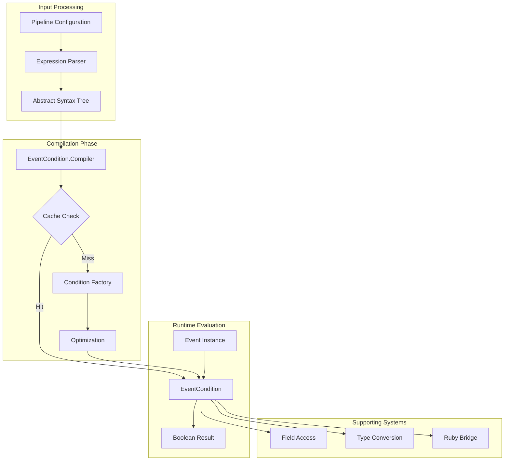

# Event Condition System

The Event Condition System is a critical component of Logstash's IR (Intermediate Representation) compiler that transforms boolean expressions from pipeline configurations into optimized, executable conditions for event filtering and routing.

## Overview

The Event Condition System serves as the conditional evaluation engine within Logstash's pipeline execution framework. It compiles high-level boolean expressions from configuration files into efficient Java predicates that can evaluate events at runtime. This system is essential for implementing conditional logic in filters, outputs, and other pipeline components.

### Key Responsibilities

- **Expression Compilation**: Transforms abstract boolean expressions into executable event conditions
- **Performance Optimization**: Implements caching and optimized evaluation strategies
- **Type Safety**: Handles type conversions and comparisons across Ruby-Java boundaries
- **Pattern Matching**: Supports regex operations and field pattern matching
- **Conditional Logic**: Implements boolean operators (AND, OR, NOT) and comparison operations

## Architecture


## Core Components

### EventCondition Interface

The `EventCondition` interface defines the contract for all compiled conditions:

```java
public interface EventCondition {
    boolean fulfilled(JrubyEventExtLibrary.RubyEvent event);
}
```

This simple interface enables polymorphic evaluation of different condition types while maintaining high performance through specialized implementations.

### EventCondition.Compiler

The `Compiler` class is the heart of the system, responsible for:

- **Expression Analysis**: Determines the type and structure of boolean expressions
- **Condition Generation**: Creates appropriate `EventCondition` implementations
- **Caching Management**: Maintains a synchronized cache to prevent duplicate compilation
- **Type Validation**: Ensures expression components are compatible

#### Compilation Process


## Condition Types

### Field-Based Conditions

These conditions evaluate event fields against various criteria:

- **FieldTruthy**: Checks if a field value is truthy
- **FieldMatches**: Performs regex matching against field values
- **FieldInConstantList**: Tests field membership in constant lists
- **FieldInField**: Compares field containment relationships

### Constant Conditions

Pre-evaluated conditions that return fixed boolean values:

- **ConstantMatches**: Pre-computed regex matches
- **Constant Boolean**: Direct true/false conditions

### Comparison Conditions

Support numeric and string comparisons:

- **Greater Than (>)**: Field > constant or field > field
- **Less Than (<)**: Field < constant or field < field  
- **Greater Than or Equal (>=)**: Field >= constant or field >= field
- **Less Than or Equal (<=)**: Field <= constant or field <= field

### Boolean Logic Conditions

Combine multiple conditions:

- **AND**: Both conditions must be true
- **OR**: Either condition must be true
- **NOT**: Negates the wrapped condition

## Data Flow



## Integration Points

### Pipeline Execution System

The Event Condition System integrates closely with the [pipeline_execution](pipeline_execution.md) module:

- **WorkerLoop**: Uses compiled conditions for event routing decisions
- **EventDispatcherExt**: Applies conditions during event dispatch
- **Filter Processing**: Conditions determine filter application

### IR Compiler Integration

Works within the broader [ir_compiler](ir_compiler.md) framework:

- **DatasetCompiler**: Uses conditions for dataset filtering
- **FilterDelegatorExt**: Applies conditions in filter delegation
- **OutputStrategyExt**: Uses conditions for output routing

### Type Conversion Dependencies

Relies heavily on the [type_conversion_system](type_conversion_system.md):

- **Rubyfier**: Converts Java objects to Ruby for comparison
- **Valuefier**: Converts Ruby objects to Java for storage
- **Type Coercion**: Handles cross-language type compatibility

## Performance Optimizations

### Caching Strategy


### Specialized Implementations

Each condition type has optimized implementations:

- **String Operations**: Use ByteList for efficient string comparisons
- **Numeric Comparisons**: Direct primitive comparisons where possible
- **Field Access**: Cached FieldReference objects
- **Regex Matching**: Pre-compiled RubyRegexp instances

### Short-Circuit Evaluation

Boolean operations implement short-circuit logic:

- **AND**: Returns false on first false condition
- **OR**: Returns true on first true condition
- **NOT**: Single negation operation

## Error Handling

### Type Safety

The system includes comprehensive type checking:

```java
private static final class UnexpectedTypeException extends IllegalArgumentException {
    // Provides detailed error information for debugging
}
```

### Expression Validation

- **Syntax Validation**: Ensures expressions are well-formed
- **Type Compatibility**: Validates operand types for operations
- **Field Reference Validation**: Checks field path syntax

## Usage Patterns

### Basic Field Comparison

```ruby
# Configuration
if [status] == 200 {
    # Process successful requests
}
```

Compiles to a `FieldEquals` condition that compares the status field to the constant 200.

### Complex Boolean Logic

```ruby
# Configuration  
if [level] == "ERROR" and [service] in ["web", "api"] {
    # Handle service errors
}
```

Compiles to an `AND` condition combining field equality and membership tests.

### Pattern Matching

```ruby
# Configuration
if [message] =~ /^ERROR/ {
    # Handle error messages
}
```

Compiles to a `FieldMatches` condition with pre-compiled regex.

## Monitoring and Debugging

### Cache Statistics

The compiler maintains internal metrics:

- **Cache Hit Rate**: Percentage of cache hits vs. misses
- **Compilation Count**: Number of unique conditions compiled
- **Memory Usage**: Cache memory consumption

### Debug Information

Conditions include source metadata for debugging:

- **Expression Source**: Original configuration text
- **Compilation Context**: Location in pipeline configuration
- **Type Information**: Detailed type analysis results

## Security Considerations

### Secret Variable Handling

The system includes special handling for secret variables:

```java
private static Comparable<IRubyObject> eventuallyDecryptSecretVariable(Comparable<IRubyObject> value) {
    // Safely handles SecretVariable instances
}
```

### Input Validation

- **Field Reference Validation**: Prevents malicious field access patterns
- **Expression Bounds**: Limits expression complexity
- **Type Safety**: Prevents type confusion attacks

## Related Documentation

- [IR Compiler](ir_compiler.md) - Parent compilation system
- [Pipeline Execution](pipeline_execution.md) - Runtime execution context
- [Type Conversion System](type_conversion_system.md) - Type handling dependencies
- [Ruby Integration](ruby_integration.md) - Ruby-Java bridge functionality
- [Core Data Structures](core_data_structures.md) - Underlying data types

## Future Enhancements

### Performance Improvements

- **JIT Compilation**: Dynamic optimization of frequently used conditions
- **Vectorization**: SIMD operations for batch condition evaluation
- **Memory Pooling**: Reduce garbage collection pressure

### Feature Extensions

- **Custom Operators**: Plugin-defined comparison operators
- **Fuzzy Matching**: Approximate string matching capabilities
- **Temporal Conditions**: Time-based condition evaluation

### Observability

- **Condition Metrics**: Per-condition performance statistics
- **Execution Tracing**: Detailed condition evaluation traces
- **Performance Profiling**: Hotspot identification and optimization