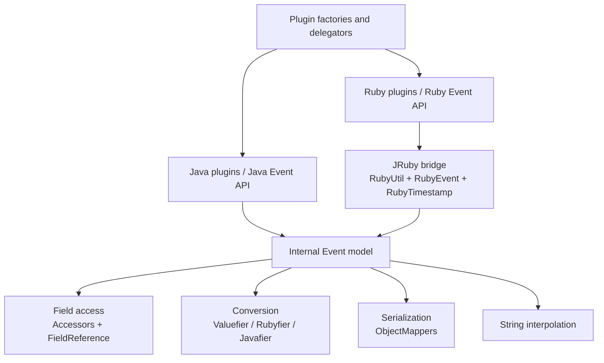
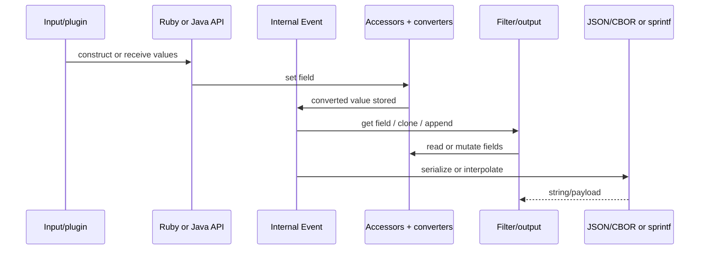

# Event Model and JRuby Interoperability

## Purpose

The `event_model_and_jruby_interop` module is Logstash’s language boundary for events. It provides a Java plugin-facing event contract, an internal field/value representation, and JRuby wrappers that let Ruby plugins use the same event safely. It also standardizes timestamp behavior, JSON/CBOR serialization, interpolation, cloning, and event merging.

## Architecture overview

The central invariant is that writes enter through `Valuefier`, while reads leave through the target-language adapter (`Rubyfier` or `Javafier`). `Accessors` operates on converted maps/lists, keeping nested field semantics consistent across both APIs.

## Submodules

- [Event storage and Java/Ruby value conversion](event_model_and_jruby_interop_event_storage_and_conversion.md) — event contract, nested access, conversion caches, deep cloning, and merge semantics.
- [JRuby event and timestamp bridge](event_model_and_jruby_interop_jruby_event_and_timestamp_bridge.md) — Ruby class registration, Ruby event methods, timestamp operations, collection proxy behavior, and error translation.
- [Serialization and interpolation](event_model_and_jruby_interop_serialization_and_interpolation.md) — Jackson JSON/CBOR integration and `%{...}` expansion.

## End-to-end event flow

## System integration

Compiled pipeline filters and outputs use the JRuby/Java plugin bridge described in [pipeline_ir_and_compilation_jruby_plugin_bridge.md](pipeline_ir_and_compilation_jruby_plugin_bridge.md). Runtime pipeline execution, queues, and dead-letter handling consume the serialized event behavior described in [data_plane_execution_and_reliability.md](data_plane_execution_and_reliability.md).

## Key invariants and maintenance notes

1. Field references must be parsed consistently before access; malformed references are surfaced as Ruby-facing errors at the wrapper boundary.
2. Timestamp values have a Java `Timestamp` core and a JRuby `RubyTimestamp` façade; serializers must preserve compatible round trips.
3. Conversion maps cache converters for discovered subclasses using concurrent maps, reducing repeated assignability scans.
4. Java collection proxies are deliberately patched to satisfy Ruby collection type checks and nil-sensitive map-key behavior.
5. Deep cloning supports only known collection implementations, making unsupported internal collection types fail loudly instead of being copied ambiguously.
