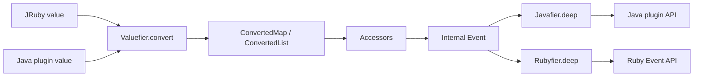

# Event Storage and Java/Ruby Value Conversion

This submodule defines the event-facing data model and the conversion boundary used while values move between Logstash Ruby objects, Java plugin objects, and the internal event representation.

## Components

- `co.elastic.logstash.api.Event` — stable Java-plugin contract for field access, metadata, cancellation, timestamps, cloning, merging, tagging, and interpolation.
- `org.logstash.Accessors` — nested field-path reads, writes, deletes, and existence checks over converted maps/lists. It preserves Ruby-style negative list indexes and grows lists with `null` placeholders when setting beyond the current end.
- `org.logstash.Valuefier` — converts incoming Java, JRuby, date/time, collection, and proxy values into event-safe values. Ruby scalar objects remain unchanged; Java scalars become JRuby equivalents; maps/lists become `ConvertedMap`/`ConvertedList`.
- `org.logstash.Javafier` — converts event-safe values back to Java values for Java plugins. Converted collections are unwrapped and JRuby scalars become ordinary Java scalars.
- `org.logstash.Rubyfier` — converts event-safe values back to Ruby values for the Ruby API, recursively producing `RubyHash` and `RubyArray` objects.
- `org.logstash.Cloner` — restricted deep clone for supported maps, lists, and `RubyString`; unsupported collection implementations fail explicitly.
- `org.logstash.Util` — recursive map merge and ordered, de-duplicating list merge used by event append/overwrite behavior.

## Conversion pipeline

`Valuefier` is the write-side boundary and `Javafier`/`Rubyfier` are read-side boundaries. This separation prevents Ruby runtime objects from being stored indiscriminately in the internal collection representation while preserving Ruby-compatible behavior at the API edge.

## Field semantics

`Accessors` traverses a `FieldReference` path. Maps use string keys; lists use numeric strings and support negative indexes. A missing intermediate path during a write is materialized as a converted map. Invalid writes—such as assigning a child field beneath a scalar—raise `InvalidFieldSetException`.

## Related documentation

The event is consumed by compiled filter/output execution described in [pipeline_ir_and_compilation_jruby_plugin_bridge.md](pipeline_ir_and_compilation_jruby_plugin_bridge.md). Plugin-facing execution context is established by the broader extensibility layer in that module family.
