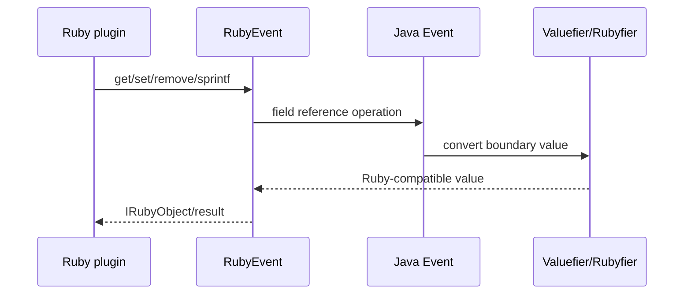

# JRuby Event and Timestamp Bridge

This submodule exposes the Java event implementation as Ruby classes and translates Ruby method calls into typed Java operations.

## Components

- `org.logstash.ext.JrubyEventExtLibrary` — defines the `Event` JRuby class. It wraps an internal `org.logstash.Event`, dispatches field operations, translates errors, supports JSON construction/parsing, and exposes clone, merge, cancellation, tags, metadata, and timestamp methods.
- `org.logstash.ext.JrubyTimestampExtLibrary` — defines the comparable `Timestamp` Ruby class backed by `org.logstash.Timestamp`. It supports ISO-8601 parsing, Ruby `Time` conversion, epoch access, formatting, arithmetic, comparison, cloning, and JSON serialization.
- `org.logstash.RubyUtil` — initializes the global JRuby runtime, registers Java-defined Logstash classes/modules, publishes constants, and installs collection interop overrides. It also provides Java-to-Ruby conversion and nil-safe casts.
- `org.logstash.RubyJavaIntegration` — makes Java `Map`/`Collection` proxies behave like Ruby `Hash`/`Array` for type checks and common operations such as `compact`, `delete`, union, intersection, and map key lookup.

## Ruby event call path

`RubyEvent#ruby_set_field` treats the timestamp reference specially: only a `RubyTimestamp` is accepted. Other values pass through `Valuefier`. Reads and removals use `Rubyfier` so nested converted collections become native Ruby collections.

## Runtime registration

`RubyUtil` performs static registration before normal plugin use. It creates the `LogStash` namespace, defines `Event` and `Timestamp`, registers annotated methods/constants, and installs the Java collection overrides. This is also the registration point for many other Java extensions, including plugin delegators, queues, metrics, logging, and pipeline reporting.

## Error behavior

Parser and generator failures are converted into Logstash Ruby error classes. Invalid field-reference syntax becomes a Ruby runtime error; invalid timestamp input becomes `TimestampParserError`; Java I/O failures can be wrapped as Ruby `IOError` while retaining the Java cause.

## Related documentation

Compiled Java filters and outputs use the same interop boundary, described in [pipeline_ir_and_compilation_jruby_plugin_bridge.md](pipeline_ir_and_compilation_jruby_plugin_bridge.md). The bridge is also registered as part of the runtime extensions used by plugin execution.
