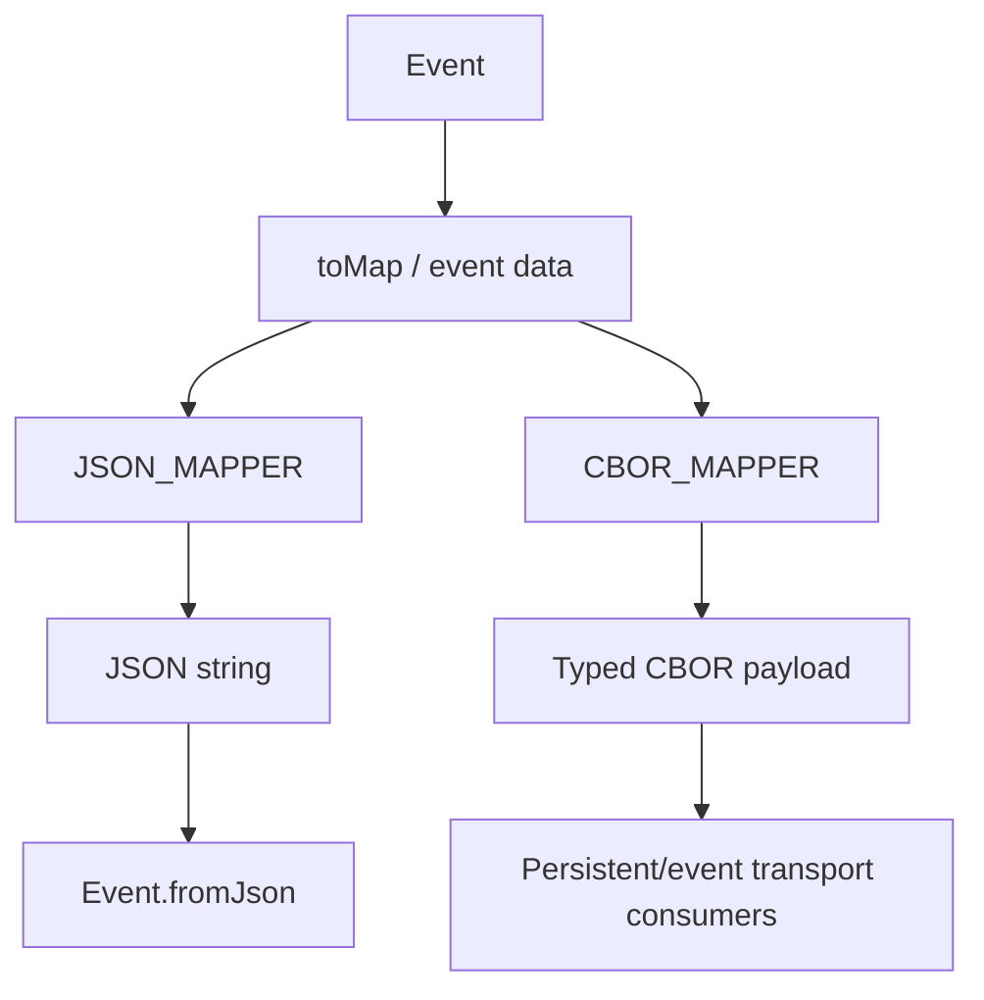

# Serialization and String Interpolation

This submodule handles event persistence/transport formats and Logstash `%{...}` expansion.

## Components

- `org.logstash.ObjectMappers` — configures JSON and CBOR Jackson mappers. Ruby scalar serializers make JRuby types serializable, while timestamp serializers preserve the event timestamp representation. CBOR uses registered Ruby deserializers and default typing for event maps.
- `org.logstash.StringInterpolation` — evaluates field substitutions and timestamp formatters using a reusable thread-local `StringBuilder`.
- `org.logstash.KeyNode` — recursively joins nested lists for interpolation.

## Serialization boundary

JSON serializes Ruby scalars as their natural JSON values. Timestamps are emitted as strings with type information where required for round-trip reconstruction. CBOR registers both Ruby serializers and deserializers and exposes `EVENT_MAP_TYPE` for event-map decoding.

## Interpolation behavior

Supported forms include:

- `%{[field][path]}` or another field reference: scalar values use `toString`, lists are comma-joined, and maps are JSON-encoded.
- `%{+%s}`: Unix epoch seconds from the event timestamp.
- `%{+JODA_PATTERN}`: UTC Joda formatting.
- `%{{JAVA_PATTERN}}`: UTC `java.time` formatting.
- `%{{TIME_NOW}}`: current timestamp, independent of the event timestamp.

Missing ordinary fields remain as their original `%{...}` token; missing timestamps produce an empty formatted result. The public Java `Event` contract exposes this behavior through `sprintf`, and the JRuby wrapper maps I/O failures to a Logstash Ruby error.

## Related documentation

JSON event construction is surfaced by [event_model_and_jruby_interop_jruby_event_and_timestamp_bridge.md](event_model_and_jruby_interop_jruby_event_and_timestamp_bridge.md). Event serialization is used by pipeline execution, queues, and plugin implementations covered by [data_plane_execution_and_reliability.md](data_plane_execution_and_reliability.md).
