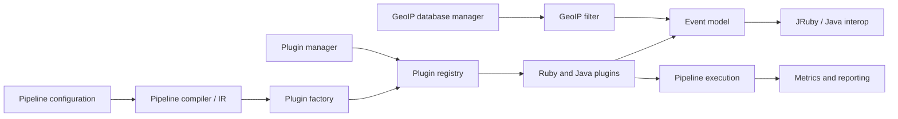
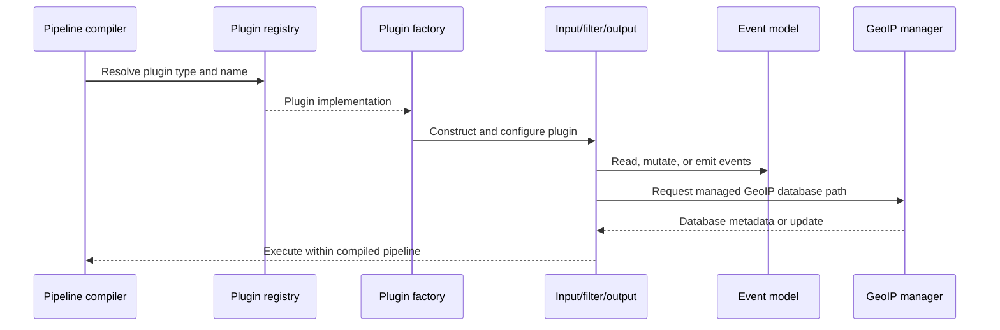

# Event Processing and Extensibility

## Purpose

The `event_processing_and_extensibility` module defines how Logstash represents and processes events, supports Ruby and Java plugin implementations, discovers and constructs plugins, and manages extensible runtime resources such as GeoIP databases.

It spans:

- Event storage, field access, serialization, and JRuby interoperability.
- Plugin contracts, lifecycle management, discovery, validation, and registration.
- Core Java input, filter, and output plugins.
- Plugin installation and packaging through `bin/logstash-plugin`.
- X-Pack GeoIP database acquisition and lifecycle management.

## Architecture

The event model is the shared data contract. Plugin APIs and registries resolve implementations and create runtime wrappers. Core built-ins provide reference Java implementations, while the plugin manager supplies external plugin packages. The GeoIP manager supplies managed database resources to the GeoIP filter.

## Event and plugin flow

## Core components

- [Event Model and JRuby Interoperability](/home/anhnh/CodeWiki-journal/results/generation/logstash/event_model_and_jruby_interop.md)  
  Defines the internal event representation, field access, Java/Ruby conversion, timestamps, serialization, interpolation, cloning, and merging.

- [Plugin API and Registry](/home/anhnh/CodeWiki-journal/results/generation/logstash/plugin_api_and_registry.md)  
  Defines plugin contracts, lifecycle APIs, configuration validation, discovery, registries, Java factories, and JRuby delegators.

- [Core Built-in Plugins](/home/anhnh/CodeWiki-journal/results/generation/logstash/core_builtin_plugins.md)  
  Documents the built-in `java_stdin`, `java_uuid`, `java_stdout`, and `sink` plugins.

- [Plugin Manager](/home/anhnh/CodeWiki-journal/results/generation/logstash/plugin_manager.md)  
  Documents plugin listing, installation, updates, removal, generation, packaging, Bundler integration, and offline workflows.

- [X-Pack GeoIP Database Management](/home/anhnh/CodeWiki-journal/results/generation/logstash/xpack_geoip_database_management.md)  
  Documents managed GeoLite2 database downloads, validation, storage, expiration, subscriptions, and GeoIP filter integration.