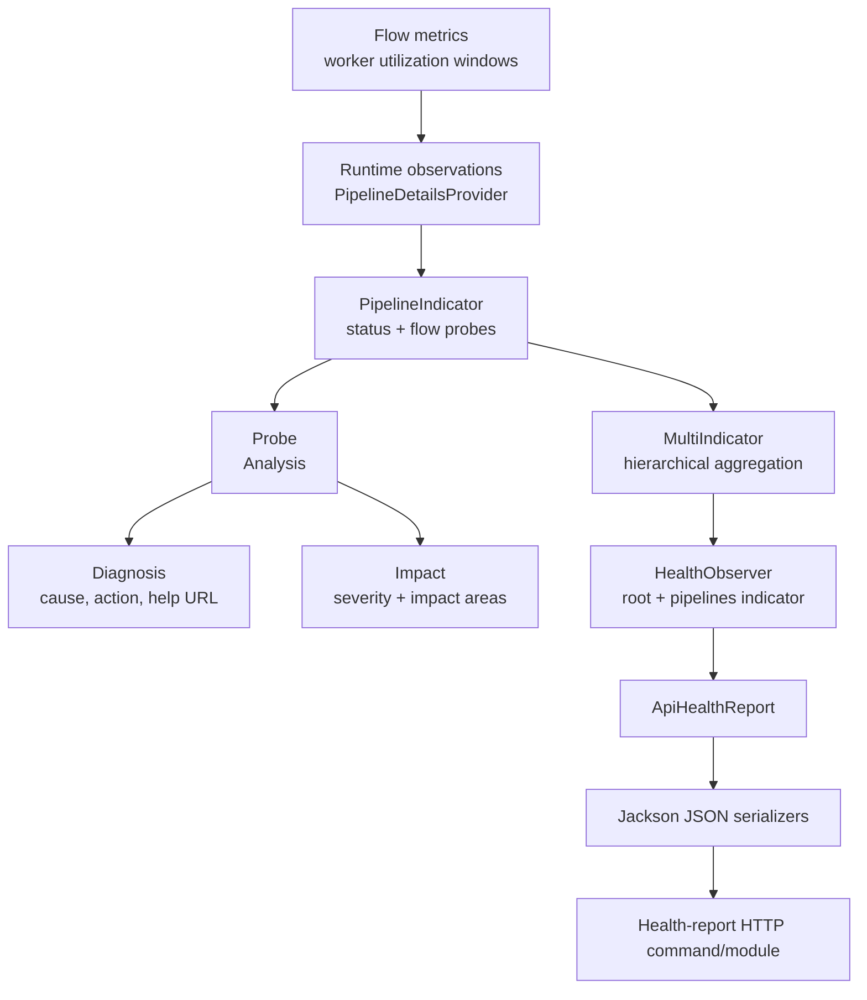
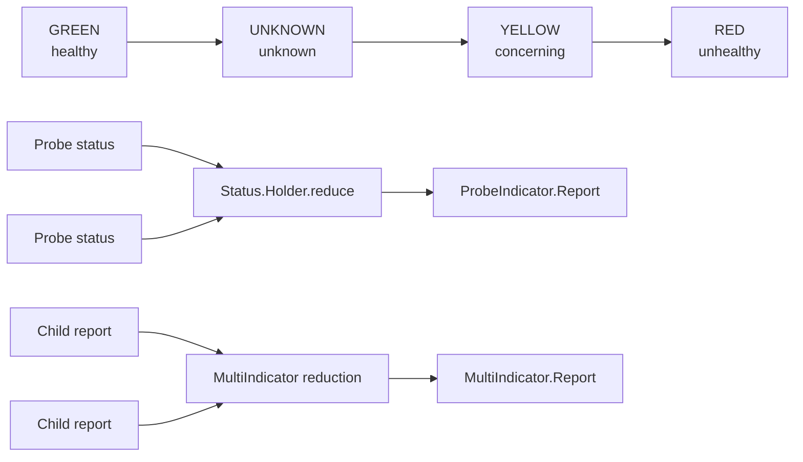
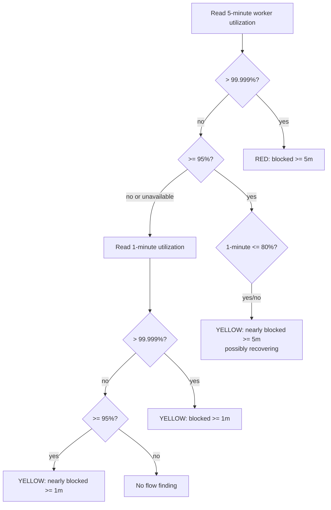
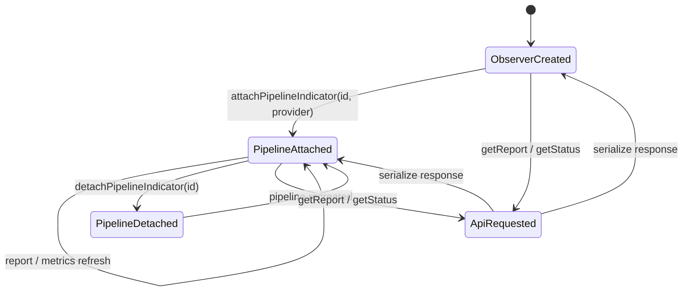
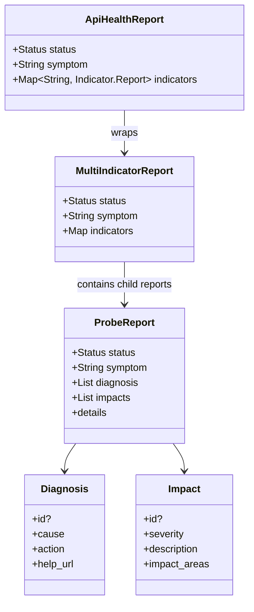
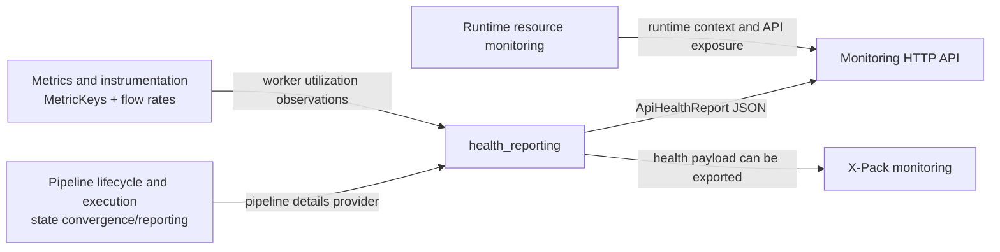

# Health reporting

The `health_reporting` module evaluates Logstash runtime health and exposes a structured, API-ready report. It combines a hierarchy of named indicators, turns observations into status/diagnosis/impact records through probes, and serializes the resulting report as JSON. The current concrete indicator is `PipelineIndicator`, which reports pipeline state and worker utilization.

Health reporting is an interpretation layer over runtime state and metrics. Pipeline lifecycle state is managed by [pipeline_lifecycle_and_execution_state_convergence.md](pipeline_lifecycle_and_execution_state_convergence.md), runtime metrics are supplied by [metrics_and_instrumentation.md](metrics_and_instrumentation.md), and HTTP routing is handled by the monitoring API described in [runtime_resource_monitoring.md](runtime_resource_monitoring.md). This module owns the health vocabulary, aggregation rules, analysis thresholds, and report shape.

## Architecture overview



The hierarchy is intentionally compositional:

- `HealthObserver` owns the root `MultiIndicator` and permanently attaches a `pipelines` child.
- The pipeline child contains one `PipelineIndicator` per pipeline ID.
- `PipelineIndicator` extends `ProbeIndicator<Details>` and attaches probes for pipeline `status` and `flow:worker_utilization`.
- `ProbeIndicator` obtains one observation, evaluates all attached probes, and produces a report.
- `MultiIndicator` combines child reports, selecting the most degraded `Status` and generating a human-readable symptom.
- `ApiHealthReport` wraps the root report as the stable API-facing object.

## Component responsibilities

| Component | Responsibility | Main boundary |
| --- | --- | --- |
| `Status` / `Status.Holder` | Defines `green`, `unknown`, `yellow`, and `red`; reduces multiple statuses to the most degraded value | Shared result semantics |
| `Indicator` | Minimal report contract with optional `ReportContext` | Extensibility point |
| `MultiIndicator` | Concurrent named registry and hierarchical report aggregation | Parent/child health composition |
| `ProbeIndicator` | Observation acquisition, probe execution, diagnosis/impact collection, and report construction | Observation-to-health conversion |
| `Probe` / `Probe.Analysis` | Evaluates one observation and returns status plus optional diagnosis and impact | Health rule implementation |
| `Diagnosis` | Immutable operator guidance: identifier, cause, action, and help URL | Remediation metadata |
| `Impact` | Immutable consequence description with severity and affected areas | User/system impact metadata |
| `PipelineIndicator` | Pipeline-specific observation model and health rules | Pipeline lifecycle and flow metrics |
| `HealthObserver` | Root registry, pipeline attach/detach operations, report access, and force-green escape hatch | Runtime integration |
| JSON serializers | Explicit external field names and omission rules | HTTP/API representation |

## Status model and aggregation

`Status` has two representations: the lowercase external value (`green`, `unknown`, `yellow`, `red`) and a descriptive value (`healthy`, `unknown`, `concerning`, `unhealthy`). `reduce` is commutative and returns whichever status is more degraded according to enum order. A new `Status.Holder` starts at `GREEN`, so an indicator with no degraded findings remains healthy.



`MultiIndicator.report` also groups child names by status and creates a symptom such as “1 indicator is unhealthy (`pipeline-a`)”. Muted indicators are excluded from both status reduction and the report map. A `ReportContext` is passed down with the indicator name as the scope, allowing callers to mute selected indicators or probes without changing the indicator registry.

## Probe evaluation pipeline

```mermaid
sequenceDiagram
    participant Caller as API/report caller
    participant PI as ProbeIndicator
    participant O as Observer
    participant P as Probe
    participant A as Analysis
    participant R as Report

    Caller->>PI: report(context)
    PI->>O: get()
    O-->>PI: one observation
    loop each attached probe
        PI->>P: analyze(observation)
        P-->>PI: Analysis(status, diagnosis?, impact?)
        PI->>PI: ignore if muted; otherwise reduce status
    end
    PI->>R: build details, symptom, diagnoses, impacts
    R-->>Caller: ProbeIndicator.Report
```

The observer is called once per report, ensuring all probes evaluate the same snapshot. Probe failures are not converted by `ProbeIndicator` itself; probe implementations are expected to return an `Analysis`. Registry attach/detach operations are guarded against replacing or removing a different object with the same name, which protects dynamic runtime wiring.

## Pipeline health rules

`PipelineIndicator.forPipeline` creates a pipeline indicator with subject `pipeline`, an observer backed by `PipelineDetailsProvider`, and two probes.

### Pipeline status probe

The status probe maps pipeline state to health as follows:

| Pipeline state | Status | Meaning |
| --- | --- | --- |
| `RUNNING` | `GREEN` | Pipeline is processing normally |
| `LOADING` | `YELLOW` | Pipeline is loading and is not yet processing |
| `FINISHED` | `YELLOW` | Inputs closed and queued events were processed; no further processing is occurring |
| `TERMINATED` | `RED` | Pipeline is not running, likely after an error |
| `UNKNOWN` | `UNKNOWN` | Pipeline is missing, newly deleted, or failed to start |

Non-running states provide a diagnosis with a stable ID, cause, recommended action, and help URL anchor. They also report a `PIPELINE_EXECUTION` impact named `not_processing`; severity is highest for `FINISHED` (10), and lower for loading, terminated, and unknown states as encoded by the probe.

### Worker-utilization probe

The flow probe reads `MetricKeys.WORKER_UTILIZATION_KEY` from `FlowObservation` for the `last_1_minute` and `last_5_minutes` windows. Rates are optional: absent metrics do not generate a finding. Five-minute data takes precedence over one-minute data because it represents a longer sustained condition.



Five-minute utilization above `99.999` is `RED`; five-minute utilization from `95.00` through `99.999` is `YELLOW`. If the five-minute window is unavailable or below the threshold, the one-minute window is checked: above `99.999` and from `95.00` through `99.999` both produce `YELLOW`, with different diagnosis IDs and severity. All flow findings use the `PIPELINE_EXECUTION` impact area and recommend addressing bottlenecks or adding resources, except a recovering five-minute condition, which recommends continued monitoring.

## Runtime integration and lifecycle



`HealthObserver.attachPipelineIndicator` creates the indicator from a pipeline ID and details provider. It logs and suppresses attachment failures rather than allowing a single pipeline registration failure to break the observer. Detachment similarly logs failures. The provider is implemented by the Ruby agent/runtime boundary and returns `PipelineIndicator.Details`, containing lifecycle status plus optional flow data.

`getIndicator` exposes the mutable root indicator for integration code that needs to attach other health domains. `getReport` snapshots the root hierarchy into an `ApiHealthReport`; `getStatus` derives the same status, except that the system property `logstash.forceApiStatus=green` provides a short-term force-green escape hatch. Unsupported values are logged and ignored.

## Report and JSON contract



The top-level JSON shape is:

```json
{
  "status": "yellow",
  "symptom": "1 indicator is concerning (`pipelines`)",
  "indicators": {
    "pipelines": {
      "status": "yellow",
      "symptom": "1 indicator is concerning (`main`)",
      "indicators": {
        "main": {
          "status": "yellow",
          "symptom": "The pipeline is concerning; 1 area is impacted and 1 diagnosis is available",
          "diagnosis": [{"cause": "...", "action": "...", "help_url": "..."}],
          "impacts": [{"severity": 1, "description": "...", "impact_areas": ["..."]}],
          "details": {"status": {"state": "LOADING"}}
        }
      }
    }
  }
}
```

`Status` serializes to lowercase strings. `ApiHealthReport` and `MultiIndicator.Report` emit `status`, `symptom`, and `indicators`. `ProbeIndicator.Report` always emits `status`, `symptom`, and `details`, but omits empty `diagnosis` and `impacts`. `Diagnosis.id` and `Impact.id` are omitted when null. Pipeline status details serialize as `{ "state": "RUNNING" }`, while non-empty flow observations are emitted under `details.flow`.

The serializers are explicit rather than relying on default Jackson bean discovery, preserving the API field names (`help_url`, `impact_areas`) and the omission behavior of optional content.

## Dependencies and integration boundaries



Use the neighboring documentation for implementation details outside this module:

- [pipeline_lifecycle_and_execution.md](pipeline_lifecycle_and_execution.md) covers pipeline execution ownership and runtime behavior.
- [pipeline_lifecycle_and_execution_reporting.md](pipeline_lifecycle_and_execution_reporting.md) covers reporting and snapshots that provide operational data.
- [metrics_and_instrumentation.md](metrics_and_instrumentation.md) covers metric storage and APIs.
- [runtime_resource_monitoring.md](runtime_resource_monitoring.md) covers periodic resource pollers and monitors.
- [data_plane_execution_and_reliability.md](data_plane_execution_and_reliability.md) covers queues, dead-letter handling, and execution reliability.

## Concurrency and maintenance considerations

- Indicator and probe registries use `ConcurrentHashMap`, allowing runtime attachment and reporting to occur concurrently.
- Reports copy maps, lists, and impact-area sets before exposing them, so a completed report is not backed by mutable registry state.
- Attach/detach methods reject conflicting same-name operations; callers should use the original instance when performing identity-sensitive detachment.
- `MultiIndicator.report` iterates current indicators and constructs a snapshot. A pipeline added or removed during reporting may appear in the next report rather than the current one.
- Keep status ordering stable unless the degradation policy is deliberately changed; `Status.reduce` depends on enum ordering.
- Preserve diagnosis and impact IDs and help URL anchors because clients can use them for grouping, remediation links, and compatibility.
- When adding a health domain, prefer a new `Indicator` or `ProbeIndicator` and attach it to the root hierarchy rather than duplicating aggregation or JSON logic.
- When adding a pipeline health rule, keep observation acquisition in `PipelineDetailsProvider` and put threshold interpretation in a dedicated `Probe`.
