# Health System Module

## Overview

The Health System module is a comprehensive health monitoring and reporting framework within Logstash that provides real-time visibility into the operational status of pipelines and system components. It implements a probe-based architecture to continuously assess system health, detect issues, and provide actionable diagnostics.

## Purpose

The health system serves as the central nervous system for Logstash operations, enabling:

- **Real-time Health Monitoring**: Continuous assessment of pipeline and system health
- **Proactive Issue Detection**: Early identification of performance bottlenecks and operational issues
- **Diagnostic Reporting**: Detailed analysis with actionable recommendations
- **Status Aggregation**: Hierarchical health status rollup from individual components to system-wide health
- **API Integration**: RESTful health endpoints for monitoring tools and dashboards

## Architecture Overview

The health system follows a hierarchical indicator-probe architecture that enables modular and extensible health monitoring:


## Core Components

### 1. HealthObserver
The central orchestrator that manages the health monitoring system:
- Maintains the root indicator hierarchy
- Provides system-wide health status aggregation
- Manages pipeline indicator lifecycle (attach/detach)
- Supports forced status override for testing/maintenance

### 2. Indicator Framework
A hierarchical system for organizing health checks:
- **MultiIndicator**: Aggregates multiple child indicators
- **ProbeIndicator**: Executes probes against observations
- **PipelineIndicator**: Specialized indicator for pipeline health

### 3. Probe System
Modular health assessment components:
- **StatusProbe**: Monitors pipeline operational state
- **FlowWorkerUtilizationProbe**: Analyzes pipeline throughput and bottlenecks

### 4. Reporting Infrastructure
Structured health reporting with actionable insights:
- **Report**: Contains status, symptoms, diagnoses, and impacts
- **Analysis**: Probe-specific health assessment results
- **Diagnosis**: Root cause analysis with remediation actions

## Health Status Model

The system uses a traffic-light status model with detailed semantics:

```mermaid
graph LR
    subgraph "Status Hierarchy"
        GREEN[🟢 GREEN<br/>Healthy Operation]
        YELLOW[🟡 YELLOW<br/>Warning Condition]
        RED[🔴 RED<br/>Critical Issue]
        UNKNOWN[⚪ UNKNOWN<br/>Indeterminate State]
    end
    
    GREEN --> |"Degradation"| YELLOW
    YELLOW --> |"Escalation"| RED
    YELLOW --> |"Recovery"| GREEN
    RED --> |"Recovery"| YELLOW
    UNKNOWN --> |"Assessment"| GREEN
    UNKNOWN --> |"Assessment"| YELLOW
    UNKNOWN --> |"Assessment"| RED
```



## Pipeline Health Monitoring

### Pipeline States
The system monitors pipelines through distinct operational states:

- **LOADING**: Pipeline is initializing
- **RUNNING**: Normal operational state
- **FINISHED**: Pipeline completed processing (inputs closed)
- **TERMINATED**: Pipeline stopped due to error
- **UNKNOWN**: State cannot be determined

### Flow Monitoring
Worker utilization tracking provides insights into pipeline performance:


## Integration Points

### Metrics System Integration
The health system leverages the [metrics_system](metrics_system.md) for:
- Worker utilization metrics collection
- Performance data aggregation
- Historical trend analysis

### Pipeline Execution Integration
Integration with [pipeline_execution](pipeline_execution.md) provides:
- Real-time pipeline state information
- Execution context for health assessment
- Performance metrics correlation

### Monitoring System Integration
Coordination with [monitoring](monitoring.md) enables:
- System resource correlation
- Cross-component health analysis
- Comprehensive operational visibility

## API Health Reporting

The system provides structured JSON health reports through REST endpoints:

```json
{
  "status": "yellow",
  "symptom": "The pipeline is yellow; 1 area is impacted and 1 diagnosis is available",
  "diagnosis": [
    {
      "id": "logstash:health:pipeline:status:diagnosis:loading",
      "cause": "pipeline is loading",
      "action": "if pipeline does not come up quickly, you may need to check the logs to see if it is stalled",
      "help_url": "https://www.elastic.co/guide/en/logstash/current/health-report-pipeline-status.html#loading"
    }
  ],
  "impacts": [
    {
      "id": "logstash:health:pipeline:status:impact:not_processing",
      "severity": 1,
      "description": "pipeline is loading",
      "impact_areas": ["pipeline_execution"]
    }
  ],
  "details": {
    "status": {
      "state": "loading"
    },
    "flow": {
      "worker_utilization": {
        "last_1_minute": 45.2,
        "last_5_minutes": 52.8
      }
    }
  }
}
```

## Configuration and Extensibility

### Probe Configuration
The system supports dynamic probe attachment and configuration:
- Runtime probe registration
- Configurable thresholds and windows
- Custom probe implementations

### Status Override
Emergency override capability for maintenance scenarios:
```bash
-Dlogstash.forceApiStatus=green
```

## Operational Considerations

### Performance Impact
The health system is designed for minimal operational overhead:
- Lazy evaluation of health checks
- Efficient metric collection
- Configurable reporting intervals

### Scalability
The hierarchical architecture supports large-scale deployments:
- Independent pipeline monitoring
- Distributed health aggregation
- Efficient status propagation

### Reliability
Built-in resilience mechanisms ensure continuous monitoring:
- Exception isolation in probes
- Graceful degradation on failures
- Comprehensive error logging

## Related Documentation

- [Metrics System](metrics_system.md) - Underlying metrics collection and aggregation
- [Pipeline Execution](pipeline_execution.md) - Pipeline runtime and execution context
- [Monitoring](monitoring.md) - System-level monitoring and resource tracking
- [Logging System](logging_system.md) - Diagnostic logging and troubleshooting