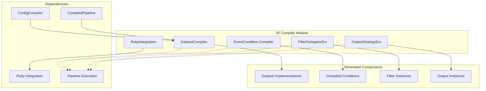
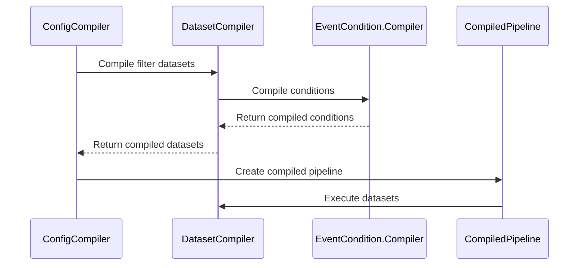
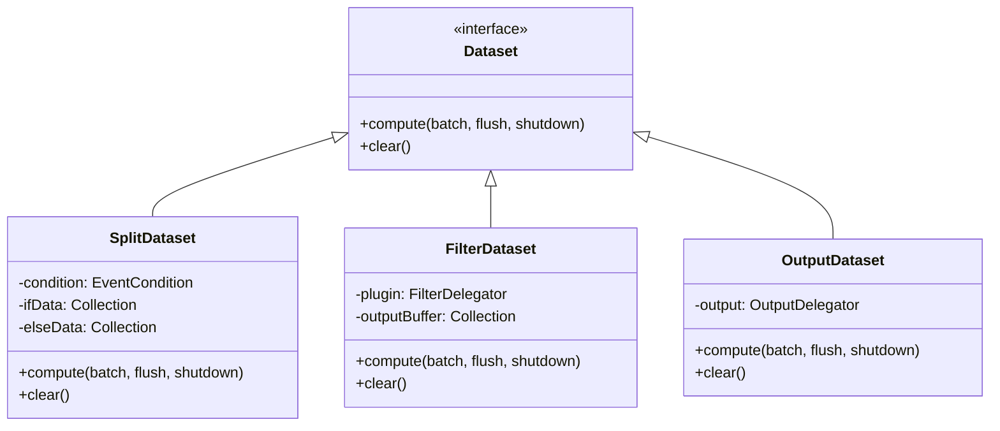

# IR Compiler Module

## Overview

The **IR Compiler** module is a critical component of Logstash's pipeline execution system that transforms intermediate representation (IR) configurations into optimized, executable Java code. This module serves as the bridge between Logstash's configuration parsing and runtime execution, providing high-performance compilation of pipeline components including filters, outputs, and conditional logic.

## Purpose

The IR Compiler module enables:
- **Runtime Code Generation**: Compiles pipeline configurations into optimized Java bytecode for maximum performance
- **Dataset Management**: Creates and manages data flow structures for efficient event processing
- **Plugin Integration**: Provides seamless integration between Ruby plugins and Java execution engine
- **Conditional Logic Compilation**: Transforms configuration conditionals into efficient runtime evaluations
- **Output Strategy Management**: Implements various output delegation strategies for different concurrency models

## Architecture Overview

## Sub-modules

### [Dataset Compilation](dataset_compilation.md)
The **DatasetCompiler** handles the compilation of data flow structures and event processing pipelines. It creates optimized dataset implementations for different pipeline components including split datasets for conditional logic, filter datasets for plugin execution, and terminal datasets for outputs. This sub-module is responsible for generating efficient Java code that processes events in batches while maintaining proper resource management and error handling.

### [Event Condition System](event_condition_system.md)
The **EventCondition.Compiler** compiles boolean expressions from pipeline configurations into efficient runtime condition evaluators. It transforms complex conditional logic including comparisons, regular expressions, field references, and boolean operations into optimized Java code that can quickly evaluate conditions against events during pipeline execution.

### [Plugin Delegation](plugin_delegation.md)
The **FilterDelegatorExt** manages the integration between Ruby filter plugins and the Java execution engine. It provides a delegation pattern that wraps Ruby plugins with Java interfaces, handles method invocation optimization, manages plugin lifecycle, and integrates with the metrics system for performance monitoring.

### [Output Strategy Management](output_strategy_management.md)
The **OutputStrategyExt** implements various output delegation strategies to handle different concurrency models and performance requirements. It provides single-threaded, shared, and legacy multi-worker patterns, each optimized for specific use cases and plugin characteristics while maintaining thread safety and resource efficiency.

### [Ruby Integration Layer](ruby_integration_layer.md)
The **RubyIntegration** provides interfaces and utilities for seamless integration between Ruby plugin implementations and Java execution components. It defines the contract for plugin factories and handles the bridging between Ruby and Java execution contexts, enabling efficient plugin instantiation and execution.

## Core Functionality

### Pipeline Compilation Flow

### Dataset Types and Relationships

## Integration Points

### With Configuration System
- Receives compiled IR from [config_compilation](config_compilation.md) module
- Transforms configuration elements into executable code
- Integrates with [core_data_structures](core_data_structures.md) for type conversion

### With Pipeline Execution
- Provides compiled datasets to [pipeline_execution](pipeline_execution.md) module
- Integrates with [event_api](event_api.md) for event processing
- Coordinates with [ruby_integration](ruby_integration.md) for plugin execution

### With Plugin System
- Works with [plugin_system](plugin_system.md) for plugin instantiation
- Utilizes [plugin_factory](plugin_factory.md) for creating plugin instances
- Integrates with [metrics_system](metrics_system.md) for performance monitoring

## Performance Characteristics

### Compilation Optimizations
- **Caching**: Compiled conditions and datasets are cached to avoid recompilation
- **Inline Optimization**: Frequently used code paths are inlined for better performance
- **Buffer Management**: Efficient buffer allocation and reuse strategies
- **Method Call Optimization**: Direct method invocation bypassing Ruby overhead where possible

### Runtime Efficiency
- **Zero-Copy Operations**: Minimizes data copying during event processing
- **Batch Processing**: Optimized for processing events in batches
- **Memory Management**: Efficient cleanup and resource management
- **Concurrent Execution**: Support for various concurrency models through output strategies

## Error Handling

The module implements comprehensive error handling:
- **Compilation Errors**: Detailed error reporting during code generation
- **Runtime Exceptions**: Graceful handling of plugin execution errors
- **Conditional Evaluation Errors**: Safe handling of condition evaluation failures
- **Resource Cleanup**: Proper cleanup on errors and shutdown

## Thread Safety

- **Immutable Compiled Code**: Generated code is thread-safe by design
- **Synchronized Access**: Critical sections are properly synchronized
- **Worker Isolation**: Output strategies provide appropriate worker isolation
- **State Management**: Careful management of mutable state in multi-threaded environments

## Monitoring and Observability

The IR Compiler integrates with Logstash's monitoring systems:
- **Compilation Metrics**: Tracks compilation time and success rates
- **Execution Metrics**: Monitors runtime performance of compiled code
- **Plugin Metrics**: Delegates metric collection to individual plugins
- **Error Tracking**: Comprehensive error logging and reporting

## Related Documentation

- [config_compilation](config_compilation.md) - Configuration compilation and IR generation
- [pipeline_execution](pipeline_execution.md) - Pipeline execution engine
- [ruby_integration](ruby_integration.md) - Ruby-Java integration layer
- [plugin_system](plugin_system.md) - Plugin management and lifecycle
- [event_api](event_api.md) - Event processing API
- [core_data_structures](core_data_structures.md) - Core data structures and type conversion