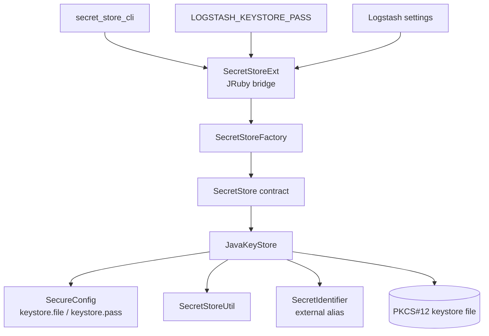
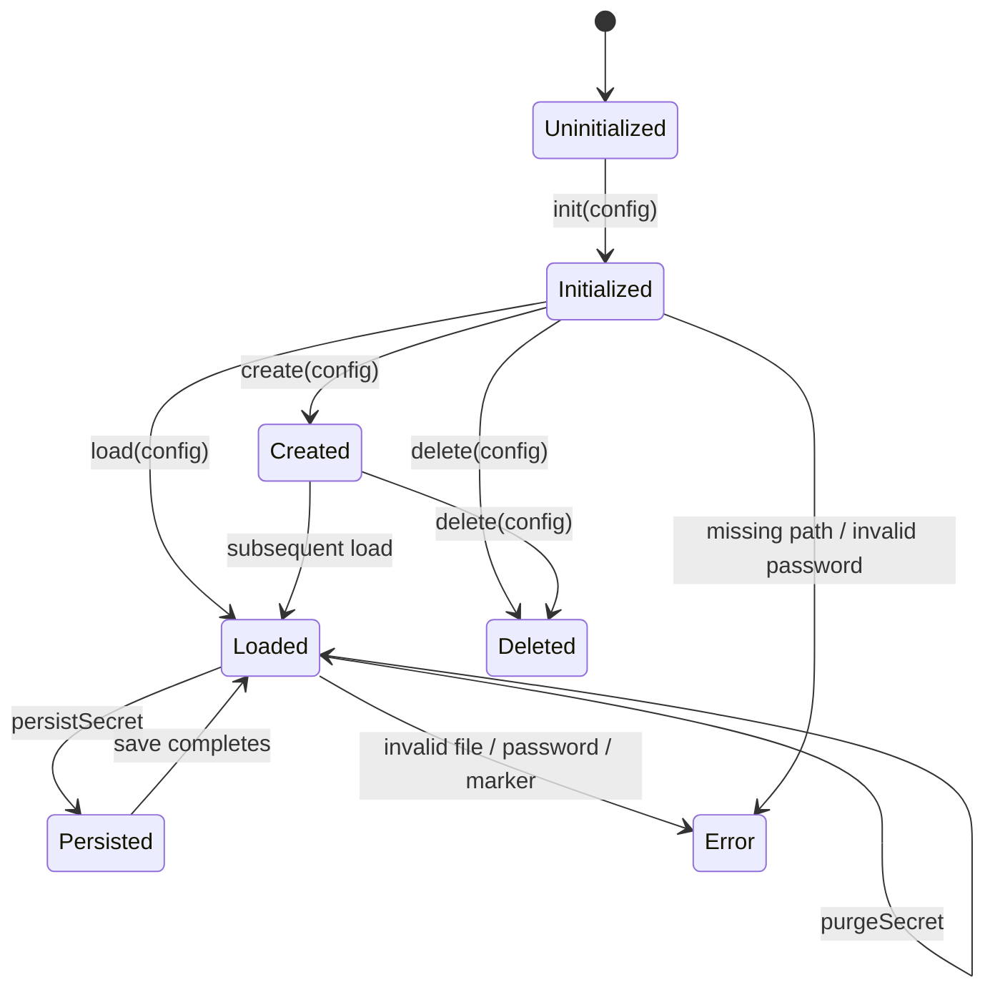
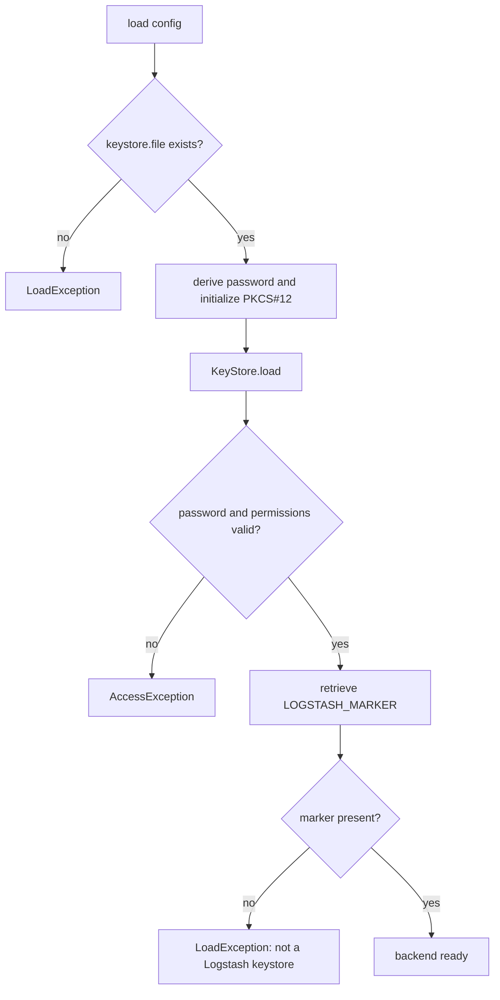
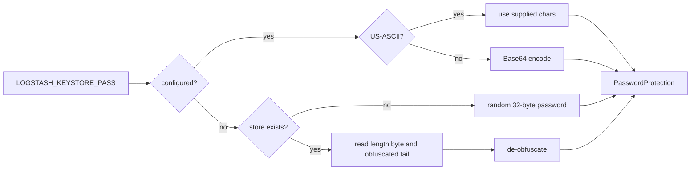
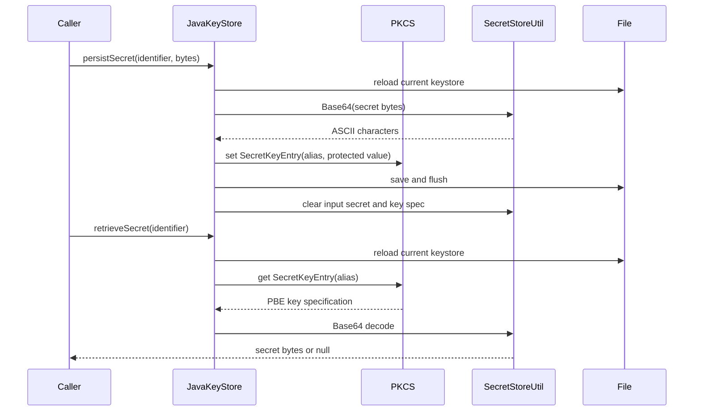
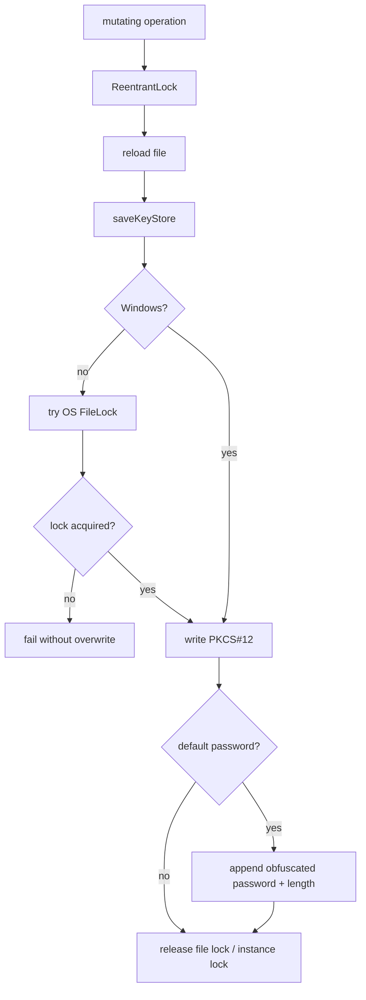
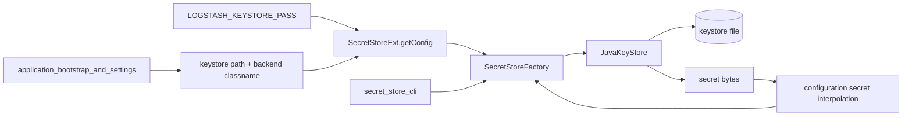

# Keystore backend

The `keystore_backend` module provides Logstash’s file-backed `SecretStore` implementation. `JavaKeyStore` stores named secrets in a password-protected PKCS#12 Java KeyStore, while `SecretStoreExt` exposes the backend to JRuby callers and obtains optional password configuration from the process environment.

The backend is used by the [secret_store_cli.md](secret_store_cli.md) command-line layer and by configuration consumers that resolve `${secret-id}` references. General settings discovery and Logstash startup remain the responsibility of [application_bootstrap_and_settings.md](application_bootstrap_and_settings.md).

## Responsibilities and boundaries

| Component | Responsibility |
| --- | --- |
| `JavaKeyStore` | Creates, loads, deletes, lists, tests, persists, retrieves, and purges secrets in a PKCS#12 file. |
| `SecretStoreExt` | JRuby bridge that builds `SecureConfig`, selects the configured factory, checks existence, loads an existing store, and creates `SecretIdentifier` values. |
| `SecretStoreFactory` | Selects the configured `SecretStore` implementation; its factory contract is consumed here rather than reimplemented. |
| `SecureConfig` | Carries the keystore path, optional access password, and backend class name as sensitive character arrays. |
| `SecretStoreUtil` | Supplies Base64 conversion, password obfuscation, ASCII conversion, and clearing helpers used by the backend. |
| `SecretIdentifier` | Represents the external alias used for a stored secret. |

The backend is deliberately a low-volume configuration store, not a general-purpose database. Each operation reloads the file before accessing entries so changes made by another process are observed.

## Architecture

`SecretStoreExt` has a static factory initialized from the environment. Its `getConfig` method always supplies `keystore.file` and `keystore.classname`; it adds `keystore.pass` only when `LOGSTASH_KEYSTORE_PASS` is present. The factory then resolves the implementation by class name.

## `JavaKeyStore` state and lifecycle

The instance holds the `KeyStore`, its password, the path, a `PasswordProtection` parameter, and a `ReentrantLock`. `create` and `load` initialize these fields from `SecureConfig`; both clear the configuration values in a `finally` block. The object is documented as thread-safe, and public operations serialize access with the instance lock where mutation or loading is involved.

### Creation

`create(config)` performs these checks and actions:

1. It rejects an already existing path with `AlreadyExistsException`.
2. `init` validates `keystore.file` and determines the password.
3. It creates the file and initializes a PKCS#12 `KeyStore`.
4. It writes an internal `SecretStoreFactory.LOGSTASH_MARKER` entry. This marker distinguishes a Logstash keystore from an arbitrary PKCS#12 file.
5. It saves the store and reapplies `rw-r--r--` POSIX permissions where supported.

The file creation relies on the directory umask initially; explicit POSIX permissions are applied afterward. Windows does not expose the same POSIX attribute view, and its file-locking behavior is handled separately during saving.

### Loading and validation

`load(config)` first requires the path to exist, initializes the password, and loads the PKCS#12 contents. It then retrieves the marker entry. A file can therefore fail in three distinct ways: it is absent, it cannot be opened with the available password/permissions, or it is a readable PKCS#12 file without the Logstash marker.

## Password handling

The password rules are implemented in `getKeyStorePassword`:

- An explicitly configured empty password is rejected. Existing stores report an access error; new stores report a creation error.
- An explicit password is used as-is when it is US-ASCII encodable. Non-ASCII passwords are Base64-encoded so they can satisfy the Java KeyStore password requirements.
- Without `keystore.pass`, a new store receives a random 32-byte password, Base64-encoded to characters.
- Without `keystore.pass` for an existing store, the backend reads password metadata appended to the file, decodes it, and de-obfuscates it.

For default-password stores, `saveKeyStore` writes the normal PKCS#12 bytes first and then appends an obfuscated representation of the generated password followed by a one-byte length. On the next load, the final byte supplies the metadata length. Empty, malformed, or inconsistent metadata causes an `AccessException`.

The access password is held as a `char[]`; secret bytes and derived `PBEKeySpec` passwords are cleared where the implementation owns them. Password conversion and related CLI concerns are documented in [secret_store_passwords.md](secret_store_passwords.md) when that module is used alongside this backend.

## Secret representation and operations

Each logical secret is addressed by `SecretIdentifier.toExternalForm()`, which becomes a KeyStore alias. The secret bytes are Base64-encoded, converted to an ASCII character array, and used to generate a `PBE` `SecretKey`. The resulting key is stored as a `KeyStore.SecretKeyEntry` protected by the keystore password.

### Operation behavior

| Operation | Behavior | Main failures |
| --- | --- | --- |
| `exists` | Checks whether the configured path exists; missing/empty path returns `false`. | None for an invalid path; warning is logged. |
| `create` | Creates a new PKCS#12 file and marker entry; applies POSIX permissions where available. | `AlreadyExistsException`, `CreateException`, `UnknownException`. |
| `load` | Loads and validates the file and marker. | `LoadException`, `AccessException`. |
| `list` | Reloads the store and converts every alias into a `SecretIdentifier`. | `ListException`. |
| `containsSecret` | Reloads and checks whether an alias exists. | `LoadException`. |
| `persistSecret` | Reloads, replaces/sets the alias entry, saves, then clears input secret bytes. | `PersistException`. |
| `retrieveSecret` | Reloads and returns decoded bytes; a missing or invalid identifier returns `null`. | `RetrievalException`. |
| `purgeSecret` | Reloads, deletes the alias, and saves. | `PurgeException`. |
| `delete` | Locks and removes the configured file if it exists. | `UnknownException` for unexpected failures. |

`persistSecret` uses `setEntry`, so an existing alias is overwritten. `retrieveSecret` returns `null` for a missing entry, while `containsSecret` is the explicit existence check. The internal marker is visible to `list`; the CLI filters it before presenting identifiers to operators, as described in [secret_store_cli.md](secret_store_cli.md).

## File locking and concurrency

There are two protection layers:

1. The instance `ReentrantLock` serializes operations within one `JavaKeyStore` object.
2. `saveKeyStore` obtains an OS-level `FileLock` on non-Windows systems before rewriting the file. If another process holds the lock, saving fails rather than silently overwriting concurrent changes.

On Windows, the implementation avoids acquiring the explicit channel lock because `KeyStore.store` itself rejects interaction with an already locked file. The method uses an append-capable stream to test/retain the relevant file interaction and a separate non-append stream for the actual KeyStore write. Default-password metadata is appended only after the PKCS#12 store has been written.

The design protects individual saves, but it is still a file store: callers should avoid high-frequency writes and should treat a failed concurrent save as an operational error requiring retry or coordination.

## Error model and security considerations

The backend wraps operation-specific failures in `SecretStoreException` subtypes so callers can distinguish creation, loading, access, listing, persistence, retrieval, and purge failures. Configuration values are cleared after `create`, `load`, and `delete`; callers remain responsible for clearing any secret buffers they continue to own.

Important operational properties are:

- The keystore path must be defined and writable for creation.
- An explicit empty password is never accepted.
- A readable PKCS#12 file without the Logstash marker is rejected.
- Secret values are not logged; debug messages contain identifiers only.
- File permissions are tightened on POSIX systems, but deployment-level ownership and directory permissions still matter.
- The default-password mode stores recoverable, obfuscated password metadata in the same file. It protects against casual inspection but should not be treated as equivalent to a separately managed external secret.

## Integration flow

The CLI administers the store, while normal Logstash configuration processing consumes identifiers and asks the selected `SecretStore` to retrieve values. Pipeline parsing, compilation, and execution are documented by the corresponding pipeline modules; this backend only supplies secure configuration values and does not participate in event processing.

## Maintenance guidance

Changes to the storage format must preserve compatibility with both the PKCS#12 payload and the optional appended password metadata. Changes to alias generation must remain compatible with `SecretIdentifier` and the CLI’s marker filtering. Changes to environment or settings wiring belong in `SecretStoreExt`, `SecretStoreFactory`, or the settings modules rather than in `JavaKeyStore`.

Tests should cover explicit and generated passwords, non-ASCII password encoding, malformed metadata, marker validation, missing and foreign files, overwrite and purge behavior, concurrent saves, POSIX permission application, Windows-specific save behavior, and clearing of sensitive buffers.
